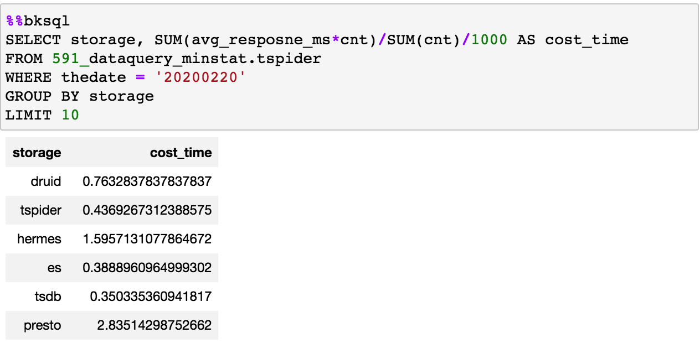

# 笔记任务

## 功能入口


## 功能介绍

笔记任务提供交互式文档，它的核心在于“所见即所得”，支持在网页文档中编写代码和运行代码，代码的执行结果会和相关代码一同保存，方便进行代码的结果展示和快速迭代。我们可以将笔记理解为一张草稿纸，在纸上进行思考和探索，每一步的探索都有即时的结果输出，方便我们根据结果调整决策，进行下一步探索。

目前笔记任务提供的功能：

- 交互式编程，边看边写，边写边看
- 即时结果输出并保存，一次执行，多次阅读
- 代码块之间支持代码和结果复用
- 支持多语言内核，可以编写 Python、Java、SQL 等代码

## BKSQL 查询语法

笔记中使用平台特有的 bksql 语法提供查询服务，使用方式如下

### 多行 SQL

示例：

```sql
%%bksql
select 
	col, col2, col3
from table1
where thedate = '20200101'
limit 10
```



### 单行 SQL

示例：

```python
%bksql select col, col2, col3 from table1 where thedate = '20200101' limit 10
```

## 查询结果引用

执行查询语句后，查询结果集支持赋值给自定义变量，方式如下

```sql
%%bksql
select 
	col, col2, col3
from table1
where thedate = '20200101'
limit 10
```

```python
result = _
```

自定义变量 result 包含 dicts、DataFrame 等方法，方便对结果集进行二次处理

```python
for line in result.dicts():
  print(line)
```


```python
df = result.DataFrame()
```


## 查询结果图表展示

查询结果集支持图表展示，目前提供柱状图和饼图的支持，方式如下

```python
%matplotlib inline
result.bar();
```


```python
result.pie();
```


## 复用查询任务结果集

笔记中支持复用查询任务的结果集，方式如下

```python
result = datasets('query_1')
```


## Tips

#### 1、笔记中设置全局变量，SQL 引用变量组织查询语句

```python
today = '20200101'
```

```sql
%bksql select col, col2, col3 from table1 where thedate = {today} limit 10
```

```sql
%%bksql
select 
	col, col2, col3
from table1
where thedate = {today}
limit 10
```

