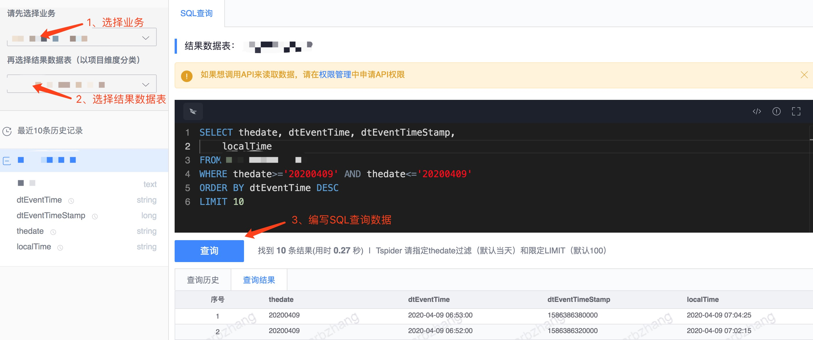

# SQL 查询

## 功能介绍

数据查询支持用户对结果数据表中的数据进行查询，数据查询分为 SQL 查询和全文检索，SQL 查询提供基于 Tspider、HDFS 等存储的数据查询功能，全文检索提供基于 Elasticsearch 的数据查询功能。

鉴于游戏数据的多样性，平台提供多种存储类型支持多样化数据的存储，用户可根据数据的用途和使用场景选择不同的存储类型。由于存储类型多种多样，不同存储间的查询语法存在差异，因此平台提供统一查询语法 [BKSQL](./bksql.md) ，基于 BKSQL 查询语法，用户可以方便地对结果数据进行数据查询和 SQL 运算。

### SQL 查询示例如下

