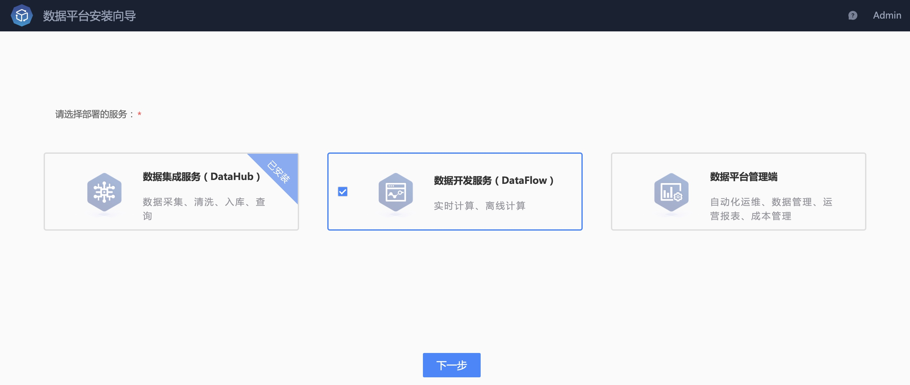
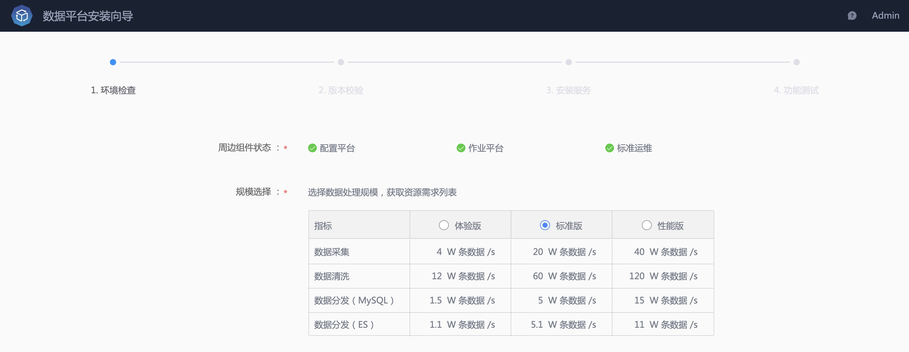
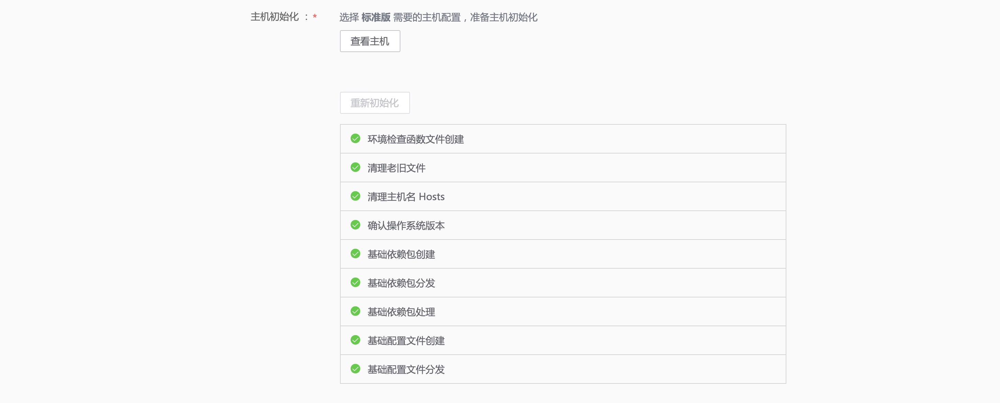
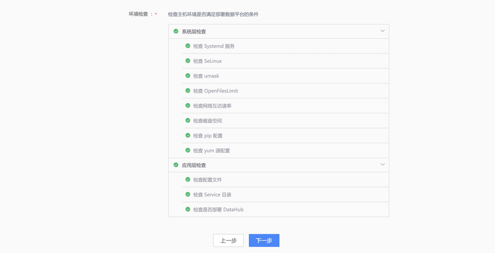
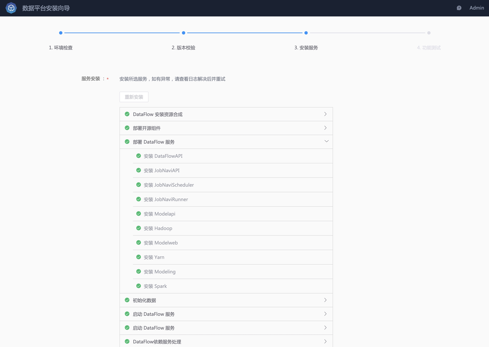
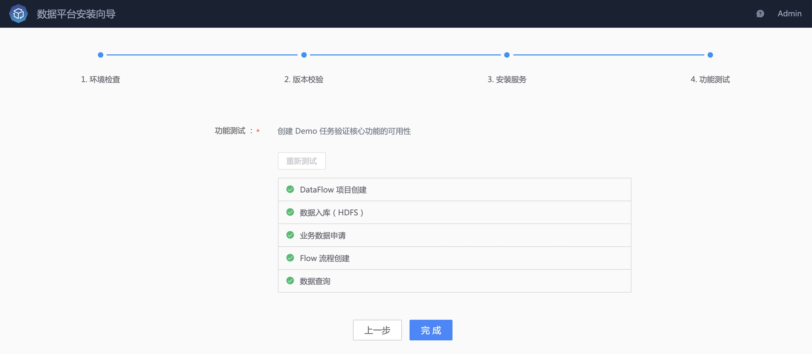
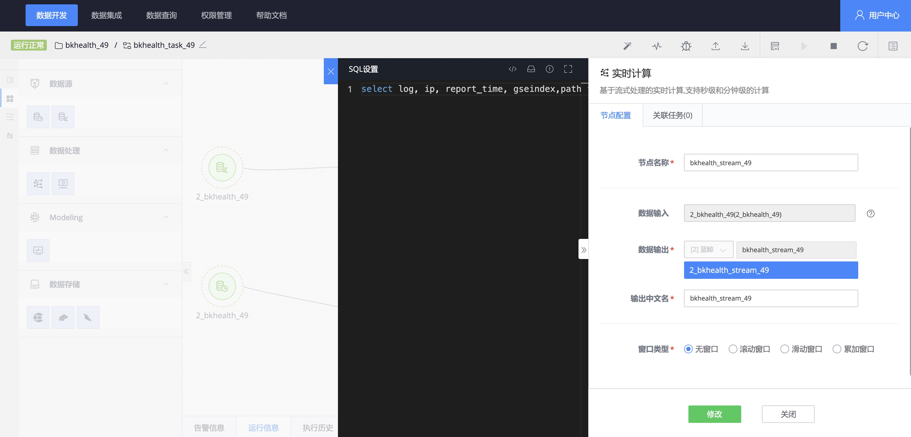
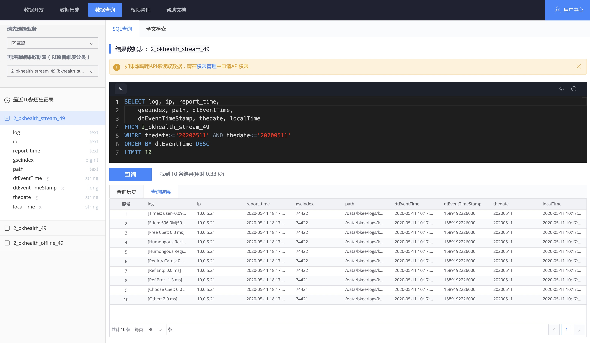
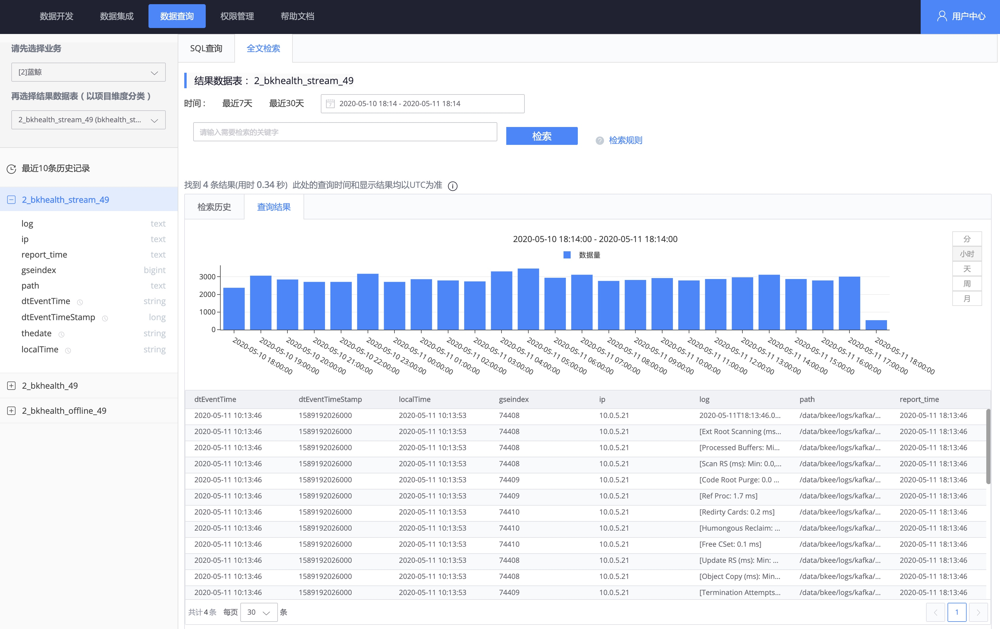

## 安装数据开发（DataFlow）服务 
> 请确保已完成数据集成服务的安装。 

和安装数据集成服务一样，主要包含 **环境检查**、**版本校验**、**服务安装**、**功能测试** 4 个步骤。

## 选择部署的服务
使用蓝鲸管理员账号打开 **数据平台安装向导 SaaS**，选择部署 **数据开发服务（DataFlow）**。

## 环境检查
首先选择规模，然后选择 [准备好的主机](./prepare.md)，点击 **主机初始化**。
> 数据开发服务的规模和数据集成服务的规模保持一致。

该步骤会完成 **主机初始化**，以及 **环境检查**。

## 版本校验

确保已完成 [安装准备](./prepare.md) 中的 **版本包准备**，包含 **服务版本包**、**开源软件包**。

开始 **版本校验**，该步骤会分发和校验版本包，预计耗时 3~5 分钟。

## 服务安装

点击 **服务安装**，将安装、启动、检查 DataFlow 服务，此外该步骤会一并完成 **数据平台 SaaS** 的安装。

## 功能测试
完成服务安装后，**功能测试** 将创建一个包含实时和离线计算节点的 **数据开发任务**，用于校验服务是否安装正常，预计 5~10 分钟。

### 在数据平台 SaaS 中体验数据开发服务

安装完成后，进入数据平台 SaaS，在 **数据开发** 页面中可以找到已经创建好的数据开发任务，其中包含 **实时计算节点**、**离线计算节点**。

- 数据开发任务

- 实时计算节点

- 离线计算节点

- 数据入库

- 数据开发任务中的数据查询

- 数据查询：SQL 查询

- 数据查询：全文检索

至此，数据开发服务安装完成。