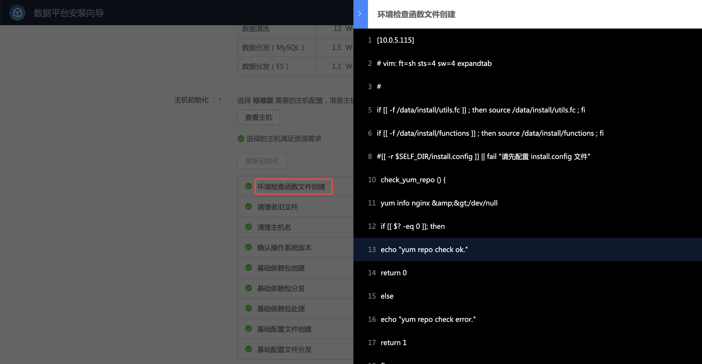
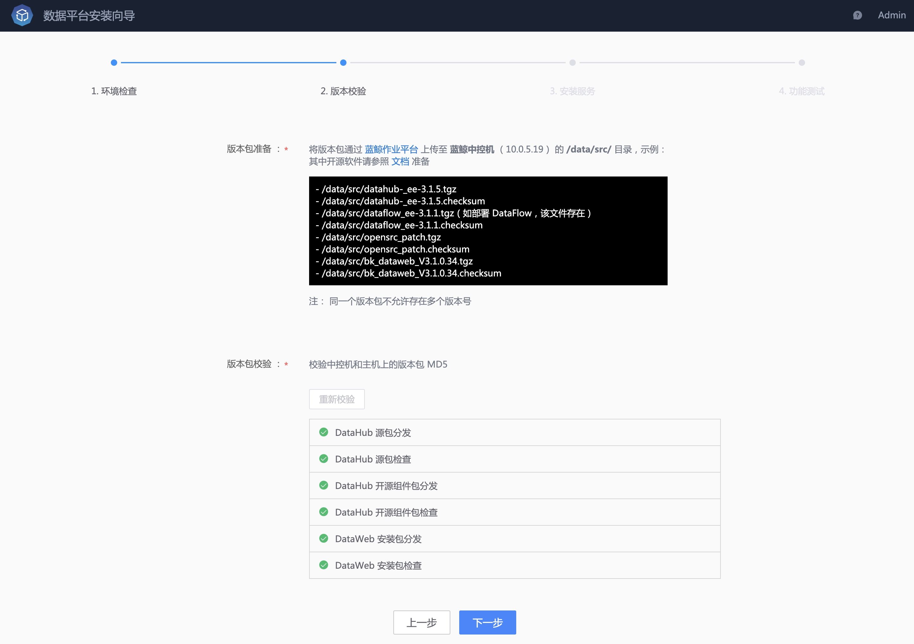
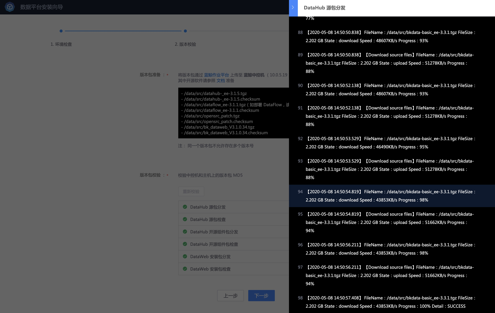
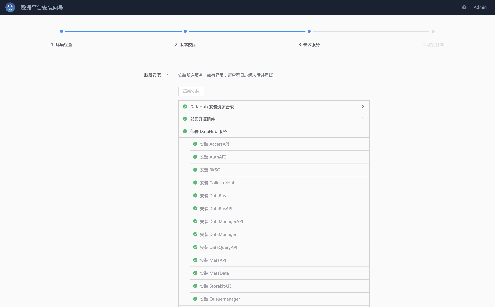
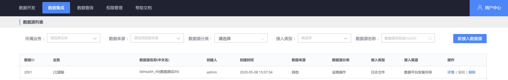
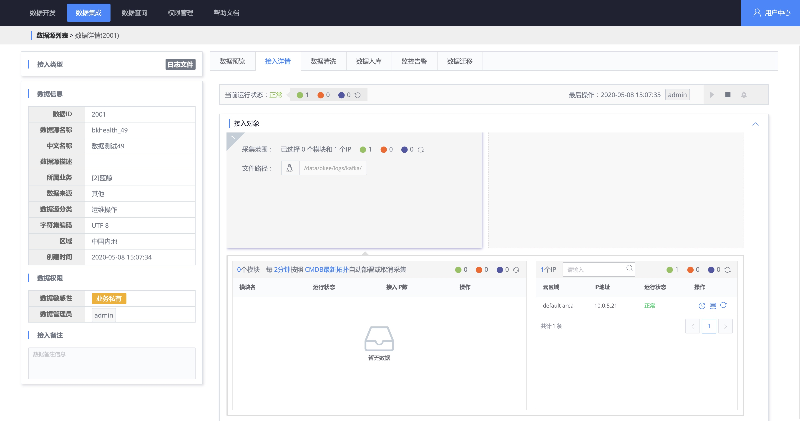
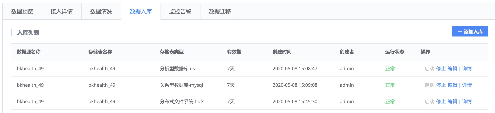
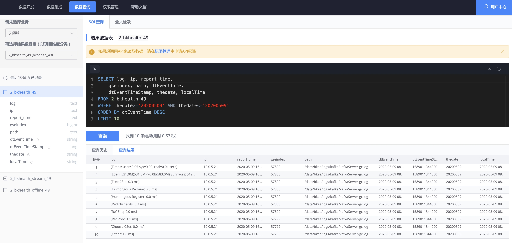

## 安装数据集成（DataHub）服务 
> 确保已完成 [安装准备](./prepare.md) 中的 **机器资源评估**、**安装 数据平台安装向导 SaaS**、**安装 GseAgent** 以及 **版本包准备**。

主要包含 **环境检查**、**版本校验**、**服务安装**、**功能测试** 4 个步骤。

## 选择部署的服务
使用蓝鲸管理员账号打开 **数据平台安装向导 SaaS**，选择部署 **数据集成服务（DataHub）**。

## 环境检查

首先选择规模，然后选择 [对应规模的主机](./prepare.md)，点击 **主机初始化**。

> 文档中以 **标准版** 作为示例。

该步骤会完成 **主机初始化**，以及 **环境检查**。

单击步骤，可以 **查看日志**。如果单个步骤执行失败，可先查看日志，然后 **重试**。

## 版本校验

确保已完成 [安装准备](./prepare.md) 中的 **版本包准备**，包含 **服务版本包**、**开源软件包**、**数据平台 SaaS 包** 。

开始 **版本校验**，该步骤会分发和校验版本包，预计耗时 3~5 分钟。

## 服务安装

点击 **服务安装**，将安装、启动、检查 DataHub 服务，此外该步骤会一并完成 **数据平台 SaaS** 的安装。

## 功能测试
完成服务安装后，**功能测试** 将创建一个数据接入、清洗、入库任务，以校验服务是否安装正常，预计 5~10 分钟。

### 在数据平台 SaaS 中体验数据集成服务

安装完成后，进入数据平台 SaaS，在 **数据集成** 页面中可以找到接入的数据源，包含接入、清洗和入库任务。

- 数据源列表

- 接入任务

- 数据清洗任务

- 数据入库任务

在 **数据查询** 页面可以查询入库的数据。

至此，数据集成服务安装完成。