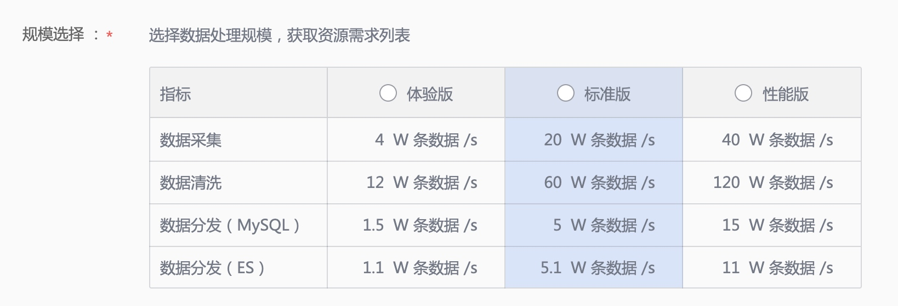

## 安装准备
在正式安装服务前，需完成 **机器资源评估**、**安装 数据平台安装向导 SaaS**、**安装 GseAgent** 以及 **版本包准备**。
 
## 机器评估
正式环境可选择 **标准版** 或 **性能版**，如果仅用于体验（非正式环境）可选择 **体验版**。

> 每次只能安装 1 个服务，如 数据集成服务（DataHub）、数据开发服务（DataFlow），请依次安装。



### 硬件配置清单
选择好规模后，请 **严格按照配置清单准备机器**。

#### 体验版
##### 数据集成服务
| CPU  | 内存  | 磁盘   | 数量 |
|------|-----|------|----|
| 12 核 | 48G | 500G | 4  |
|      |     | 合计   | 4  |

##### 数据开发服务
| CPU  | 内存  | 磁盘   | 数量 |
|------|-----|------|----|
| 12 核 | 48G | 500G | 3  |
|      |     | 合计   | 3  |

 
#### 标准版
##### 数据集成服务
| 模块  | CPU  | 内存  | 磁盘    | 数量 |
|-----|------|-----|-------|----|
| 存储类 | 12 核 | 24G | 2000G | 16 |
| API | 12 核 | 24G | 300G  | 7  |
|     |      |     | 合计    | 23 |


##### 数据开发服务
| 模块         | CPU  | 内存  | 磁盘    | 数量 |
|------------|------|-----|-------|----|
| 存储类        | 12 核 | 24G | 2000G | 2  |
| API        | 12 核 | 24G | 300G  | 2  |
| 数据计算+资源消耗类 | 24 核 | 48G | 300G  | 2  |
| 数据计算+存储类   | 24 核 | 48G | 2000G | 3  |
|            |      |     | 合计    | 9  |

#### 性能版 
##### 数据集成服务
| 模块  | CPU  | 内存  | 磁盘    | 数量 |
|-----|------|-----|-------|----|
| 存储类 | 12 核 | 24G | 2000G | 20 |
| API | 12 核 | 24G | 300G  | 9  |
|     |      |     | 合计    | 29 |

##### 数据开发服务
| 模块         | CPU  | 内存  | 磁盘    | 数量 |
|------------|------|-----|-------|----|
| 存储类        | 12 核 | 24G | 2000G | 2  |
| API        | 12 核 | 24G | 300G  | 2  |
| 数据计算+资源消耗类 | 24 核 | 48G | 300G  | 2  |
| 数据计算+存储类   | 24 核 | 48G | 2000G | 10 |
|            |      |     | 合计    | 16 |
 
## 安装 数据平台安装向导 SaaS
在开发者中心中安装 数据平台安装向导。


## 主机 GseAgent

做完机器评估后，请使用 **节点管理** SaaS **安装 GseAgent**。


## 版本包准备

请将 **版本包** 及其 **checksum** 通过 **蓝鲸作业平台** 上传至 **蓝鲸中控机** 的 `/data/src` 目录。

> checksum 生成方法示例：md5sum opensrc_patch.tgz > opensrc_patch.checksum
> checksum 用于分发至部署主机后的版本校验。


版本包由 **服务版本包**、**开源软件包**、**数据平台 SaaS 包** 组成。


   
### 开源软件补全指引

完成开源软件下载后，请 **打包并上传至中控机** 的 `/data/src/` 目录，并将压缩包命名为 `opensrc_patch.tgz`，并生成 checksum 文件。

压缩包目录结构为：

```
opensrc_patch/
opensrc_patch/logback-core-1.1.7.jar
opensrc_patch/waffle-jna-1.7.5.jar
opensrc_patch/mysql-connector-java-5.1.38.jar
opensrc_patch/uwsgi-2.0.18.tar.gz
opensrc_patch/MySQL-python-1.2.5.zip
opensrc_patch/xz-1.5.jar
opensrc_patch/mysql-connector-java-5.1.28.jar
```

#### 开源软件列表

| 开源包名称 | 下载地址 | MD5 值 |
| --- | --- | --- |
| logback-core | [logback-core-1.1.7.jar](https://repo1.maven.org/maven2/ch/qos/logback/logback-core/1.1.7/logback-core-1.1.7.jar) | 4021551de5018dfa4b79ec553280f00a |
| mysql-connector-java | [mysql-connector-java-5.1.38.jar](https://repo1.maven.org/maven2/mysql/mysql-connector-java/5.1.38/mysql-connector-java-5.1.38.jar) | 8f497455cbe1b6707d7e664c4f4be484 |
| waffle-jna | [waffle-jna-1.7.5.jar](https://repo1.maven.org/maven2/com/github/dblock/waffle/waffle-jna/1.7.5/waffle-jna-1.7.5.jar) | 6b54c704609b42a242d7d018e9f1bd16 |
| xz | [xz-1.5.jar](https://repo1.maven.org/maven2/org/tukaani/xz/1.5/xz-1.5.jar) | 51050e595b308c4aec8ac314f66e18bc |
| MySQL-python | [MySQL-python-1.2.5.zip](https://pypi.python.org/packages/a5/e9/51b544da85a36a68debe7a7091f068d802fc515a3a202652828c73453cad/MySQL-python-1.2.5.zip#md5=654f75b302db6ed8dc5a898c625e030c) | 654f75b302db6ed8dc5a898c625e030c |
| uwsgi | [uwsgi-2.0.18.tar.gz](https://files.pythonhosted.org/packages/e7/1e/3dcca007f974fe4eb369bf1b8629d5e342bb3055e2001b2e5340aaefae7a/uwsgi-2.0.18.tar.gz) | 25107741bc7f4889a3a0f5f13b8c06de |
