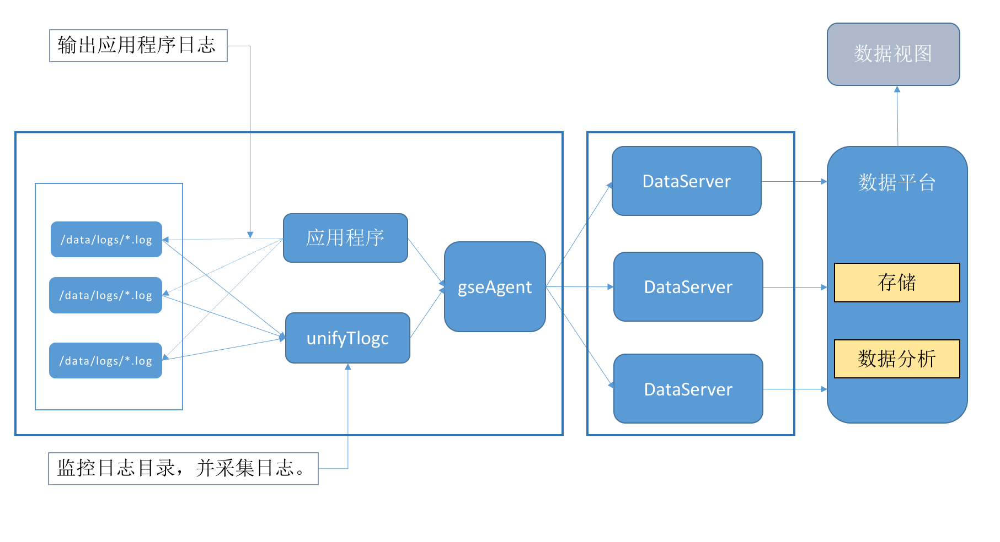

# 数据采集 DataServer

> 数据采集模块实现了数据采集、路由传输功能。包括采集器、gseAgent（数据管道部分）、DataServer。

1.  采集器：负责监控日志文件，增量采集文本数据

2.  gseAgent：负责将采集的数据路由到 DataServer

3.  DataServer：将 agent 上报的数据进行汇总，实现数据 ID 到 Kafka
    Topic 的映射，将数据传输到 Kafka
