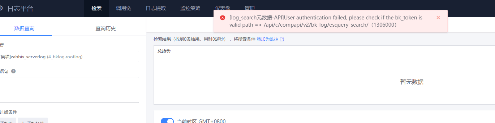

# FAQ

### 常见问题一：日志平台下发日志采集失败TemplateSyntaxError:unexpected']',expected')'

``jinja2.exceptions.TemplateSyntaxError:unexpected']',expected')'
During handling of the above exception, another exception occurred:``'

**解决方案：**
[https://bk.tencent.com/s-mart/community/question/8545?type=answer](https://bk.tencent.com/s-mart/community/question/8545?type=answer)

 

### 常见问题二：日志平台数据查询报 User authentication failed

``[log_search元数据-API]JUser authentication failed, please check if the bk_token isvalid path => /api/c/compapi/v2/bk_log/esquery_search/ (1306000)``

**解决方案：**
[https://bk.tencent.com/s-mart/community/question/8563?type=answer](https://bk.tencent.com/s-mart/community/question/8563?type=answer)
