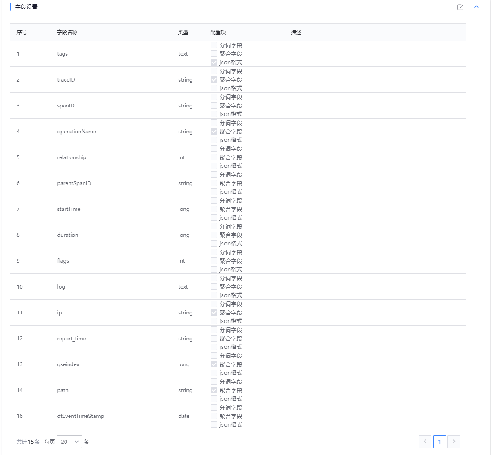
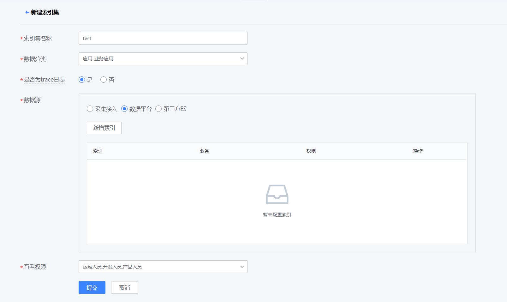

# 接入

日志平台全链路监控采用 OpenTracing 标准，符合标准的日志均可采集接入。

## 数据格式

为了更好的使用平台的统计分析功能，在 OpenTracing 标准的基础上，建议业务完成推荐字段的信息采集，同时，新增业务自定义字段，用于日志的检索分析。

|字段|示例|说明|
|--|--|--|
|traceID|2276470b5d19c8e2|必须。一类 trace 代表一种分布式的、涉及多个服务的执行轨迹，通常可以与 tag.scene 形成对应关系，如登录、登出、匹配等。|
|spanID|40772d65b2e9a93f|必须。span 代表系统中具有开始时间和执行时长的逻辑运行单元|
|operationName|get_account|强烈建议。操作名，一个具有可读性的字符串，代表这个 span 所做的工作（例如：RPC 方法名，函数名，或者一个大型计算中的某个阶段或子任务）|
|references|[{"refType": "CHILDOF","traceID": "2276470b5d19c8e2","spanID": "03b50b3958227723"}]|必须。调用关系描述；|
|startTime|1582707637126|必须。开始时间，单位毫秒|
|duration|55|必须。耗时，单位毫秒|
|tags|[{"key": "scene","type": "string","value": "Login"}, {"key": "local.service","type": "string","value": "account"}, {"key": "peer.service","type": "string","value": "profile"}, {"key": "peer.address","type": "string","value": "domain/routeid"}, {"key": "loacl.ipv4","type": "string","value": "10.10.10.11"}, {"key": "peer.ipv4","type": "string","value": "10.10.10.10"}, {"key": "peer.port","type": "integer","value": "8080"}, {"key": "error","type": "bool","value": false}, {"key": "result_code","type": "integer","value": 10000}, {"key": "uid","type": "string","value": "15rjdti2455ksd"}]|强烈建议。一组键值对构成的 Span 标签集合。键值对中，键必须为 string，值可以是字符串，布尔，或者数字类型。 建议保留推荐字段，可根据不同的场景（RPC、Message Bus、HTTP、DB 等）设置相符合的内容。 可新增业务自定义字段，用于特定条件下的检索分析。|
|logs|[{"timestamp": 1582707637128714,"messages": " [INFO][WriteSpanLogULS]: Send back, cmd:26677"}, {"timestamp": 1582707637128714,"messages": " [INFO][ Send back, cmd:235435"]|强烈建议。span 的日志集合。每次 log 操作包含一个键值对，以及一个时间戳。键值对中，键必须为 string，值可以是任意类型|
|flags|1|强烈建议。是否采集：1 采样；0 不采样|

## 数据采集
### 日志接入

1. 日志采集
	日志接入可以分为服务器日志采集、tlog 接入两种形式。推荐使用 tlog 方式接入。
		- tlog 接入：业务进程将日志上报到 tglog 或业务独立 tlog 服务器，在通过 gseAgeng 采集到数据平台，无本地服务器磁盘 I/0 压力。
		- 服务器日志：日志打印本地，gseAgent 采集日志，上报数据平台。
    日志格式 DEMO：
    
2. 数据处理：

数据清洗模板示例：

数据入库 ES，字段设置：

### kafka 接入

待更新

### SDK 接入

开发中
    
## 索引集接入

日志平台--管理--索引集管理--新建

- 是否为 trace 日志：是
- 数据源：从数据平台中选择对应的索引集

