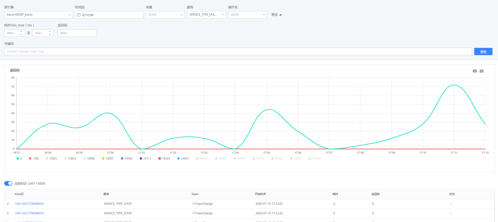
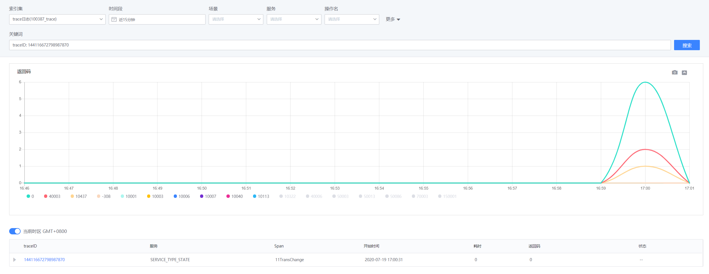
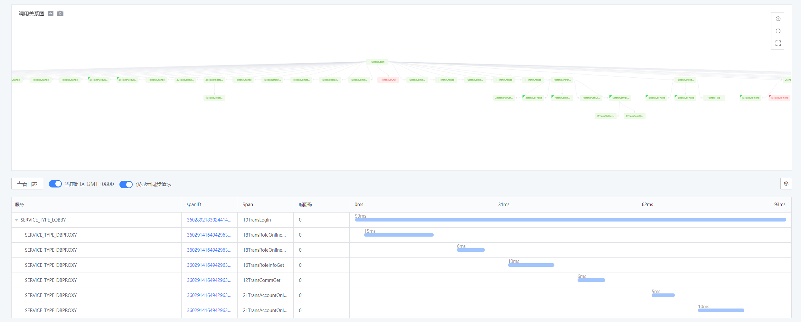

# 全链路监控——检索

## 统计预览

检索首页可以便捷使用时间、耗时、场景、服务、操作名等查询条件进行过滤。平台以耗时图、返回码等维度对结果进行统计分析。

当只有时间、场景为查询条件时，检索结果以 trace 维度进行聚合及统计；否则，结果以 span 维度进行统计及展示，两种方式结合，准确表达查询意图。

同时，用户也可以在搜索框输入具体信息，包括具体的 traceid、spanid 或者具体的错误日志等进行查询。

## Trace 详情查询

通过检索获取到响应的 trace 后，点击 traceID 可以查询 trace 详情。

trace 详情展示，按调用关系、耗时两个维度进行展示。

其中：
- 调用关系图显示各个节点(span)之间的调用关系：
    - 绿色节点为返回值正常节点，红色为异常节点。
    - 带角标的节点表示其与父节点的关系为同步执行关系，否则为异步执行节点。
- 瀑布图展示节点的执行耗时，同时瀑布图增加“仅显示同步请求”开关，用来在调用关系复杂时，可以更准确的了解到关键路径的信息。

