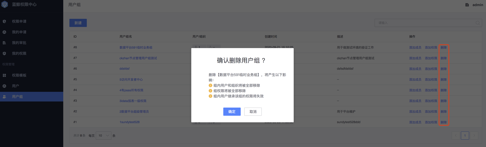

# 用户组

用户组是蓝鲸权限中心`推荐`的一种权限管理方式，一个用户组可以添加`多个系统`的权限，本章节重点介绍用户组的创建、用户组成员管理、用户组权限管理等功能。    

## 新建用户组

- 用户组名：`必填`，全局唯一，用户组名必须大于4个字符。

- 描述：`必填`，将用户组的功能描述清楚，便于管理员或者用户申请时辨识。

- 添加组成员：`非必填`，组成员包括用户和组织，权限中心提供组织架构拓扑选择和手动输入两种方式添加成员（手动输入方式只支持用户添加）。成员的添加也可以在用户组列表中找到对应的用户组直接添加。

  

- 添加组权限：`非必填`，组权限可以是权限模板，也可以是自定义的权限（待实现）。 组权限添加也可以在用户组列表中找到对应的用户组直接添加。

  

##编辑用户组

编辑用户组涉及组基本信息、用户组权限和成员的变更。

- 组基本信息编辑：可以编辑用户组名、组描述信息。

- 组成员编辑：可以删除、添加用户组成员。

- 组权限编辑：切换`组权限`Tab页，可以添加、删除权限，如果组权限是权限模板，则可以选择是否同步权限模板的最新版本。

  

## 删除用户组

在用户组列表，可以针对用户组直接删除，删除用户组会同时移除组内用户、组内权限，请谨慎操作。

