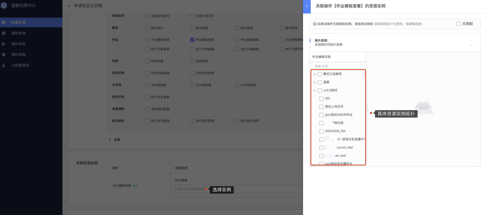

# 工作原理

本章节讲解从系统接入到用户访问鉴权的整体交互原理，可以大致了解蓝鲸权限中心的工作原理。

## 1. 注册权限模型 

对接到权限中心，接入系统需要将必要的`数据模型注册`到权限中心，具体需要注册的数据模型如下：
- 系统(System)模型
- 资源类型(ResourceType)模型
- 实例视图(Instance_selections)模型
- 操作(Action)模型

具体协议参考 [注册API协议](../../../iam_dev_docs/QuickStart/03-Model.md)。

注册成功后，在前端页面可以查看注册效果。

## 2. 用户去权限中心申请权限

系统接入权限中心后，用户可以在权限中心申请对应的操作权限，操作权限需要关联资源实例，用户选择资源实例的方式可以通过拓扑树选择或者通过属性过滤。

## 3. 接入系统提供资源实例拉取接口

用户申请权限时，权限中心需要从接入系统拉取相应的资源实例来完成最终权限策略的配置。

具体协议参考 [资源反向拉取API协议](../../../iam_dev_docs/Reference/API/03-Callback/01-API.md)

## 4. 权限中心存储权限策略

用户申请的权限，最终会变成一条条权限策略（policy）数据保存在权限中心，即subject（用户、组织、用户组） + action +  expression（包含了操作对应的资源实例表达式）。

## 5. 用户访问接入系统的资源需要鉴权

用户访问接入系统的某个资源时，因为接入了权限中心，所以需要先判断该用户是否具备访问对应资源的权限。

## 6. 接入系统通过SDK进行鉴权

新版权限中心的鉴权逻辑是由各接入系统调用SDK来完成鉴权，具体可以参考[鉴权SDK](../../../iam_dev_docs/Reference/API/04-Auth/01-SDK.md)，目前[ Python 语言版本SDK](https://pypi.org/project/bk-iam/1.1.9/) [ Go 语言版本SDK](https://github.com/TencentBlueKing/iam-go-sdk)已开源，如没有对应语言的SDK（`推荐`），需要接入系统自行实现或者使用[直接鉴权](../../../iam_dev_docs/Reference/API/04-Auth/02-DirectAPI.md)。

更详细的指引请点击阅读 [系统接入开发指引](../../../iam_dev_docs/QuickStart/01-Begin.md)。
