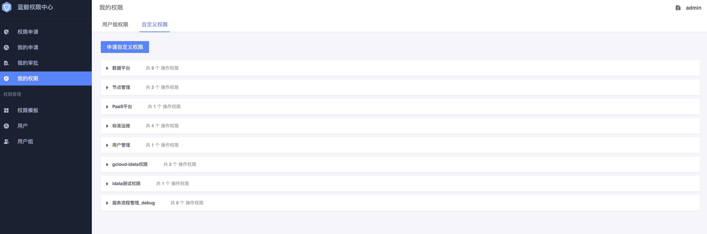

# 申请自定义权限

## 前置条件

> 无

蓝鲸权限中心`推荐`通过用户组来统一管理权限，当没有合适的已有用户组或者需要的权限比较单一时，可以通过申请自定义权限

## 操作步骤

1. 点击`权限申请`菜单，进入权限申请页面。

   

2. 点击`申请自定义权限`板块的`立即申请`按钮，进入自定义权限申请页面。

   

3.  点击`提交`，提交后等待审批人审批，审批通过后，在`我的权限`页面可以查看刚才申请的自定义权限。

   