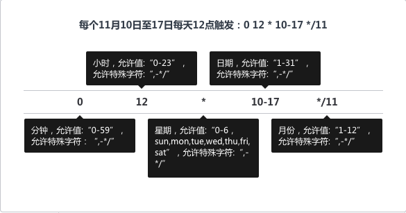

# 周期任务

周期任务能够满足用户对流程模板定期执行任务的需求。

- 新建周期任务

用户可以在新建任务时通过参数填写的页面中执行计划选择周期执行任务来创建一个周期任务。填写周期表达式来确认任务触发执行的时间。周期表达式可以通过两种方式设置：选择生成，或者手动输入。

- 周期表达式

- 生成周期任务

新建成功后，周期任务会按照周期规则自动执行，在页面上能够对周期任务执行暂停、编辑、删除、执行任务操作。

- 编辑周期任务

用户能够编辑周期任务来修改周期规则以及参数信息。注意：周期任务的状态为 “暂停” 时才可编辑。如果周期任务为 “启动” 中时，需将其暂停后再进行编辑操作。

- 执行历史

用户能够查看周期任务完整的执行历史，来查看任务执行情况。并可以对已执行的任务进行克隆、删除。

