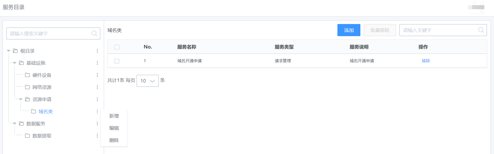

## 服务目录

> 服务目录为整体服务内容的管理视图及入口。

服务目录列表

可对服务目录进行新增，编辑，删除，排序等操作。

> 注：1.当服务目录下有子目录时，父级目录将无法删除。将子目录删除后方可删除。
>
> 2.服务目录的排序：直接选中进行拖拽即可。

新增服务目录

服务目录下可以管理多个服务。通过新增/添加或移除来进行服务目录下的服务管理。

服务目录下的服务管理

服务目录创建完成后，通过“添加”或者“移除”来进行服务目录下的服务管理。

服务添加至服务目录

将服务从服务目录移除

服务的移除仅代表从该服务目录移除，并不会删除服务。从该服务目录移除后，用户在前台的提单入口，选择原服务目录后，将看不到被移除的服务。