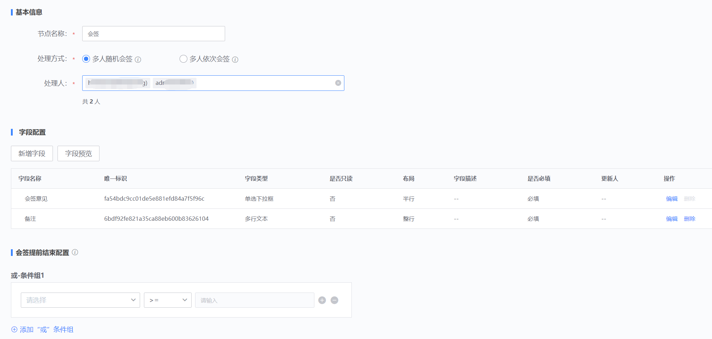
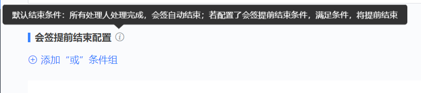
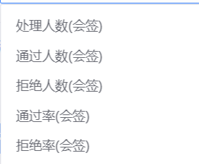
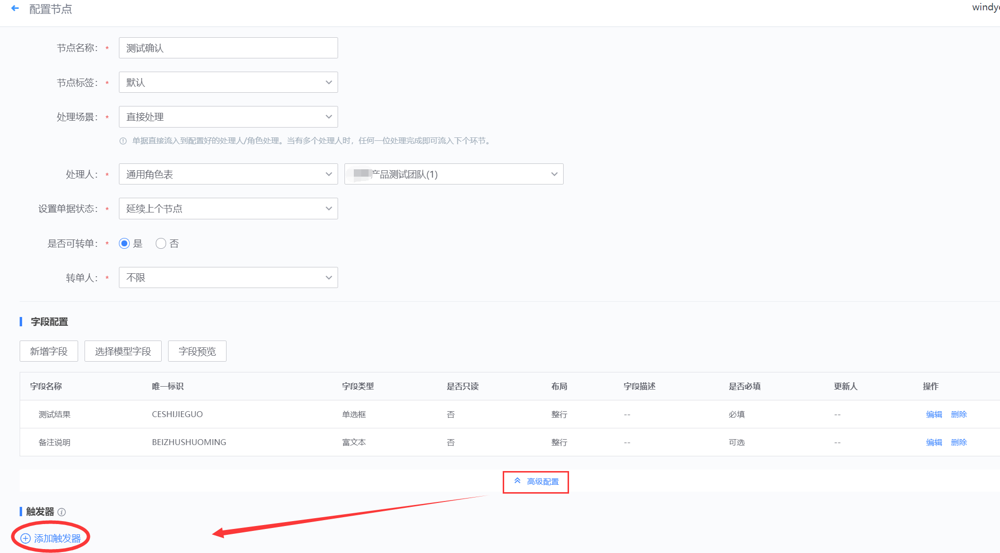
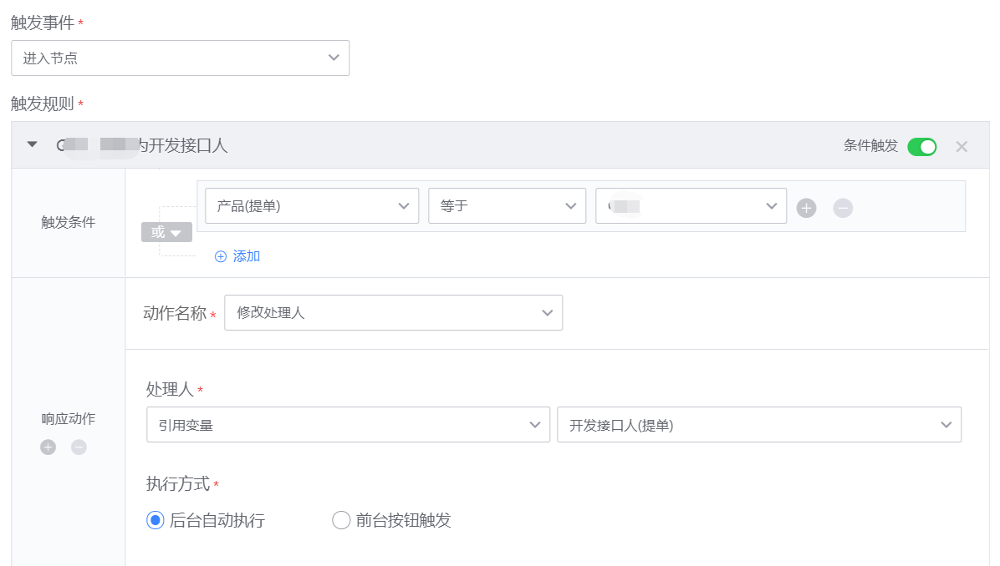
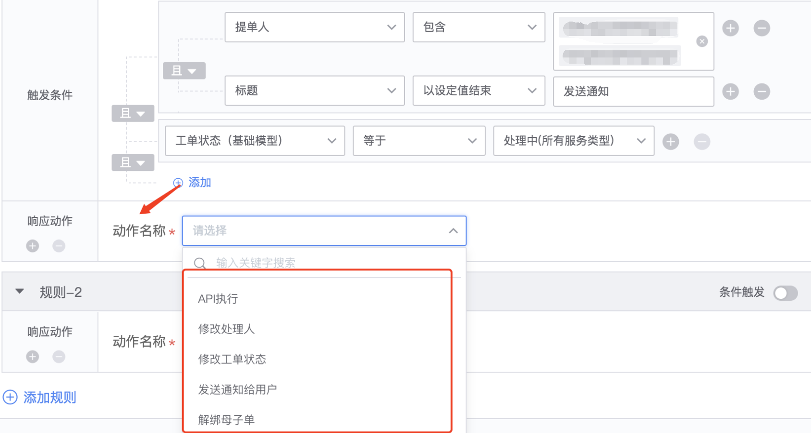
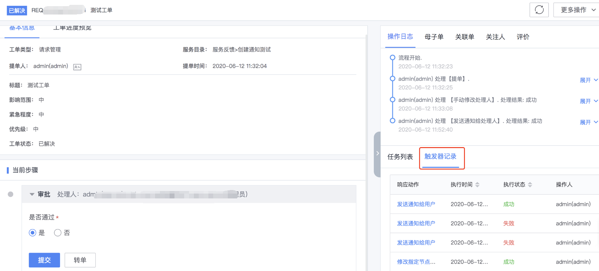
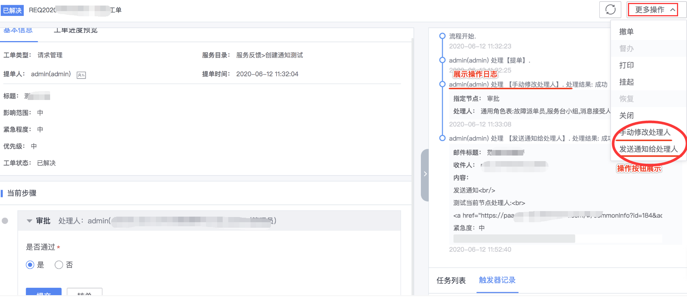

# 流程管理（后台）

流程管理主要包括流程设计、流程版本、API 配置、通知配置、基础模型、公共字段、公共触发器、任务模板，数据字典等。

## 流程设计

流程设计：各种流程模型的配置管理入口，系统的流程模型库。通过流程引擎进行服务流程的节点设置及日常维护。流程设计列表可以视为流程模板库。包括流程的新建，编辑，删除，发布，以及导入导出。

流程列表

-   新增：新建流程的入口。

-   导入：可从外部导入 json 格式的流程文件。导入的流程状态将默认为“关闭”。

-   导出：将已有流程导出，移植到其他场景。

-   状态：草稿，启用，关闭。

-   部署：流程设计完成后需要部署才可以正式应用至服务。部署完成后，在“流程版本”中会新增一条对应的版本记录。

-   删除：删除流程模板。模板库中的流程删除，并不会影响到在线已经使用中的流程实例和单据。

> 注：流程模板更新后，必须部署发布完成才可以被应用。

**新增流程**

新增流程1

成功增加一个流程，需要完成 3 个步骤的设置。

### 填写流程基本信息

新增流程2

字段信息：

-   请输入流程名称：输入该流程的名字。

-   基础模型：模型列表来自“[基础模型](./Base_model.md)”中配置的模型。选择合适的基础模型，可以引用相应的模型字段。

-   是否关联业务：该字段的配置将影响到流程后续节点的处理角色选择。

    -   是：表明该流程和业务系统强关联。比如申请变更某个业务系统或者应用系统下的服务器配置信息时，只有负责该业务系统的对应人员才能提单或者处理。则对此类流程进行设计配置时，就需要通过业务权限来进行鉴权和操作限制。勾选后，在设置该流程的节点信息时，处理角色的下拉列表中将出现“CMDB 业务角色”选项。

    -   否：表明该流程属于一般公共性服务，不与业务应用关联。例如，安全网络的策略开通，账号开通等。

-   负责人：该流程的负责人信息。非必填。

-   流程说明：对该流程的说明描述。非必填。

### 定义与配置流程节点

当填写完成基本流程信息后，会进入到流程节点的定义和配置步骤。

该部分可以自行决定整体流程的长短，增删节点，节点类型，以及设置每个节点的字段信息。

> 说明：每个流程的默认起点环节为“提单”。

流程节点配置界面1

#### 增加节点

目前节点类型分为：手动节点，API 节点，会签节点，标准运维节点。

手动节点：该节点为人工手动进行处理反馈。

API 节点：该节点为 API 自动处理节点。

会签节点：需要多人同时完成同一个处理环节。支持达到一定完成率后可以提前结束进行流转的设置。

审批节点：审批动作节点。内置审批内容和审批方式，可配置但无法修改。

标准运维节点：可调用蓝鲸平台中标准运维中的公共流程。

##### 新增手动节点

手动节点配置界面

-   节点名称：自定义该节点的名字，建议简单明了。

-   节点标签：无特别需要情况下，直接选择默认即可。如果需要标记为特别的标签，可到数据字典中的标签字段进行管理。

-   **处理场景：**

    -   先派单，后处理：指该节点动作需要通过派单人分派到指定处理人或者处理角色，被分派到的处理人再进行处理。

    -   直接处理：单据直接流入到配置好的处理人/角色处理。当有多个处理人时，任何一位处理完成即可流入下个环节。

    -   先认领，后处理：指配置好的处理人/角色人员需要主动认领任务。当处理人只有 1 位时，会自动认领。处理人有 2 人及以上时，需要主动认领至自己的待办任务中。

    -   先派单，后认领：单据需要派单人进行指派到组或者多人，然后被指派对象进行主动认领。认领完成后才会到自己的待办任务列表中。

-   操作角色：选择指定角色后，该角色下的所有人员均拥有该节点的处理权限。

    

流程节点配置界面6

-   CMDB 业务公用角色：存放在 CMDB 业务列表中的业务公用角色。比如业务运维人员，产品人员，测试人员，开发人员。

    备注：只有该流程的基本信息中，流程与业务关联时，各节点的操作角色下拉框中才会出现“CMDB 公用角色”选项。

    

-   通用角色表：“角色配置”后台中“通用角色”中的角色。

-   个人：指定具体的人员，可同时指定多人。

-   提单人：指提交单据的人。

-   组织架构：拉取企业的组织架构作为处理人的选取范围和对象。（这里需要先接入蓝鲸用户管理。）

-   引用变量：可以引用前置节点中的一些变量满足动态处理人的场景需要。

-   派单人指定：不预设环节处理人，由特殊的派单人来进行指定。

-   不限：指该节点任何用户都可以进行操作。目前仅“提单”环节的操作角色有“不限”选择。

-   是否可转单：指该节点是否可以转给其他人处理。勾选“是”，则在前台的处理页面，会出现“转单”按钮。

-   **字段设置：自定义该节点中需要用户提交的信息。**

    系统有内置部分字段，用户可根据需要进行删减。点击“新增字段”按钮进行其他字段的自定义配置。

    

手动节点字段配置1

目前支持的字段类型有：

单行文本，多行文本，数字，日期，时间，时间间隔，表格，单选下拉框，多选下拉框，复选框，单选框，单选人员选择，多选人员选择，富文本，附件上传，自定义表格，树形选择。其中，“附件上传”类型，可以在后台上传附件模板，供用户在前台提单时下载参考查看。

-   **字段排序及字段预览**

    可通过拖拽管理字段顺序。并通过“字段预览”来查看应用到前台页面时的显示。

    

手动节点字段预览

##### 新增 API 节点

API节点配置界面

##### 新增标准运维节点

标准运维节点配置界面1

##### 新增会签节点

会签节点配置界面

会签处理方式的说明：

-   多人随机会签：要求所有处理人全部处理完成，多人处理没有先后顺序要求。

-   多人依次会签：要求所有处理人按照名单顺序，依次全部处理完成。

    会签节点，一般情况下，默认为需要所有处理人都完成操作之后，节点才算结束。

    如果在某些特定场景下，达成一定条件后可以提前结束。可以通过“会签提前结束配置”来完成。提前结束的可用条件有：通过/拒绝人数，通过率/拒绝率。

会签提前结束1

会签提前结束2

会签节点中的通过/拒绝率可以应用至节点间流转的条件设置。

##### 新增审批节点

审批节点

审批方式的说明：

-   或签：任一处理人审批完成即可。以实际审批人的审批意见为审批结果。

-   多签：所有处理人要完成审批。只要一个处理人审批不同意，则审批节点的结果为拒绝。全部处理人审批通过，审批节点的结果才为通过。

#### 节点中的高级配置：触发器

**触发器的定义：由触发事件，触发规则以及响应动作组成的一套机制，用来满足在流程场景中的个性化业务逻辑**。

例如：

1.当完成某个节点后，希望调用指定 API 通知第三方系统。

2.进入到某个节点时，根据前序节点中特定字段的不同值，可以更改当前节点的处理人。

3.关键节点完成之后，希望自动触发额外通知到特定人。

<table>
    <tr>
        <th rowspan="1">触发事件大类</th>
        <th rowspan="1">触发事件小类</th>
        <th rowspan="1">触发规则方式</th>
        <th rowspan="1">响应动作</th>
        <th rowspan="1">配置入口</th>
    </tr>
    <tr>
        <td>单据类</td>
        <td>创建单据 关闭单据 终止单据 挂起单据 恢复单据 撤销单据</td>
        <td rowspan="4">方式1：默认触发 方式2：条件触发</td>
        <td rowspan="4">API执行 修改处理人 修改工单状态 发送通知给用户 解绑母子单</td>
        <td>流程设计>流程启用设置</td>
    </tr>
    <tr>
        <td>节点类</td>
        <td>进入节点 离开节点 节点中分派单据 节点中认领单据 节点中转单</td>
        <td>流程设计>定义与配置流程>节点配置>高级配置</td>
    </tr>
    <tr>
        <td>线条类</td>
        <td>进入分支</td>
        <td>流程设计>定义与配置流程>流转条件配置</td>
    </tr>
     <tr>
        <td>任务类 （启用任务模块功能才适用）</td>
        <td>创建任务之后 删除任务 执行任务之前 执行任务之后 任务完成之后</td>
        <td>任务模板>高级配置</td>
    </tr>
</table>

触发器根据其应用的具体位置，可分为以下几种类型：

-   公共触发器：
    可以调用通用的参数，实现一个共享基础模型中的基础配置，可以在同模型下的流程实例中引用。这里的引用，是指将公共触发器中的配置复制一份到引用位置，可以根据具体的需要进行修改。修改后的内容并不会更新至被引用的公共触发器中。公共触发器的管理和维护一般由超级管理员来负责。

    引用原则：与引用位置相匹配的触发器。如：在节点中引用触发器，只能引用“触发事件类型=节点信号”的公共触发器。在流转条件配置时引用触发器，只能引用“触发事件类型=线条信号”的公共触发器。系统会根据引用位置来自动过滤不适用的公共触发器。*

-   流程触发器：在流程单据全局事件下配置的触发器，在流程中的触发器引用公共触发器的时候，必须保持基础模型一致或者基础模型为空。

流程触发器入口

-   节点内触发器：发生在节点实例中的触发器

节点触发器入口

-   线条触发器：进入到某个线条实例中的触发器

线条触发器入口

-   任务触发器： 发生于任务事件中的触发器

任务触发器入口

触发器的配置说明。以下以节点中的触发器配置作为示例。

节点触发器配置1

节点触发器配置2

新建：直接创建一个触发器。

引用公共触发器：引用该模型下已经存在的公共触发器。引用后，可以针对适用情况再进行配置修改。

节点触发器配置3

触发器的应用机制：当单据发生了“触发事件”，按照“触发规则”，进而执行“响应动作”。

-   单个触发器只能匹配一个触发事件。

-   触发规则可以设置多条，只要规则满足，都会响应对应规则下的动作。

-   规则默认不带条件触发：表示达到事件即可以直接执行响应动作。条件触发配置支持两个层级的条件组配置，可以根据用户的需求，选择对应的关系表达式。

-   响应动作的类型目前均为系统内置。响应动作的执行方式分为两种：

    1.后台自动执行：表示触发器被激活，直接执行，无需前台用户干预。

    2.前台按钮触发：触发器被激活之后，会生成一条按钮记录，展示在单据页面，由用户手动触发。触发次数为一次，表示只能执行一次。多次，表示按钮一直存在，可以多次点击执行。

节点触发器配置4

发送通知：可以配置通知方式和内容，是一个组合的响应插件。

响应动作

响应动作-发送通知

API 执行，根据系统 API 配置，填写 API 的请求参数。

响应动作-API执行

触发器的响应动作大多为自动执行，且对大部分用户来说，属于不需要用户感知的行为。考虑到管理员对触发器的执行校验，以及系统审计需求。在单据的详情内容，管理员可以通过“触发器记录”查看单据下所有触发器的响应动作记录。

触发器记录

执行动作的详细内容

手动触发器的按钮入口

#### 流转条件设置

添加并设置完成各节点后，节点间的流转逻辑可以通过线条的配置来实现。当前后节点不需要特别条件自动流转时，线条保持系统默认即可。如果前后节点需要满足特定条件时才可以流转，则可以在线条中进行配置。目前接受按指定字段/字段组的条件设置来实现需要的节点流转逻辑。

流转条件1

-   设置关系

    线条名称，线条流转逻辑，字段及字段组的条件配置。

    利用字段值作为流转条件时，只能选择包括前置节点在内的所有前置节点中已存在的字段。线条名称将会显示在流程图中。

流转条件配置2

-   流程预览

    

流程预览

### 流程启用设置

在未进行流程启用设置之前，流程会以“草稿”状态保存在流程列表中。流程启用按钮打开以后，该流程才会正式生效供前台应用。

流程节点启用设置界面

是否督办：是指该流程是否需要指定人在任务过程中进行督办提醒操作。“提单人”为默认督办人。在流程未结束之前，可以随时对处理人进行督办提醒。当设置后，在前台单据流转过程中，会出现“督办”按钮。

说明：【流程服务】中的通知方式是直接调用 ESB 的通知组件服务，在使用该服务之前，请确保在蓝鲸的开发者中心里面完成各渠道的配置工作。

配置路径：蓝鲸\>开发者中心\>API 网关\>通道管理\>[CMSI]蓝鲸消息管理

蓝鲸消息管理API配置入口

