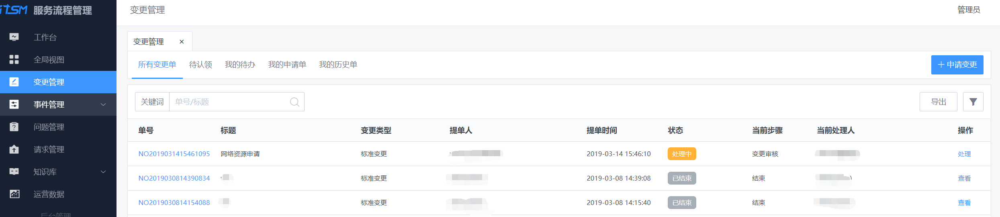

## 请求管理/变更管理/事件管理/问题管理（前台）

-   请求管理

    请求管理是指用户对 IT 部门施加的或提出的各种不同类型要求的一般描述。其中很多实际上是小量的变更或者日常服务，具有低风险，高频需求，低成本等特征。例如开通权限，资源申请，数据支持，安装软件，咨询服务等，将此类与其他标准化的服务类型区分开，可以得到更高效的处理。

-   变更管理

    变更是对 IT 生产环境中的软硬件及相关文档所作的增加、修改或移除。变更管理的目的在于管理和控制好变更（如变更的分类、审批、实施、回顾等），最小化变更所带来的风险。

-   事件管理

    事件，是指非计划有服务中断、服务质量的降低或尚未对客户服务造成影响的事情。事件管理中的“事件”是一个广义的概念，不是狭义的故障，它可能是软件、硬件问题，也可能是服务需求事件。

    事件管理的宗旨是尽快恢复故障或者排除告警，从而将对客户的服务损失降到最低，在此前提下尽可能满足服务的要求

-   问题管理

问题管理是指确定引起事件发生的真正潜在原因以及提供的服务中可能存在的故障。并根据发现的原因来决定消除根因的解决方案，直至完成解决。问题管理的目标是消除引起事件的深层次根源以防止事件再次发生。

### 应用逻辑

1.  管理员对服务项配置时，确定其所属“服务类型”。数据字典中，服务类型默认为请求，变更，事件，问题。服务项关联适合的流程版本。

2.  服务项配置完成后，根据其所属服务类型，更新到前台各服务入口的提单选项中。

变更申请提交入口

提单入口的服务选择

