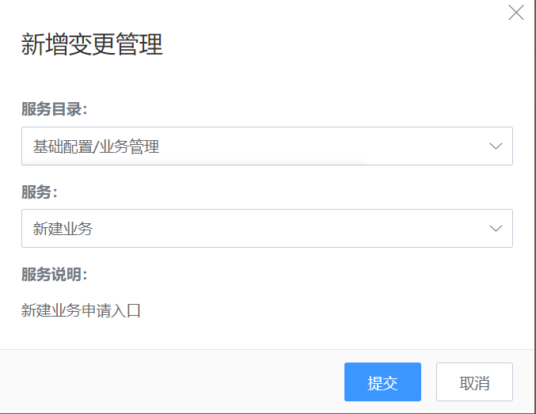

## 变更管理（前台）

首页\>变更管理

首页变更提单入口

### 申请变更

提交变更申请1

提交变更申请2

提交后，页面默认回到变更管理列表页。提交成功的单据会显示在列表中。

变更列表更新

在个人待办页中，会出现待办事项的更新提示。

### 处理变更

成功提交变更申请后，每个处理步骤的处理人会收到待办通知，其“我的待办”列表也会更新。处理人可以通过列表页的“处理”入口进入需求单的处理页面。

变更处理

单据信息-SLA计时信息

根据后台流程中设置的操作内容，以及当前用户的登录权限，单据处理页面会出现不同的操作按钮。

挂起：单据处理过程中遇到特殊情况暂时无法处理完成时，可以选择“挂起”。需要备注挂起原因。

恢复：指将“挂起”的单据重新恢复到正常流程流转中。

打印：指打印工单当前信息。

新建母子单：通过母子单的创建，将一些需要进行相同处理操作的同类单据（同类单据：同一服务同一流程版本下的单据）进行关联。一个母单可以关联多个子单，一个子单只能关联到一个母单。一旦关联，子单将冻结操作，子单的状态将全部跟随母单更新。

母子单关联页面

新建关联单：在处理单据过程中，如果衍生出其他的服务需求时，可以通过“新建关联单”来操作。将两个单据关联起来，关联后，两个单的处理流程依然独立进行不受影响，但可以在单据详情的“关联单“中查看单据信息。

新建关联单

关联单据查看

取消关联入口

撤销：当流程设计中开启了“撤销”，则操作下拉框中将出现“撤销”按钮。

关闭：在工单状态流转规则下，在工单可以关闭的情况下进行关单操作。关闭之后，单据流程终止。

关闭单据

### 查看变更

当变更单据处理完成，或者单据相关用户（如提单人）想查看变更单据详情以及，均可以通过变更列表的“查看”按钮进入详情页面。
