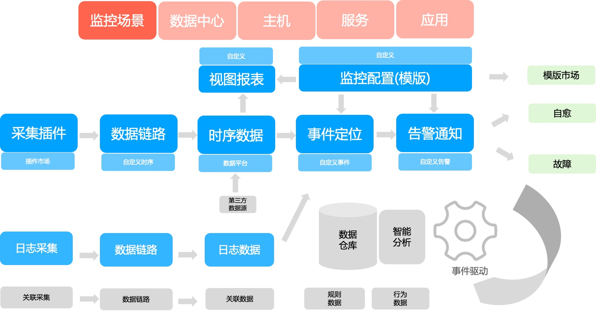

# 产品架构

监控平台致力于实现一站式监控平台，目标要做到**快**、**稳**、**准**、**全**。

* **快**： 数据上报快、数据处理快、问题定位快、故障处理快

* **准**： 问题定位准确、信息准确、智能决策

* **稳**： 告警及时、不漏告、不多告、海量数据处理能力

* **全**： 数据全、管理齐、生态闭环

## 架构图

要了解监控平台主要掌握三条主线：

* **第一条：数据处理主线**
    * 从`监控对象`通过多样的`数据采集`，不管是何种`数据来源`都将进入监控平台的`数据链路/存储`，对数据进行`异常检测`和`分析定位`，确定要如何进行`告警通知`，对于产生的告警有完整的`告警跟踪`和`生态闭环`，并且将最后的数据反馈给监控做为判断的依据

* **第二条：数据可视化**
    * 日常工作中通过 `pc/移动端`来使用各种`监控场景`来进行巡检，在发现问题的时候还可以通过各种`视图报表`来进行问题的综合定位，提供了各种数据可视化的工具

* **第三条：配置管理**
    * 便利的`采集管理`减少采集配置繁琐，配套齐全的`监控配置管理`和`平台系统管理`让管理工作更加的容易

## 监控平台能力

从下至上依次介绍：

* **管控平台**：蓝鲸 PaaS 的优势，可以满足不同的云区域的需求，满足文件、命令、数据的基本需求。并且整个监控平台也是建立在蓝鲸的 PaaS 平台之上
* **依赖服务**：是在蓝鲸工作的过程中需要依赖的蓝鲸 SaaS。分为强依赖缺一不可，增强型有配套功能会更加的强大
* **监控服务层**：监控的核心服务能力，每个服务都可以独立配置和复用，满足上层监控场景和需求的复杂需求。每块能力都是可以不断的补充
* **监控场景**：针对不同的监控场景有更加专业的场景来满足用户的问题定位。当前主要是主机监控和服务拨测
* **用户层**：用户可以直接接触到监控的一些途径

## 产品演变

当前监控平台产品还在不断的演变过程中， 当前重点在`蓝色`的部分监控最核心的能力和`绿色`部分生态的建设。

当前已经有`主机监控`和`服务拨测`两个场景，对于其他监控场景的扩展还在不断的完善中，在这个监控平台的能力之上完全可以通过合作的方式来完成。

`灰色`的部分依据上层的需求场景不断的完善，并建立一套以`事件`为驱动的智能监控体系。

