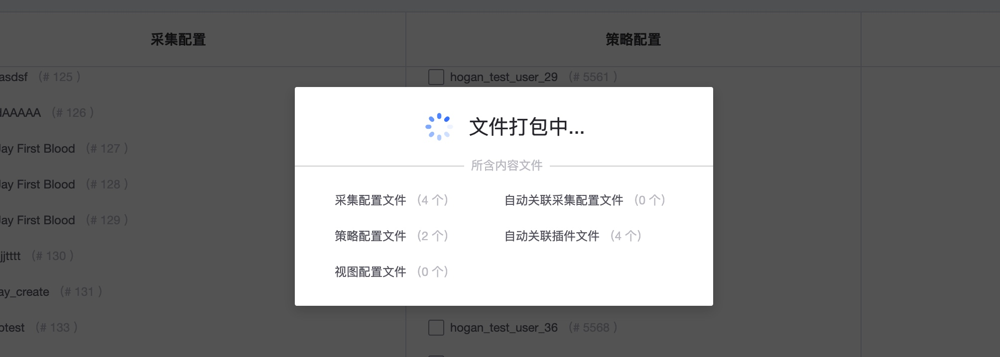

# 导入导出

导入导出指提批量的导入和导出功能，可以将采集配置(及关联的插件)，策略配置，视图配置一起导出也可以一起导入。

## 前置步骤

**导航路径**：导航  →  监控配置  →  导入导出

## 主功能一览

* 导出功能
* 导入
* 导入历史

## 功能说明

### 导出

可以按搜索，CMDB 节点，服务分类，数据对象进行检索卖出。

可以将强关联的插件和配置进行一起导出。

### 导入

将批量导出的内容可以直接导入到另外一个业务，或者另外一个监控平台上面。 结合模版功能就会方便的共享监控的配置内容。

> **警告：**导入后，如果是相同的监控目标，强烈建议这个时候设置统一的监控目标，当前不进行统一设置，导入后的配置需要逐一进行设置。而且建议导出的也是相同监控目标的这样好管理。

如果导入的内容太多，可能会占用比较久的时候，如果中途离开没有完成，还可以查看导入历史。

> **注意**：导入历史默认只会保留近 30 天的数据，30 天后将清理记录和导入的数据。

