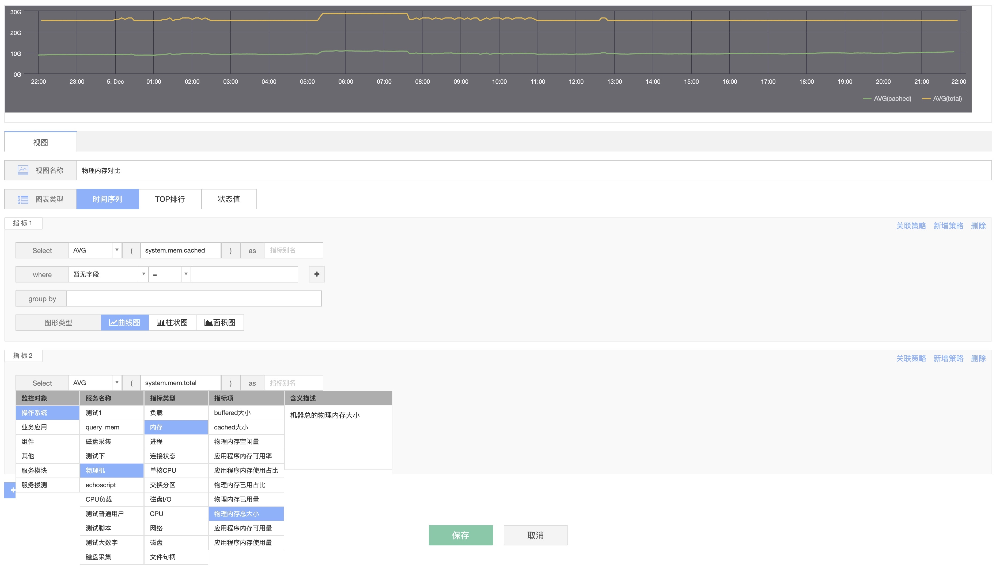

# 仪表盘

通过指标生成视图，具有丰富的图表图力，通过 曲线/TopN/状态 等多种类型方式呈现多元化的数据趋势，从而自定义制作属于自己的大屏视图面板，直观的查看各种数据指标，帮助用户日常巡检或者快速定位问题.

## 前置步骤

在还未使用监控的功能，或者在 CMDB 未导入任何主机的情况下.首页的数据都是空的或者是样例数据.

仪表盘当前只支持时序数据画图. [什么是时序数据](../../concepts/glossary.md)

**使用场景**：

1. 固定图表的收藏巡检.查看趋势，指标对比，状态值等.
2. 验证不同的来源数据.如新增加的指标是否有数据，计算平台的数据是否有数据，自定义上报的否有数据等.
3. 验证数据的正确性.

**主配置流程**：

* (1) 选择仪表盘名称
* (2) 新建视图
* (3) 选择指标
* (4) 选择图形
* (5) 保存并调整视图位置

## 功能说明

* 标号 1) 创建多个 Dashboard 满足不同场景需求.
* 标号 2) 时间选择，区间或者最近时间段，自动刷新和全屏等功能.
* 标号 3) 新建视图，增加一个新的视图
* 可以调整视图大小，调整顺序

仪表盘(Dashboard)

* 可以进行多指标对比，支持按维度和条件进行画图
* **图表支持**： 时序序列，TOP 排行，状态值
* **图形样式**： 曲线图，柱状图，面积图
* **支持汇聚方法**： AVG ， SUM ， MAX，MIN ，COUNT
* **监控周期**：1 分钟，2 分钟，5 分钟
* **指标选择器**：支持来自监控采集，日志采集，计算平台的时序数据。

> 注意： 通过仪表盘可以快捷到策略进行添加配置，但不会进行强关联.意思是建立的策略不会受各自的变化和影响.

* **标记功能**： 如警戒线的标识，更容易识别是否达到危险.

