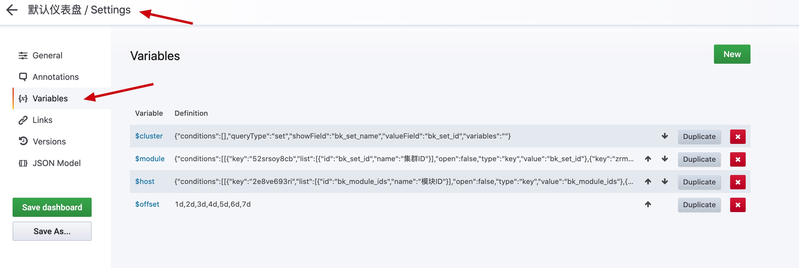

# 新仪表盘

新仪表盘非常的灵活，意味着也有很多实用的功能，接下来一一介绍这些功能。

### 新建视图和分组

1. 新建视图，可以先选数据也可以先选图
2. 如果想实现分组，使用 Convert to row 就可以实现类似的分组功能

### 视图种类

### Query 数据面板说明

* 监控对象：数据的分类，当找不到你的数据时可能是监控对象选错了
* 指标选择：选择正确的指标
* 汇聚方法：当一个汇聚周期内有多个数据点时，这个时候要注意选择汇聚方法。当采集的数据是 1 分钟，汇聚周期也是 1 分钟时，并且数据点也只有一个，那么汇聚方法不论是 SUM MAX MIN 其实都是一样的
* 维度：类似 Group by 
* 条件：类似 Where 用于过滤数据
* 目标选择：是快捷的 IP/实例选择方法
* 功能：里面包含 排序(top bottom)，还有时间偏移用于时间对比数据
* 别名：一般默认的示例名称都很长，那么就可以好好利用别名功能让图表更好看

### 别名功能

别名语法：以`$`开头，`$表头_字段名`

比如：指标 id. 表头为`metric` ， 字段名为`id` . 所以整个变量为： `$metric_id` 如果是要显示指标名就是. `$metric_name`

比如：维度名 . 表头为`tag`，字段名为`device_name`，所以整个变量为：`$tag_device_name` 。

### TOP 或 Bottom 功能

使用功能里面有 TOP 和 Bottom 设置一个 limit 的数字就可以实现 TOP 的数据查询。

### 时间对比

与过去某天数据对比，就可以使用时间偏移功能。

时间格式：

| key  | shorthand | 
|---|---|
| years | y | 
| quarters | Q| 
| months | M | 
| weeks | w | 
| days | d  | 
| hours | h | 
| minutes | m | 
| seconds | s | 

如：`1d 1day 1days`

### 变量功能

在仪表盘的设置里面有一个变量功能，设置了变量再配合查询的条件就可以实例变量的联动效果。接下来配置一个集群模块对应的主机查询为例。

#### 配置集群和模块的联动变量

先配置集群`cluster`。

再配置模块`module`，模块里面的查询条件以集群 ID 做为条件。

#### 配置主机

设置变量`host`。

可以开启多主机选择和 all 条件 

就可以看到如下的效果。

#### 配置查询条件关联

在条件里面使用 host 变量，就可以达到联动查询的效果

### 数据下钻

如该图配置了数据下钻，点击了该 IP 通过“主机详情”就可以跳转到主机监控对应的页面。

配置方法：在视图配置里面，使用`Add link`功能，在 URL 里面使用相关变量

