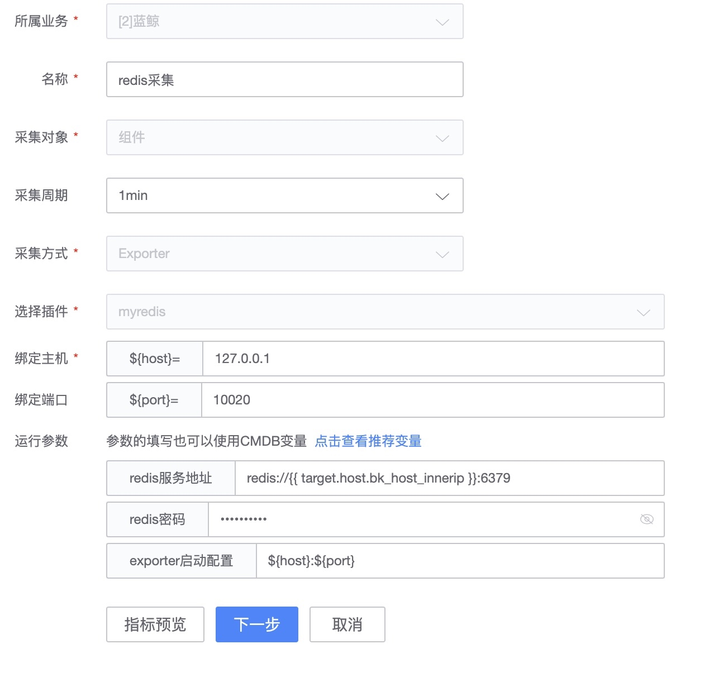
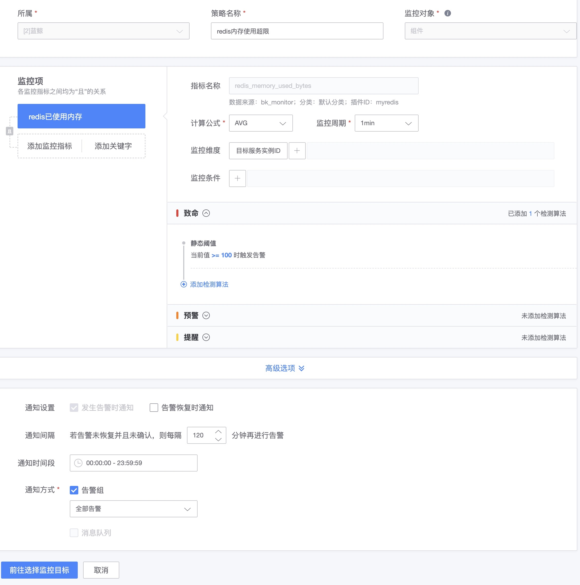

# 如何在线制作 Exporter 插件

监控平台兼容 [Prometheus Exporter](https://prometheus.io/docs/instrumenting/exporters/)的导入能力，从 Github 获取源码编译二进制或直接获取 release，按照监控平台的插件规范，可以让监控采集变得非常的简单。

## 环境准备

1. Golang 编译环境
2. 找到开源的 Exporter [Exporter 列表](https://prometheus.io/docs/instrumenting/exporters/)

> 以下内容以 redis_exporter 为例， [redis_exporter](https://github.com/oliver006/redis_exporter)

## 编辑 Exporter

3. 按 readme 进行编译。

```bash
$ go get github.com/oliver006/redis_exporter
$ cd $GOPATH/src/github.com/oliver006/redis_exporter
$ go build
$ ./redis_exporter <flags>
```

## 定义监控平台插件

4. 新增插件填写相关信息并且上传编译好的二进制程序。


5. 查看命令行参数，选择常用的参数并且设置

    * 查看参数内容`redis-exporter -h`

    

    * 设置参数

    

    * 1) 绑定端口：指的是插件运行的默认端口，如果默认端口被占用会自动自增一个可用的端口
    * 2) 绑定主机：默认是 127.0.0.1 ， 暂不支持其他，主要提供给

    > 注意：这里不是 redis 服务的端口，而是 Exporter 运行的端口。绑定的主机也是 Exporter 运行的主机。

    > `${port}`和`${host}` 是内置的两个变量为了让 `bkmonitorbeat` 知道监听的端口和位置。

    * 3) 定义需要的参数

        * 必要参数：为了让 `bkmonitorbeat` 可以发现 Exporter 需要使用 `${port}`和`${host}`

        

        * 常用参数：指定服务的地址 如 redis

        

        * 常用参数：redis 服务连接的方式需要密码时

        

6. 查看采集的指标，并进行设置

查看指标的方法：

1\) readme 文件

2\) 本地启动 Exporter 命令行 `curl http://127.0.0.1:9121/metrics`


7. 补充其他信息 LOGO 说明


### 插件调试和验证

8. 下一步进入调试


### 插件采集数据

9. 开始正式采集



> **注意**：因为 redis 是绑定在内网 IP 上面，所以需要使用 CMDB 变量参数来解决采集。`redis://{{target.host.bk_host_innerip}}:6379`

10. 查看**检查视图**来确认数据是否已经上报.


> **注意**：因为数据采集有一定的周期性，至少等待两分钟才可以看到相应的数据点。

### 策略配置和视图配置

11. 配置策略



12. 查看**告警事件**


13. 在仪表盘中添加视图

### 插件导出并分享

制作好的插件还可以导出给其他人或者其他业务使用。如果是管理员还可以将插件共享给整个平台使用。


