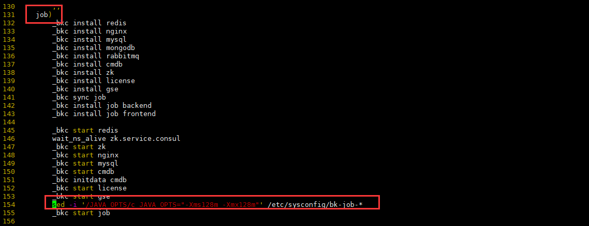

# 基础套餐单机部署

## 环境准备

- 准备一台 CentOS 7.6 及以上操作系统的机器 (物理机和虚拟机均可)。

- 按照安装 [环境准备](../../基础包安装/环境准备/get_ready.md) 章节中，主机和系统环境的要求做好相应设置。

- 配置好 YUM 源，包含 EPEL 仓库(可以通过 `yum info pssh` 测试下)。

- 从 [官网下载](http://bk.tencent.com/download/) 基础套餐，并解压到 /data/ 下。实际版本请以蓝鲸官网下载为准。

    ```bash
    tar xf bkce_basic_suite-6.0.3.tgz -C /data
    ```

  - 获取机器的 MAC 地址后，下载 [证书文件](https://bk.tencent.com/download_ssl/)，解压到 src/cert 目录下

    ```bash
    install -d -m 755 /data/src/cert
    tar xf ssl_certificates.tar.gz -C /data/src/cert
    ```

  - 解压各个产品软件包

    ```bash
    cd /data/src/; for f in *gz;do tar xf $f; done
    ``` 

  - 拷贝 rpm 软件包

    ```bash
    cp -a /data/src/yum /opt
    ```

- 修改 bk_install 脚本

```bash
# 在 job 处添加以下内容
vim bk_install
sed -i '/JAVA_OPTS/c JAVA_OPTS="-Xms128m -Xmx128m"' /etc/sysconfig/bk-job-*
```



- install.config 这个文件安装脚本会自动生成，无需自行配置。

## 执行安装

如果部署全部组件，请执行：

```bash
cd /data/install
./install_minibk -y
```

安装过程中遇到失败的情况，请先定位排查解决后，再重新运行失败时的安装指令。

执行完部署后，执行降低内存消耗脚本。以确保环境的稳定

```bash
# 临时修复：执行 tweak 操作后 open_paas uWsgi 参数中 cheaper > workers 的问题
# 感谢[广州六子](https://bk.tencent.com/s-mart/personal/1283/)的反馈
sed -i '/^cheaper/d' /data/bkce/etc/uwsgi-*.ini 

# 执行降低内存消耗脚本
bash bin/single_host_low_memory_config.sh tweak all
```

## 访问蓝鲸

根据 `install/bin/04-final/global.env`、`install/bin/04-final/usermgr.env` 里配置的 PaaS 域名(BK_PAAS_PUBLIC_ADDR)、账号 (BK_PAAS_ADMIN_USERNAME)、密码(BK_PAAS_ADMIN_PASSWORD)信息，登录访问(若域名没设置 DNS 解析，需配置本机 hosts)。

- 域名信息

  ```bash
  # 蓝鲸的根域名
  BK_DOMAIN=bktencent.com
  # 访问PaaS平台的域名
  BK_PAAS_PUBLIC_ADDR=paas.bktencent.com:80
  # 访问CMDB的域名
  BK_CMDB_PUBLIC_ADDR=cmdb.bktencent.com:80
  # 访问Job平台的域名
  BK_JOB_PUBLIC_ADDR=job.bktencent.com:80
  BK_JOB_API_PUBLIC_ADDR=jobapi.bktencent.com:80
  # 访问节点管理下载插件包的URL
  BK_NODEMAN_PUBLIC_DOWNLOAD_URL=nodeman.bktencent.com:80
  ```

- 账号信息

  ```bash
  BK_PAAS_ADMIN_PASSWORD=xxxxx
  BK_PAAS_ADMIN_USERNAME=admin
  ```

日常维护和运维，单机部署和多机是一致的，请参考 [维护文档](../../维护手册/日常维护/maintain.md)。

## 使用蓝鲸

可参考蓝鲸 [快速入门](../../../../快速入门/quick-start-v6.0-info.md) 以及相关 [产品白皮书](https://bk.tencent.com/docs/)