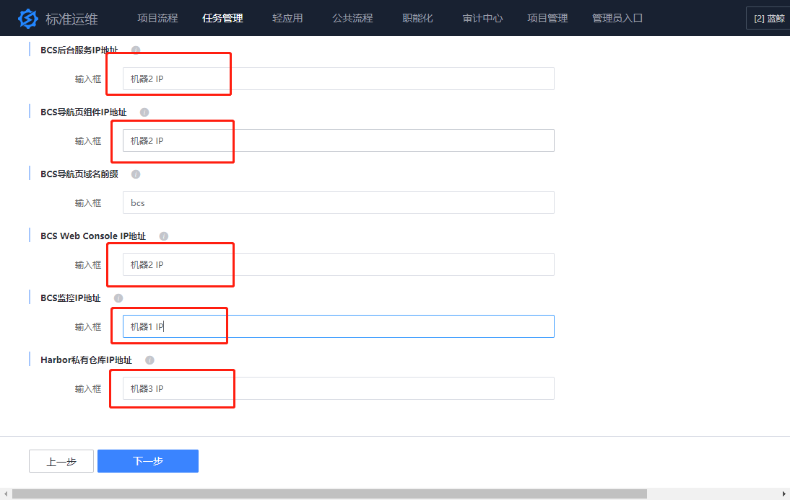

## 一、容器管理平台（BCS）安装环境准备

### 服务器资源准备

   1. #### 建议操作系统： CentOS 7.6
   
   2. #### 服务器网络要与安装蓝鲸社区版基础包的服务器相通，在配置平台中需放在同一业务下
   
   3. #### 容器管理平台服务器不能与 K8S 集群服务器、蓝鲸基础服务服务器共用，需要独立申请，否则会导致端口冲突等环境问题
   
   4. #### K8S 集群服务器不能与容器管理平台服务器、蓝鲸基础服务服务器共用，需要独立申请，否则会导致端口冲突等环境问题
   
   5. #### Harbor 私有仓库 IP 地址、BCS 导航页组件 IP 地址与 BCS 监控 IP 地址都会占用 TCP 80 端口，需要部署在 3 台不同的服务器上以免端口冲突

   6. #### 容器管理平台服务器配置与所需数量
       ##### 体验环境（共 3 台）
       - MYSQL 数据库、MongoDB 数据库、Redis 数据库、Harbor 私有仓库（客户端浏览器可访问的 IP），最低使用 4 核 CPU|8G 内存|200G 磁盘（1 台）

       - BCS 后台服务、BCS 导航页（客户端浏览器可访问的 IP）、web_console 服务，最低使用 4 核 CPU|8G 内存|100G 磁盘（1 台）

       - 容器监控服务，最低使用 4 核 CPU|4G 内存|100G 磁盘（1 台）
  
       ##### 生产环境（共 10 台）
       - MYSQL 数据库，最低使用 4 核 CPU|8G 内存|200G 磁盘（1 台，如果已有 MYSQL 实例无需准备服务器）

       - MongoDB 数据库，最低使用 4 核 CPU|8G 内存|200G 磁盘（1 台，如果已有 MongoDB 实例无需准备服务器）

       - Redis 数据库，最低使用 4 核 CPU|4G 内存|50G 磁盘（1 台，如果已有 Redis 实例无需准备服务器）

       - Harbor 私有仓库（客户端浏览器可访问的 IP），最低使用 4 核 CPU|4G 内存|300G 磁盘（1 台）

       - 容器管理平台后台服务，最低使用 4 核 CPU|8G 内存|100G 磁盘（3 台，做高可用）

       - BCS 导航页（客户端浏览器可访问的 IP）、web_console 服务可以部署在同一台服务器，最低使用 4 核 CPU|4G 内存|50G 磁盘（2 台，做高可用）

       - 容器监控服务，最低使用 4 核 CPU|8G 内存|200G 磁盘（1 台）
   
   7. #### K8S 集群服务器配置与数量
       ##### 体验集群（最少 2 台）
       - master 节点，最低使用 4 核 CPU|8G 内存|100G 磁盘（1 台）

       - node 节点，最低使用 4 核 CPU|8G 内存|100G 磁盘（按需申请）
       ##### 生产集群（最少 4 台）
       - master 节点，最低使用 8 核 CPU|16G 内存|200G 磁盘（3 台，做高可用）

       - node 节点，最低使用 8 核 CPU|16G 内存|200G 磁盘（按需申请）

### 基础环境依赖
社区版 V6.0+以上的基础包软件，必须包含 4 个基础平台和 4 个基础 SaaS：
1. **基础平台**
   - 管控平台
   - 配置平台
   - 作业平台
   - PaaS 平台
2. **基础 SaaS**
   - 用户管理
   - 权限中心
   - 节点管理
   - 标准运维

### 使用节点管理 SaaS 导入服务器信息到配置平台与安装 GSEAgent

- 节点管理使用方法请参考文档：[https://bk.tencent.com/docs/markdown/节点管理/产品白皮书/Introduce/Overview.md](https://bk.tencent.com/docs/markdown/节点管理/产品白皮书/Introduce/Overview.md)
- 容器管理平台后台、K8S 集群服务器都需要导入服务器信息到配置平台与安装 GSEAgent，请把容器管理平台后台、K8S 集群服务器与安装蓝鲸社区版基础包的服务器放在同一业务下

### 下载、解压安装包

- 下载安装包到社区版基础服务安装的中控机，因为容器管理平台安装包较大，请在相应分区至少保留 20G 的剩余空间（注：本文档以/data 目录为例，如果放到其他目录，请自行修改相关命令涉及到的路径）

   容器管理平台扩展软件包：bcs_ce-6.0.3.tgz

   **下载完成后，请核对 MD5 码。**

- 解压容器管理平台扩展软件包

   ```bash
   tar xvf bcs_ce-6.0.3.tgz -C /data/
   ```

## 二、容器管理平台（BCS）开始部署

### 部署方案说明
   容器管理平台部署全新采用标准运维模版部署，与传统部署方案相比具备页面可视化效果，可以使用作业平台的脚本执行功能与文件传输功能，操作简单方便，只需完成以下几个步骤即可完成部署：
   
   - 下载部署容器管理平台标准运维模版
   - 导入标准运维模版
   - 新建标准运维部署任务
   - 标准运维参数填写
   - 执行标准运维部署任务
   - 容器管理平台部署完成

### 标准运维模版说明
| 标准运维模版名称 | 标准运维模版说明 |
| ---- | ---- |
| [BlueKing][BCS][Basic] Environment Deployment | 容器管理平台部署作业模版，用于部署容器管理平台组件，用户手工通过模版新建任务完成部署工作 |
| [BlueKing][BCS][K8S] Create Master | 容器管理平台 SaaS 调用此模版创建 K8S 集群，此模版请勿手工执行、修改、删除 |
| [BlueKing][BCS][K8S] Remove Master | 容器管理平台 SaaS 调用此模版删除 K8S 集群，此模版请勿手工执行、修改、删除 |
| [BlueKing][BCS][K8S] Add Node | 容器管理平台 SaaS 调用此模版添加 K8S 节点，此模版请勿手工执行、修改、删除 |
| [BlueKing][BCS][K8S] Delete Node | 容器管理平台 SaaS 调用此模版删除 K8S 节点，此模版请勿手工执行、修改、删除 |


### 部署详细步骤
1. 下载标准运维模版文件 bk_sops_common_ce_2020_11_16_03.dat
2. 打开标准运维--->公共流程--->导入--->点击上传--->选择文件 bk_sops_common_ce_2020_11_16_03.dat--->流程 ID 不变提交（因为 bcs-ops 模块需要关联标准运维模版流程 ID，如果流程 ID 有冲突请参考第六部分 FAQ 的第 2 小点解决）
   
   
   
   
3. 打开标准运维--->公共流程--->[BlueKing][BCS][Basic] Environment Deployment--->新建任务
   
4. 选择 容器管理平台后台服务器所在业务
   
5. 节点选择，不用修改，直接进入下一步
   
6. 参数填写

   
   - **安装包与安装脚本存放路径**：社区版安装包（src 目录）、安装脚本存放路径（install 目录）和安装后文件存放路径（bkce），默认为/data，建议选择一个大一点的数据分区挂载路径
   - **中控机 IP 地址**：社区版基础服务安装的中控机 IP 地址，用于在此服务器上获取一些容器管理平台依赖的其它服务变量
   - **是否新建 MySQL 实例**：如果没有 MySQL 实例，这里不用修改，默认为 1，安装步骤会创建一个新的 MySQL 实例；如果已有 MySQL 实例这里修改为 0，安装步骤将会使用已有 MySQL 实例，不会安装新的 MySQL 实例
   - **MySQL IP 地址**：需安装或可连接的 MySQL 实例 IP 地址或域名，目前只支持单个 IP，如果已有实例是多节点，可以使用域名实现高可用；注意：如果“是否新建 MySQL 实例”值为 1 时，需要指定一台没有部署过 MySQL 实例的服务器上，防止 MySQL 端口冲突
   - **MySQL 端口**：MySQL 实例监听端口，默认为 3306，可根据实际情况自行修改
   - **MySQL 用户名**：MySQL 用户名，默认为 root，如需新建实例，这里会把实例设置成此用户名；如果是连接已有实例，请输入对应实例的用户名
   - **MySQL 密码**：MySQL 密码，如需新建实例，这里会把实例设置成此密码；如果是连接已有实例，请输入对应实例的密码
   - **是否新建 Redis 实例**：如果没有 Redis 实例，这里不用修改，默认为 1，安装步骤会创建一个新的 Redis 实例；如果已有 Redis 实例这里修改为 0，安装步骤将会使用已有 Redis 实例，不会安装新的 Redis 实例
   - **Redis IP 地址**：需安装或可连接的 Redis 实例 IP 地址或域名，目前只支持单个 IP，如果已有实例是多节点，可以使用域名实现高可用；注意：如果“是否新建 Redis 实例”值为 1 时，需要指定一台没有部署过 Redis 实例的服务器上，防止 redis 端口冲突
   - **Redis 端口**：Redis 实例监听端口，默认为 6379，可根据实际情况自行修改
   - **Redis 密码**：Redis 密码，如需新建实例，这里会把实例设置成此密码；如果是连接已有实例，请输入对应实例的密码
   - **是否新建 MongoDB 实例**：是否新建 MongoDB 实例：如果没有 MongoDB 实例，这里不用修改，默认为 1，安装步骤会创建一个新的 MongoDB 实例；如果已有 MongoDB 实例这里修改为 0，安装步骤将会使用已有 MongoDB 实例，不会安装新的 mongodb 实例；MongoDB 必须使用 2.4.x，使用高版本可能会存在兼容性问题，MongoDB 性能消耗较大，建议使用单独的服务器部署
   - **MongoDB IP 地址**：需安装或可连接的 MongoDB 实例 IP 地址或域名，目前只支持单个 IP，如果已有实例是多节点，可以使用域名实现高可用；注意：如果“是否新建 MongoDB 实例”值为 1 时，需要指定一台没有部署过 MongoDB 实例的服务器上，防止 MongoDB 端口冲突
   - **MongoDB 端口**：MongoDB 实例监听端口，默认为 27017，可根据实际情况自行修改
   - **MongoDB 用户名**：MongoDB 用户名，默认为 root，如需新建实例，这里会把实例设置成此用户名；如果是连接已有实例，请输入对应实例的用户名
   - **MongoDB 密码**：MongoDB 密码，如需新建实例，这里会把实例设置成此密码；如果是连接已有实例，请输入对应实例的密码
   - **BCS 后台服务 IP 地址**：容器管理平台后台服务部署的 IP 地址，容器管理平台后台服务包括 bcs-api、bcs-dns-service、bcs-storage、bcs-cc，同时还会部署容器管理平台后台服务所依赖的 etcd 与 zookeeper 服务，体验环境使用 1 台服务器即可，生产环境建议用 3 台服务器做高可用，多个 IP 使用半角逗号分隔
   - **BCS 导航页组件 IP 地址**：部署项目信息管理服务 IP 地址，负责项目创建及基本信息管理，生产环境建议用 2 台服务器做高可用，多个 IP 使用半角逗号分隔，此 IP 需要在客户端浏览器可访问
   - **BCS 导航页域名前缀**：容器管理平台 SaaS 的访问地址，默认为 bcs，例如基础平台使用 bktencent.com 的域名作为基础域名，那容器管理平台 SaaS 的访问地址为：http://bcs.bktencent.com
   - **Web Console IP 地址**：部署在提供 kubectl 命令行工具 IP 地址，可以使用 web 页面快捷查看集群内资源，生产环境建议用 2 台服务器做高可用，多个 IP 使用半角逗号分隔
   - **BCS 监控 IP 地址**：部署容器监控服务的 IP 地址，目前只支持单个 IP
   - **Harbor 私有仓库 IP 地址**：部署私有镜像仓库的 IP 地址，使用 Harbor 提供私有仓库服务，如果需要存放的镜像较多，需要部署在磁盘空间稍大的服务器上，目前只支持部署 1 台服务器；此 IP 需要在客户端浏览器可访问，访问 Harbor 页面管理方式为http://{外网 IP}，管理员用户名默认为：admin，密码为：Harbor12345
   
7. 执行部署作业，执行作业过程中没有出现错误即部署正常，否则需要根据 job 执行错误信息解决问题
   
### 添加 hosts 解析或域名解析
   ```bash
   # Linux、Mac：/etc/hosts，Windows：C:\Windows\System32\drivers\etc\hosts
   # BCS导航页组件IP地址（客户端浏览器可访问的地址） BCS导航页域名（BCS导航页域名前缀.蓝鲸基础域名） BCS导航页API域名（api-BCS导航页域名前缀.蓝鲸基础域名）
   # 例如：
   110.111.112.113 bcs.bktencent.com api-bcs.bktencent.com
   ```
### 访问容器管理平台 SaaS
   刷新蓝鲸工作台，会出现一个容器管理平台的 SaaS，点击图标会跳转到蓝鲸容器管理平台的 console 页面，也可以直接访问 URL http://bcs.bktencent.com 来访问容器管理平台，如果无法访问时，可能是 hosts 域名解析没有生效，可以关闭浏览器后重试。

### 容器管理平台部署完毕
完成以上步骤容器管理平台就已经部署完毕，以下内容（第三至六部分）可以帮助用户更全面的了解容器管理平台的内容和后期维护。

## 三、容器管理平台帮助文档与术语解释
### 帮助文档
[https://bk.tencent.com/docs/document/6.0/144/6523](https://bk.tencent.com/docs/document/6.0/144/6523)

### 术语解释
了解蓝鲸容器服务，会涉及到以下基本概念：

- **容器编排引擎**：用于容器化应用的自动化部署、扩展和管理的工具或平台，目前行业主流的引擎有 K8S 、Mesos。

- **集群**：是指容器运行所需要的物理机或虚拟机资源的集合，可以选择集群-的模式是 Kubernetes（简称 K8S） 或者 Mesos。

- **节点**：一台已经注册到集群中的服务器，为集群提供计算资源。

- **应用**：由一组容器及服务构成集合，这个集合可以代表一个业务，或者业务的某个大区，在 K8S 中应用由 K8S 的工作负载（Workload）、服务（Service、Ingress）构成一个整体对外提供服务。
模板集：配置文件模板的集合，简化服务管理的复杂度，可以实现部署、升级应用。

- **网络**：主要包含 服务 和 负载均衡器 的定义和管理，服务是由多个相同配置的容器和访问这些容器的规则组成的微服务，负载均衡器定义了访问规则的具体实现。

- **资源**：资源中可以定义业务配置项，通过配置模板中关联这些业务配置项，可以实现对容器中业务进程使用配置的个性化管理。
仓库：用户存放 Docker 镜像、Helm Charts。

## 四、容器管理平台服务简介
### 服务管理方式
容器管理平台使用 systemd 组件托管，具备以下特性与操作：

1. 服务器重启或进程异常 crash 后会自动拉起
2. 服务启动命令：systemctl start <service_name>
3. 查看服务状态：systemctl status <service_name>
4. 查看服务配置：systemctl cat <service_name>
5. 服务停止命令：systemctl stop <service_name>
6. 服务重启命令：systemctl restart <service_name>

### 服务简介与部署路径

#### 存储组件
1. ##### MYSQL
- 组件简介：为 bcs-api、bcs-cc、web_console、容器管理平台 SaaS、容器监控提供数据存储服务
- 服务名称：mysql@bcs
- BIN 文件：/sbin/mysqld
- 配置文件：/etc/mysql/bcs.my.cnf
- 部署路径：rpm -ql mysql-community-server
- 日志路径：/data/bkce/logs/mysql/bcs.mysqld.log
2. ##### Redis
- 组件简介：bcs-cc、web_console、容器管理平台 SaaS、容器监控提供数据缓存服务
- 服务名称：redis@bcs
- 部署路径：rpm -ql redis
- BIN 文件：/usr/bin/redis-server
- 配置文件：service 参数
- 日志路径：/var/log/redis/bcs.log
3. ##### MongoDB
- 组件简介：为 bcs-storage 提供数据存储服务
- 服务名称：mongod
- 部署路径：/usr/bin
- BIN 文件：/usr/bin/mongod
- 配置文件：/etc/mongod.conf
- 日志路径：/data/bkce/logs/mongodb/mongod.log
4. ##### Harbor
- 组件简介：Harbor 是 Vmware 公司开源的企业级 Docker Registry 管理项目，为 K8S 集群提供镜像仓库功能
- 服务名称：/data/bkce/harbor/server/start.sh、/data/bkce/harbor/server/stop.sh
- 部署路径：/data/bkce/harbor/server
- BIN 文件：docker 容器
- 配置文件：docker 容器
- 日志路径：docker 容器
5. ##### Etcd
- 组件简介：为 bcs-dns-service、K8S 集群提供数据存储服务
- 服务名称：etcd
- 部署路径：/usr/local/bin
- BIN 文件：/usr/local/bin/etcd
- 配置文件：service 参数
- 日志路径：/var/log/messages
6. ##### Zookpeer
- 组件简介：为 bcs-api、bcs-storage、bcs-cc 提供服务发现服务
- 服务名称：zookeeper
- 部署路径：rpm -ql zookeeper
- BIN 文件：/usr/bin/java
- 配置文件：/etc/zookeeper/zoo.cfg
- 日志路径：/var/log/zookeeper/zookeeper.log

#### 容器管理平台组件
1. ##### BCS API
- 组件简介：bcs-api 是容器管理平台对外提供服务的 API 接入层，负责将用户请求转发至对应的 kubernetes 集群中，兼容 kube-apiserver 的接口，同时打通了 kubernetes 的 rbac 体系
- 服务名称：bcs-api
- 部署路径：/data/bkce/bcs/bcs-api
- BIN 文件：/data/bkce/bcs/bcs-api/bcs-api
- 配置文件：/data/bkce/etc/bcs/bcs-api.json
- 日志路径：/data/bkce/logs/bcs/bcs-api.[INFO|WARNING|ERROR]
2. ##### BCS DNS Service
- 组件简介：bcs-dns-service 是容器管理平台系统中为集群提供域名解析服务的组件，同时支持集群内部和跨集群的 service 域名解析，并提供自定义域接口
- 服务名称：bcs-dns-service
- 部署路径：/data/bkce/bcs/bcs-dns-service
- BIN 文件：/data/bkce/bcs/bcs-dns-service/bcs-dns-service
- 配置文件：/data/bkce/etc/bcs/bcs-dns-service.json
- 日志路径：/data/bkce/logs/bcs/bcs-dns-service.[INFO|WARNING|ERROR]
3. ##### BCS Storage
- 组件简介：bcs-storage 是容器管理平台系统的动态数据管理组件，负责存储和汇聚容器管理平台系统中所有 kubernetes 集群上报的资源动态数据，对外提供统一的数据查询和事件订阅接口
- 服务名称：bcs-storage
- 部署路径：/data/bkce/bcs/bcs-storage
- BIN 文件：/data/bkce/bcs/bcs-storage/bcs-storage
- 配置文件：/data/bkce/etc/bcs/bcs-storage.json
- 日志路径：/data/bkce/logs/bcs/bcs-storage.[INFO|WARNING|ERROR]
4. ##### BCS OPS
- 组件简介：bcs-ops 为容器管理平台的创建集群、添加节点、删除节点、删除集群、导入集群等功能提供接口
- 服务名称：bcs-ops
- BIN 文件：/data/bkce/bcs/bcs-ops/bcs-ops
- 配置文件：/data/bkce/etc/bcs/bcs-ops.json
- 部署路径：/data/bkce/bcs/bcs-ops
- 日志路径：/data/bkce/logs/bcs/bcs-ops.[INFO|WARNING|ERROR]
5. ##### BCS CC
- 组件简介：容器管理平台配置中心是容器集群及节点等的配置中心，具备保存项目信息及绑定的蓝鲸 CMDB 业务信息、集群版本信息及集群快照信息、生成集群 ID，保存 master 及 node IP 信息及状态等功能
- 服务名称：bcs-cc
- 部署路径：/data/bkce/bcs/cc
- BIN 文件：/data/bkce/bcs/cc/bin/bcs_cc
- 配置文件：/data/bkce/etc/bcs/cc.yml
- 日志路径：/var/log/messages
6. ##### WebConsole
- 组件简介：提供 kubectl 命令行工具，可以快捷查看集群内资源
- 服务名称：bcs-web-console
- 部署路径：/data/bkce/bcs/web_console
- BIN 文件：/data/bkce/.envs/bcs-web_console/bin/python
- 配置文件：参数-m backend.web_console
- 日志路径：/var/log/messages
7. ##### BCS 导航页
- 组件简介：项目信息管理服务，负责项目创建及基本信息管理
- 服务名称：devops
- 部署路径：/data/bkce/devops
- BIN 文件：/usr/local/openresty/nginx/sbin/nginx
- 配置文件： /usr/local/openresty/nginx/conf/nginx.conf
- 日志路径：/data/bkce/logs/nginx
8. ##### Harbor API
- 组件简介：封装了部分 harbor 接口，提供给容器服务 SaaS 访问镜像资源
- 服务名称：harbor_api
- 部署路径：/data/bkce/harbor/api
- BIN 文件：/opt/java/bin/java
- 配置文件：/data/bkce/harbor/api/conf/application.yml
- 日志路径：/data/bkce/logs/harbor/harbor_api.log

#### 容器监控
1. ##### BCS Thanos Query
- 组件简介：thanos API 查询模块，提供统一的兼容 PromQL 的查询层，支持跨集群，不存储类型异构查询等
- 服务名称：bcs-thanos-query
- 部署路径：/data/bcs/monitoring/bcs-thanos
- BIN 文件：/data/bcs/monitoring/bcs-thanos/thanos
- 配置文件：/data/bcs/monitoring/bcs-thanos/bcs-thanos-query.yml
- 日志路径：/var/log/messages
2. ##### BCS Thanos Relay
- 组件简介：thanos 跨云代理模块, 可通过 websocket 隧道，打通不同网络的 prometheus 服务注册和代理请求
- 服务名称：bcs-thanos-relay
- 部署路径：/data/bcs/monitoring/bcs-thanos
- BIN 文件：/data/bcs/monitoring/bcs-thanos/thanos
- 配置文件：service 参数
- 日志路径：/var/log/messages
3. ##### BCS Thanos SD SVC
- 组件简介：thanos 服务注册中心，提供 thanos-sidecar, thanos-relay 注册自身的地址
- 服务名称：bcs-thanos-sd-svc
- 部署路径：/data/bcs/monitoring/bcs-thanos
- BIN 文件：/data/bcs/monitoring/bcs-thanos/thanos
- 配置文件：/data/bcs/monitoring/bcs-thanos/bcs-thanos-sd-svc.yml
- 日志路径：/var/log/messages
4. ##### BCS Thanos SD Target
- 组件简介：thanos 服务发现模块，通过请求 sd-svc，把 sidecar, relay 地址提供给 query 查询
- 服务名称：bcs-thanos-sd-target
- 部署路径：/data/bcs/monitoring/bcs-thanos
- BIN 文件：/data/bcs/monitoring/bcs-thanos/thanos
- 配置文件：service 参数
- 日志路径：/var/log/messages
5. ##### BCS Monitor Ruler
- 组件简介：BCS 告警策略执行模块，通过执行兼容的 prom alerting rule 规则，生成告警，推送到 alertmanager
- 服务名称：bcs-monitor-ruler
- 部署路径：/data/bcs/monitoring/bcs-monitor
- BIN 文件：/data/bcs/monitoring/bcs-monitor/thanos
- 配置文件：/data/bcs/monitoring/bcs-monitor/bcs-monitor-prod.yml
- 日志路径：/data/bcs/logs/bcs/monitoring/ruler.log
6. ##### BCS Monitor Alertmanager
- 组件简介：BCS 告警汇总，通知模块，对 ruler 模块推送的告警，做汇总收敛，最后按规则通知用户
- 服务名称：bcs-monitor-alertmanager
- 部署路径：/data/bcs/monitoring/bcs-monitor
- BIN 文件：/data/bcs/monitoring/bcs-monitor/thanos
- 配置文件：/data/bcs/monitoring/bcs-monitor/bcs-monitor-prod.yml
- 日志路径：/data/bcs/logs/bcs/monitoring/alertmanager.log
7. ##### BCS Monitor API
- 组件简介：BCS Monitor API 模块，对 SaaS 提供告警策略预览，常用告警策略列表接口等
- 服务名称：bcs-monitor-api
- 部署路径：/data/bcs/monitoring/bcs-monitor
- BIN 文件：/data/bcs/monitoring/bcs-monitor/thanos
- 配置文件：/data/bcs/monitoring/bcs-monitor/bcs-monitor-prod.yml
- 日志路径：/data/bcs/logs/bcs/monitoring/api.log
8. ##### BCS Grafana
- 组件简介：BCS Monitor Dashboard，开源的 grafana，内置 paas-grafana-datasource，piechart 等插件
- 服务名称：bcs-grafana
- 部署路径：/data/bcs/monitoring/bcs-grafana
- BIN 文件：/data/bcs/monitoring/bcs-grafana/bin/grafana-server
- 配置文件：/data/bcs/monitoring/bcs-grafana/conf/bcs-grafana.ini
- 日志路径：/var/log/messages

## 五、常用环境变量
安装或维护过程中，可能需要获取环境的一些变量值，可以通过以下方法获取：
```bash
source /data/install/load_env.sh
echo [$VAR_NAME]
# Example，get bcs mysql ip addr
echo $MYSQL_BCS_IP0
```
变量列表如下：
| 变量名 | 变量说明 |
| ---- | ---- |
| HTTP_SCHEMA | HTTP 协议 |
| HTTPS_SCHEMA | HTTPS 协议 |
| DEFAULT_HTTP_PORT | 默认 HTTP 监听端口 |
| DEFAULT_HTTPS_PORT | 默认 HTTPS 监听端口 |
| MYSQL_BCS_IP0 | BCS MYSQL IP 地址 |
| MYSQL_PORT | BCS MYSQL 监听端口 |
| MYSQL_BCS_USER | BCS MYSQL 用户名 |
| MYSQL_BCS_PASS | BCS MYSQL 密码 |
| BCS_REDIS_IP | BCS REDIS IP 地址 |
| BCS_REDIS_PORT | BCS REDIS 监听端口 |
| BCS_REDIS_PASS | BCS_REDIS 密码 |
| BCS_REDIS_BCS_DB | BCS_REDIS DB 名 |
| BCS_MONGO_IP | MongoDB IP 地址 |
| BCS_MONGO_PORT | MongoDB 监听端口 |
| BCS_MONGO_USER | MongoDB 管理员用户 |
| BCS_MONGO_PASS | MongoDB 管理员密码 |
| BCS_MONGO_ENCODE_PASS | 加密后的 MongoDB 管理员密码 |
| HARBOR_SERVER_FQDN | Harbor 仓库 URL |
| HARBOR_SERVER_HTTP_PORT | Harbor 服务 HTTP 监听端口 |
| HARBOR_SERVER_HTTPS_PORT | Harbor 服务 HTTPS 监听端口 |
| HARBOR_API_PORT | Harbor APi 监听端口 |
| HARBOR_SERVER_LOG_PORT | Harbor 服务日志端口 |
| HARBOR_PUBLIC_PROJECT | Harbor 公共镜像存放路径 |
| HARBOR_SERVER_ADMIN_USER| Harbor 管理员用户名 |
| HARBOR_SERVER_ADMIN_PASS | Harbor 管理员密码 |
| DEVOPS_NAVIGATOR_FQDN | BCS SaaS 访问域名 |
| DEVOPS_NAVIGATOR_HTTP_PORT | BCS SaaS 访问 HTTP 端口 |
| DEVOPS_NAVIGATOR_HTTPS_PORT | BCS SaaS 访问 HTTPS 端口 |
| DEVOPS_NAVIGATOR_API_HTTP_PORT |BCS 导航页 HTTP API 端口 |
| DEVOPS_NAVIGATOR_API_HTTPS_PORT |BCS 导航页 HTTPS API 端口 |
| DEVOPS_NAVIGATOR_PM_PORT | BCS 导航页项目端口 |
| MYSQL_DEVOPS_PORT | BCS 导航页使用的 mysql 端口 |
| THANOS_QUERY_HOST | BCS 监控 QUERY 服务访问地址 |
| THANOS_QUERY_HTTP_PORT | BCS 监控 QUERY 服务 HTTP 端口 |
| THANOS_QUERY_GRPC_PORT | BCS 监控 QUERY 服务 GRPC 端口 |
| THANOS_QUERY_CLUSTER_PORT | BCS 监控 QUERY 服务 CLUSTER 端口 |
| THANOS_RULER_HOST | BCS 监控 RULER 服务访问地址 |
| THANOS_RULE_HTTP_PORT | BCS 监控 RULE 服务 HTTP 端口 |
| THANOS_RULE_GRPC_PORT | BCS 监控 RULE 服务 GRPC 端口 |
| IAM_VERSION | BCS 使用权限中心版本号 |
| BCS_GRAFANA_HOST | BCS 监控 GRAFANA 组件部署地址 |
| BCS_GRAFANA_HTTP_PORT | BCS 监控 GRAFANA 组件监听端口 |
| BCS_WEB_CONSOLE_IP | BCS Web Conosle 服务访问地址 |
| BCS_WEB_CONSOLE_PORT | BCS Web Conosle 服务监听端口 |
| BCS_OPS_HOST | BCS OPS 服务访问地址 |
| BCS_OPS_PORT | BCS OPS 服务监听端口 |
| BCS_API_IP | BCS API 服务 HTTP 监听端口 |
| BCS_API_HTTP_PORT | BCS API 服务 HTTPS 监听端口 |
| BCS_API_INSECURE_PORT | BCS API 服务不安全监听端口 |
| BCS_STORAGE_PORT | BCS Strorage 服务监听端口 |
| BCS_DNS_SERVICE_PORT | BCS Service DNS 服务监听端口 |
| BCS_CC_IP | BCS CC 服务访问地址 |
| BCS_CC_PORT | BCS CC 服务监听端口 |
| K8S_VERSION | K8S 版本号 |
| K8S_WATCH_VERSION | BCS Data Watch 组件版本号 |
| K8S_AGENT_VERSION | BCS Agent 组件版本号 |

## 六、FAQ
1. **容器管理平台服务异常了如何排查问题？**

   容器管理平台服务基本都是使用 systemd 托管的，各个服务的功能与服务名称可以在本文档 **第四部分** 查询，首先使用命令：
   ```bash
   systemctl status [service_name] 
   ```
   查看服务的状态是否异常，如果服务器异常使用命令：
   ```bash
   systemctl restart [service_name]
   systemctl status [service_name]
   ```
    重启服务看看是否可以恢复，否则就需要根据 **第四部分** 中提供的日志路径来查看具体错误日志来解决，如果还是解决不了请在社区寻求帮忙。

2. **导入标准运维模版时流程 ID 冲突了如何处理？**
   
   如果导入标准运维模版有冲突代表你目前公共流程中已经存在流程模版中的流程 ID 了，这时我们可以选择点击 流程 ID 自增提交。等部署完成容器管理平台后，找到部署了 bcs-ops 的服务器（部署容器管理平台时填写的“bcs 后台服务 IP 地址”参数 IP，如果有多台，多台都需要修改），bcs-ops 服务的配置文件/data/bkce/etc/bcs/ops-operator.conf，原本映射关系如下：
   ```ini
   template_k8s_install_id = 1 （[BlueKing][BCS][K8S] Create Master）
   template_k8s_uninstall_id = 2 （[BlueKing][BCS][K8S] Remove Master）
   template_k8s_add_id = 3 （[BlueKing][BCS][K8S] Add Node）
   template_k8s_remove_id = 4 （[BlueKing][BCS][K8S] Delete Node）
   ```
   假如流程 ID 自增提交后的流程 ID 与模版名称如下：
   ```plain
   10001  [BlueKing][BCS][K8S] Create Master
   10002  [BlueKing][BCS][K8S] Remove Master
   10003  [BlueKing][BCS][K8S] Add Node
   10004  [BlueKing][BCS][K8S] Delete Node
   ```
   那配置文件就修改为：
   ```ini
   template_k8s_install_id = 10001
   template_k8s_uninstall_id = 10002
   template_k8s_add_id = 10003
   template_k8s_remove_id = 10004
   ```
   最后需要重启 bcs-ops，使配置生效：
   ```bash
   systemctl restart bcs-ops
   systemctl status bcs-ops 
   ```