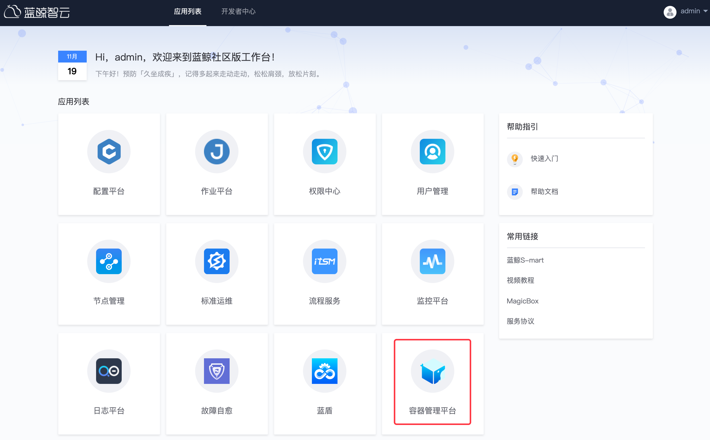

# 容器管理套餐安装指引

## 安装概览

【准备阶段】

- [准备蓝鲸基础环境](./BCS-start.md#一、安装环境准备)
- [服务器资源准备](./BCS-start.md#12)

【安装阶段】

- [安装 GSE Agent](./BCS-start.md#14)
- [下载安装包和标准运维模板文件](./BCS-start.md#15)
- [解压安装包](./BCS-start.md#16)
- [导入标准运维模板](./BCS-start.md#21)

【使用阶段】

- [执行部署作业](./BCS-start.md#23)
- [访问容器管理平台](./BCS-start.md#三、访问容器管理平台)

## 一、安装环境准备

### 1.1 基础环境依赖

> 若未部署蓝鲸基础环境，请参照[社区版 6.0 基础套餐安装](../../基础包安装/多机部署/quick_install.md)

部署容器管理平台（以下简称：BCS）须依赖社区版 6.0 基础环境，基础环境内必须包含 4 个基础平台和 4 个基础 SaaS：

<table><tbody>
<tr><th align='center'>基础平台</th><th align='center'>基础 SaaS</th></tr>
<tr><td align='center'>管控平台</td><td align='center'>用户管理</td></tr>
<tr><td align='center'>配置平台</td><td align='center'>权限中心</td></tr>
<tr><td align='center'>作业平台</td><td align='center'>节点管理</td></tr>
<tr><td align='center'>PaaS 平台</td><td align='center'>标准运维</td></tr>
</tbody></table>

### 1.2 服务器资源准备
<a id="12"></a>

1. 建议操作系统： CentOS 7.6 及以上
2. 容器管理平台服务器配置与所需数量：4 核 8G 两台、4 核 4G 一台
   - 机器分布详解（请记录此处的机器编号，后续部署时需要填入）：

<table><tbody>
<tr><th width="10%" align='center'>机器</th><th align='center'>安装服务</th><th align='center'>配置</th></tr>
<tr><td width="10%" align='center'>机器 1</td><td align='center'>MYSQL 数据库、MongoDB 数据库、Redis 数据库、Harbor 私有仓库（客户端浏览器可访问的 IP）</td><td>最低使用 4 核 CPU、8G 内存、200G 磁盘（1 台）</td></tr>
<tr><td width="10%" align='center'>机器 2</td><td align='center'>BCS 后台服务、BCS 导航页（客户端浏览器可访问的 IP）、web_console 服务</td><td>最低使用 4 核 CPU、8G 内存、100G 磁盘（1 台）</td></tr>
<tr><td width="10%" align='center'>机器 3</td><td align='center'>容器监控服务</td><td>最低使用 4 核 CPU、4G 内存、100G 磁盘（1 台）</td></tr>
</tbody></table>

> 注意：
> 1. 服务器网络要与安装蓝鲸社区版基础包的服务器相通，在配置平台中需放在“蓝鲸”业务下
> 2. 容器管理平台服务器不能与 K8S 集群服务器、蓝鲸基础服务服务器共用，需要独立申请，否则会导致端口冲突等环境问题
> 3. K8S 集群服务器不能与容器管理平台服务器、蓝鲸基础服务服务器共用，需要独立申请，否则会导致端口冲突等环境问题
> 4. Harbor 私有仓库 IP 地址、BCS 导航页组件 IP 地址与 BCS 监控 IP 地址都会占用 TCP 80 端口，需要部署在 3 台不同的服务器上以免端口冲突

### 1.3 添加域名解析

```bash
# Linux、Mac：/etc/hosts，Windows：C:\Windows\System32\drivers\etc\hosts
# BCS导航页组件IP地址（客户端浏览器可访问的地址） BCS导航页域名（BCS导航页域名前缀.蓝鲸基础域名） BCS导航页API域名（api-BCS导航页域名前缀.蓝鲸基础域名）

机器2的IP bcs.bktencent.com api-bcs.bktencent.com
```

### 1.4 安装 BCS 部署机器的 GSE Agent
<a id="14"></a>

- 安装方法，请参考[【节点管理】Agent 安装](../../../../节点管理/产品白皮书/QuickStart/DefaultAreaInstallAgent.md)
- 安装时业务请选择“蓝鲸”

### 1.5 下载 BCS 安装包
<a id="15"></a>

- 下载安装包，[下载地址](https://bkopen-1252002024.file.myqcloud.com/bcs/bcs_ce-6.0.12.tgz)
- 上传安装包至中控机 /data
- 容器管理平台扩展软件包：bcs_ce-6.0.12.tgz

### 1.6 解压 BCS 安装包
<a id="16"></a>

```bash
tar xvf bcs_ce-6.0.12.tgz -C /data/
```

## 二、开始部署

### 2.1 下载标准运维模版文件
<a id="21"></a>

- [下载模版文件](https://bkopen-1252002024.file.myqcloud.com/bcs/bk_sops_common_20220516152054.dat )至本地
- 标准运维模版文件名：bk_sops_common_20220516152054.dat

### 2.2 导入标准运维模版

打开标准运维--->公共流程--->导入--->点击上传--->选择标准运维模版文件名--->流程 ID 不变提交

> 注：因为 bcs-ops 模块需要关联标准运维模版流程 ID，如果流程 ID 有冲突请参考[BCS 维护手册-FAQ](../../增强包维护/BCS/FAQ.md)的第 2 小点解决


### 2.3 新建任务
<a id="23"></a>

打开标准运维--->公共流程--->[BlueKing][BCS][Basic] Environment Deployment--->新建任务


### 2.4 选择“蓝鲸”业务


### 2.5 节点选择，不用修改，直接进入下一步


### 2.6 参数填写

具体参数填写参考可点击这里 [查看增强包部署详解-部署详细步骤-第 6 点](./BCS-V2.md#部署详细步骤)


### 2.7 执行部署作业

执行作业过程中没有出现错误即部署正常，否则需要根据 job 执行错误信息解决问题。


## 三、访问容器管理平台

刷新蓝鲸工作台，会出现一个容器管理平台的 SaaS，点击图标会跳转到蓝鲸容器管理平台的 console 页面，也可以直接访问 URL [http://bcs.bktencent.com](http://bcs.bktencent.com) 来访问容器管理平台。

如果无法访问时，可能是 hosts 域名解析没有生效，可以关闭浏览器后重试。

完成以上步骤容器管理平台就已经部署完毕。



## 四、部署验收

### 4.1 BCS 后台部署验收

标准运维作业可以正常执行完成，执行过程无错误出现

### 4.2 BCS K8S 集群部署验收

1. 可以正常 新建项目
2. 容器服务 BCS-K8S
3. 创建容器集群正常
4. 添加节点正常
5. 创建/同步/删除命名空间
6. 变量管理/删除/添加变量
7. Helm/Chart 仓库存在 rumpetroll、blueking-nginx-ingress Chart
8. 监控 Dashboard-BCS Node、BCS Cluster、BCS Pod 存在数据
9. 存在告警策略（告警中、正常、停用其中一个不为 0）
10. 指标查询随意查询一个指标有数据
11. 告警历史/通知组/操作审计可以正常打开
12. 删除节点正常
13. 删除容器集群正常
