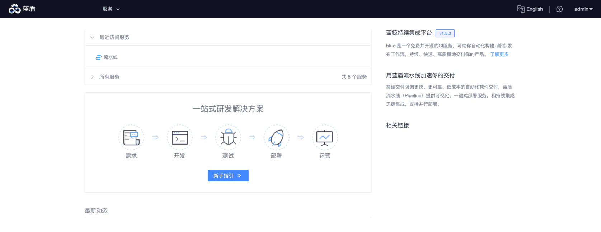

# 增强包快速部署：蓝盾

# 一、安装环境准备
## 1.1 方案说明
蓝盾（简称 `bk-ci`，在安装脚本中使用 `ci` 作为标识）作为蓝鲸基础环境的增强包存在，该产品由腾讯蓝鲸智云体系的持续集成平台作为底层支撑，预期加装到已有的蓝鲸基础环境中。
蓝鲸社区版 6.0 部署脚本包（文件名： `install_ce-v3.0.*.tgz` ）中提供了 “一键安装” 功能，直接复用蓝鲸已有的基础服务，方便快速集成到蓝鲸中。

## 1.2 基础环境依赖
请确保蓝鲸社区版 6.0 基础环境的 `install.config` 里存在如下的项目：
* `paas` （PaaS 平台）
* `ssm` （凭据管理）
* `iam` （权限中心 v3）
* `es7` （ElasticSearch，一般随蓝鲸监控安装）

## 1.3 准备机器
请按照如下清单准备服务器或虚拟机（不能是容器），用于正式部署蓝盾。

* 机器数量： `2` （一台用作服务端，一台用作公共构建机（ `ci(dockerhost)` ））
* 要求操作系统： `CentOS 7.X`  （请勿使用其他系统）
* 建议硬件配置：8 核 32GB （测试环境可使用 16GB 内存，性能略低）
* 磁盘大小：100GB

随着任务量增多，您需要准备更多机器部署公共构建机（ `ci(dockerhost)` ）服务。

## 1.4 下载安装包

请下载安装包到蓝鲸 “中控机”，参考路径如下：（ **此时无需手动解压，后续预处理步骤时包含解压操作。** ）
* `/data/src/bkci.tar.gz` 建议将下载的文件放置在此路径。参考从 GitHub 下载的命令：
``` bash
curl -L -o "${BK_PKG_SRC_PATH:-/data/src}/bkci.tar.gz" "https://github.com/Tencent/bk-ci/releases/download/v1.2.5/bkci.tar.gz"
```
* `/data/src/rabbitmq_delayed_message_exchange-3.8.0.ez`, 路径及文件名不能变动。下载 RabbitMQ 插件的命令：
``` bash
curl -L -o "${BK_PKG_SRC_PATH:-/data/src}/rabbitmq_delayed_message_exchange-3.8.0.ez" "https://github.com/rabbitmq/rabbitmq-delayed-message-exchange/releases/download/v3.8.0/rabbitmq_delayed_message_exchange-3.8.0.ez"
```

## 1.5 解压相关资源包
部署脚本预期解压后的目录，请使用我们提供的预处理脚本：（会在解压完成后自动更新默认 env 模板）
``` bash
./bin/prepare-bk-ci.sh /data/src/bkci.tar.gz  # 如果放在其他路径下，请自行修改。
```

## 1.6 自定义安装配置
需要编辑 install.config 新增配置项，可使用如下代码添加：（请根据实际机器的 IP 进行替换第一列的示例 IP 地址，确保新增 IP 和文件中已有 IP 之间能互相通信）
``` bash
[ -f install.config ] && cat >> install.config <<EOF || echo "当前目录无 install.config, 请切换到 ${CTRL_DIR:-/data/install} 目录下执行。"
10.0.0.4 ci(gateway),ci(agentless),ci(artifactory),ci(auth),ci(dispatch),ci(environment),ci(image),ci(log),ci(misc),ci(notify),ci(openapi),ci(plugin),ci(process),ci(project),ci(quality),ci(repository),ci(store),ci(ticket),ci(websocket)
10.0.0.5 ci(dockerhost)
EOF
```


# 二、开始部署
请执行 “一键安装” 脚本即可：
``` bash
cd ${CTRL_DIR:-/data/install}  # 进入部署脚本主目录，默认为 /data/install 。
./bk_install ci  # 参数为小写的ci，输入时请注意大小写。
```

“一键安装”脚本在安装过程会不断输出提示。如果失败，会在屏幕输出报错，并提示出错脚本的位置。您在排除故障后重新执行该脚本即可。

# 三、访问蓝盾
“一键安装”脚本在安装成功后会提示蓝盾的直接访问 URL。您也可以在蓝鲸 PaaS “工作台” 里找到 “蓝盾” 并打开。


