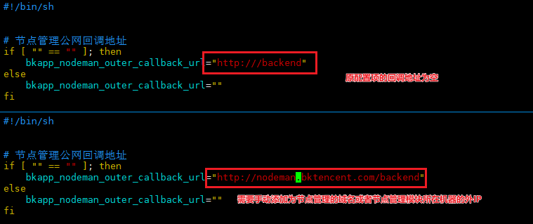

# 开启 Proxy

## 修改 bknodeman 的配置文件。

> 注意：如果填写的是域名格式且是未经过解析的。那么需要在安装 proxy 的机器上绑定 hosts。否则在安装过程中会出现 `Could not resolve host` 的报错。

```bash
# 登陆至节点管理所在的机器。$CTRL_DIR 请使用实际部署脚本路径替换。
source $CTRL_DIR/utils.fc
ssh $BK_NODEMAN_IP

# 修改配置文件。$INSTALL_PATH 请使用实际部署安装路径替换。
vim $INSTALL_PATH/bknodeman/nodeman/bin/environ.sh
```

示例：**公网回调地址请按实际进行替换**



## 重启节点管理服务

```bash
# 中控机执行
./bkcli restart bknodeman
./bkcli status bknodeman
```

修改节点管理配置文件并重启节点管理服务后，再前往节点管理页面重新安装 proxy。

