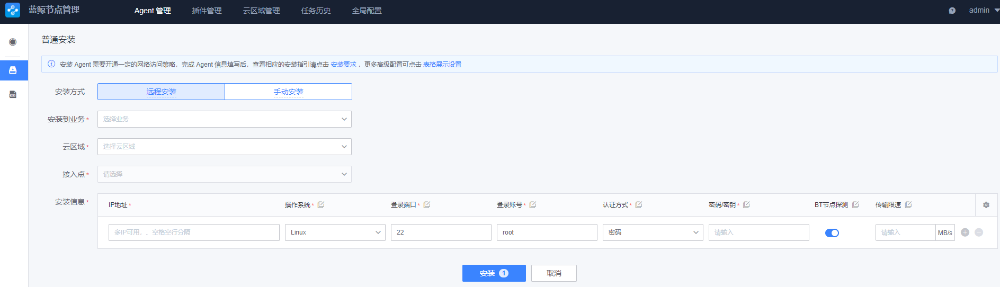
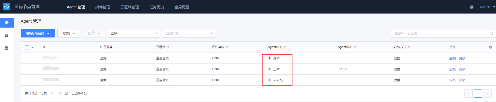
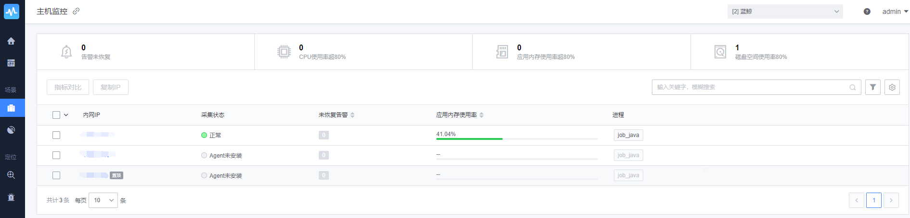
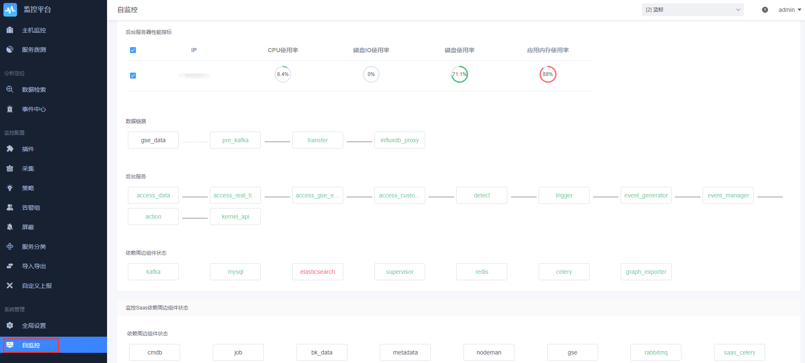

# 社区版 6.0 集成部署

## 一、安装前准备

### 下载安装包

- 下载安装包到任意目录，假设 /data/ 下

### 环境准备

- [部署方案-环境准备](https://bk.tencent.com/docs/document/5.1/20/651)

### 解压相关资源包

1. 解压 src 包

   ```shell
   tar xvf bk_product-6.xxxxx.tgz -C /data
   ```

2. 解压 src 包下的子包

   ```shell
   cd /data/src/; for f in *gz;do tar xf $f; done
   cd -
   ```

2. 解压 python 包

   ```shell
   tar xvf bk_python-1.0.2.tgz -C /data/src
   ```

3. 解压 image 包

   ```shell
   tar xvf bk_image-1.0.3.tgz -C /data/src
   ```

4. 解压 rpm 包

   ```shell
   tar xvf bk_rpm-1.0.3.tgz -C /opt
   ```

5. 解压脚本包

   ```shell
   tar xvf install_xxxxx.tgz -C /data
   ```
   
6. 解压证书包（证书包需要从官网根据提示要求下载）

   ```shell
	mkdir /data/src/cert/
   tar xvf ssl_tificates.tar.gz -C /data/src/cert/
   chmod 644 /data/src/cert/*
	```

7. 放置java8.tgz到 /data/src下，以 tencent 的 jdk 为例：

    ```shell
     wget https://github.com/Tencent/TencentKona-8/releases/download/v8.0.1-GA/TencentKona-8.0.1-242.x86_64.tar.gz -O /data/src/java8.tgz
    ```

### 自定义安装配置

以下操作均相对/data/install/目录

1. 根据 install.config.3ip.simple 和当前机器资源合理分配，新增 install.config

   ```shell
   cp install.config.3ip.simple install.config
   vim install.config # 根据实际机器ip编辑
   ```

2. 对install.config中的主机执行ssh免密，需要依次输入每台机器的密码

   ```shell
   bash ./configure_ssh_without_pass
   ```

3. 自定义环境变量
   
    假设部署脚本已解压至 /data 目录下
    > 蓝鲸 6.0 重构优化了配置渲染的逻辑。运维需要先理解下新的配置渲染方式，保证合理的配置方式：
    > 1. 先配置 /data/install/bin/03-userdef/global.env 中的文件，需要自定义覆盖 /data/install/bin/default/global.env 中的配置项的，可以写在这里,如域名的相关配置。**可看下文的域名修改示例。**
    >
    > 2. 需要自定义其他配置项，可参考 /data/install/bin/default 下同名 env 文件，先在 /data/install/bin/03-userdef 下生成同名文件。
    >
    > 如：自定义账户的登录密码
    > echo "BK_PAAS_ADMIN_PASSWORD=Blueking666" > /data/install/bin/03-userdef/usermgr.env
    >
    > 3. 运行 /data/install/bin/merge_env.sh <模块> 会自动将 1-4 (01-generate、02-dynamic、03-userdef、04-final)中的各个环境变量按优先级从低到高依次覆盖
    >
    > 4. /data/install/bin/04-final/的 env 文件就是最终用来渲染 <模块> 所需要的全部的环境变量
    >
    > 5. 可以确认下 /data/install/bin/04-final/usermgr.env 的 BK_PAAS_ADMIN_PASSWORD 是之前自定义的 "Blueking666"，而不是一个随机字符串

   - 将需要修改的环境变量写入至 /data/install/bin/bin/03-userdef 目录下的对应的模块文件中

   - 对应存储组件和密码自定义也需提前定义

     - 域名修改示例

       ```shell
         cat << EOF >/data/install/bin/03-userdef/global.env
         BK_HOME=/data/bkce
         BK_DOMAIN=bk.com
         BK_HTTP_SCHEMA=http

         # 访问 PaaS 平台的域名
         BK_PAAS_PUBLIC_ADDR=paas.bk.com:80
         BK_PAAS_PUBLIC_URL=http://paas.bk.com:80

         # 访问 CMDB 的域名
         BK_CMDB_PUBLIC_ADDR=cmdb.bk.com:80
         BK_CMDB_PUBLIC_URL=http://cmdb.bk.com:80

         # 访问 JOB 平台的域名
         BK_JOB_PUBLIC_ADDR=job.bk.com:80
         BK_JOB_PUBLIC_URL=http://job.bk.com:80
         BK_JOB_API_PUBLIC_URL="http://api.job.bk.com:80"

         # 节点管理下载插件包的域名
         BK_NODEMAN_PUBLIC_DOWNLOAD_URL="http://nodeman.bk.com:80"
         EOF
       ```

## 二、开始部署

1. 依赖资源部署, 生成环境最终部署环境变量，安装服务器所需资源，部署本地 yum 源并配置所有蓝鲸服务器

   ```shell
   ./bk_install common
   ./health_check/check_bk_controller.sh
   ```

2. 部署 PaaS 

   ```shell
   ./bk_install paas
   ```

5. 部署 app_mgr

   ```shell
   ./bk_install app_mgr
   ```

3. 部署 CMDB

   ```shell
   ./bk_install cmdb
   ```

4. 部署 JOB

   ```shell
   ./bk_install job
   ```

6. 部署 bknodeman

   ```shell
   ./bk_install bknodeman
   ```
   
7. 部署 bkmonitorv3 

   ```shell
   ./bk_install bkmonitorv3
   ```

8. 部署 bklog 

   ```shell
   ./bk_install saas-o bk_log_search
   ./bk_install bklog
   ```

9. 部署 fta 

   ```shell
   ./bk_install fta
   ```
10. 部署SaaS
   
    ```shell
    ./bk_install saas-o bk_iam
    ./bk_install saas-o bk_user_manage
    ./bk_install saas-o bk_sops
    ./bk_install saas-o bk_itsm
    ./bk_install saas-o bk_fta_solutions
    ```


## 三、环境验证

- 脚本检测。
  假设脚本在 /data 下，如不同请自行修改

```shell
cd /data/install/
./health_check/check_paas.sh
./health_check/check_job.sh
./health_check/check_gse.sh
```

- 进入到节点管理，检查 Agent 是否能够安装 


填写相关信息



安装完成后，状态会呈现 “正常” 状态，异常可通过最新执行日志查看原因



- 查看监控数据是否上报



如果数据未上报，请检查自监控的状态




