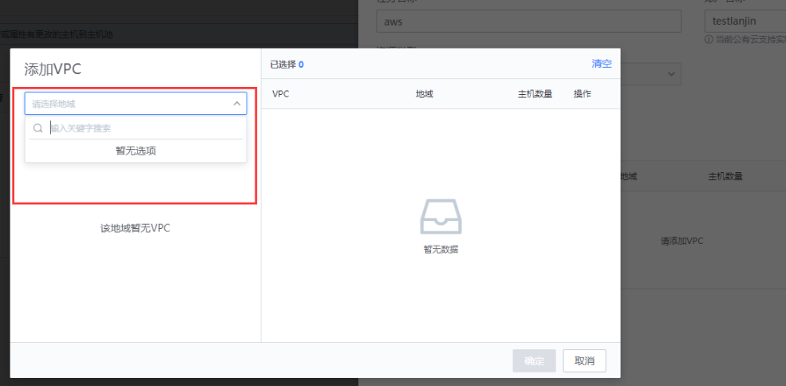

# 云资源相关 FAQ

### 常见问题一：创建“云资源发现”找不到 vpc
- 蓝鲸版本：社区 6.0.5
- 产品版本：cmdb 3.9.27

**解决方案：**

[https://bk.tencent.com/s-mart/community/question/7497?type=article](https://bk.tencent.com/s-mart/community/question/7497?type=article)

##   

### 云资源发现多久同步一次
答：同步周期默认配置是 5 分钟
