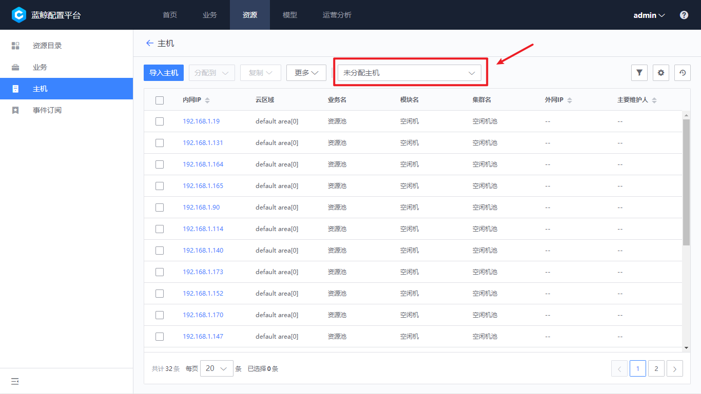
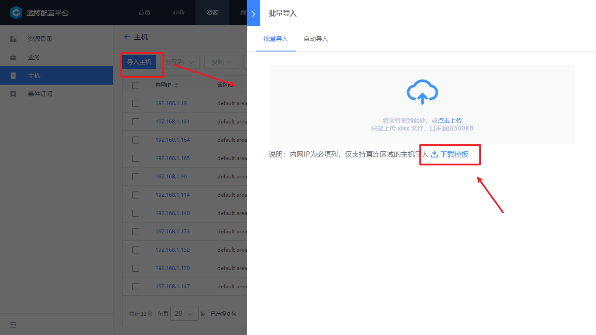

# 主机和资源池

主机实例是 CMDB 中比较重要的对象之一，系统内置了“资源池”，即未分配到业务的主机。导入的新主机，默认进入到资源池中。

图1.主机资源池

## 主机录入

目前在配置平台录入主机有两种方法：

- excel 批量导入
- 蓝鲸 Agent 安装应用进行导入。

### excel 批量导入

点击“下载模版”，可以下载到符合格式好的 excel 文档

图2.下载模版

打开 excel 文档以后，前三行为系统标识，第四行以后每行为一条记录。

- 标注红色为必填字段，其他字段可以留空
- 其他字段根据模型中的字段顺序排列

注意的是：录入同样内网 IP，是属性覆盖的操作，可以使用此特性对主机属性进行批量更新。

图3.excel字段说明

### Agent 应用导入

切换到自动导入的 tab 页，通过跳转到链接可以打开“agent 安装”应用，通过安装了蓝鲸的 agent，相关主机会自动录入到配置平台的资源池中。

图4.自动导入

## 资源分配到业务

先选中要分配主机，点击分配到按钮，选择业务后可以完成主机资源的分配，默认是放到业务的空闲机池。

图5.分配到业务

