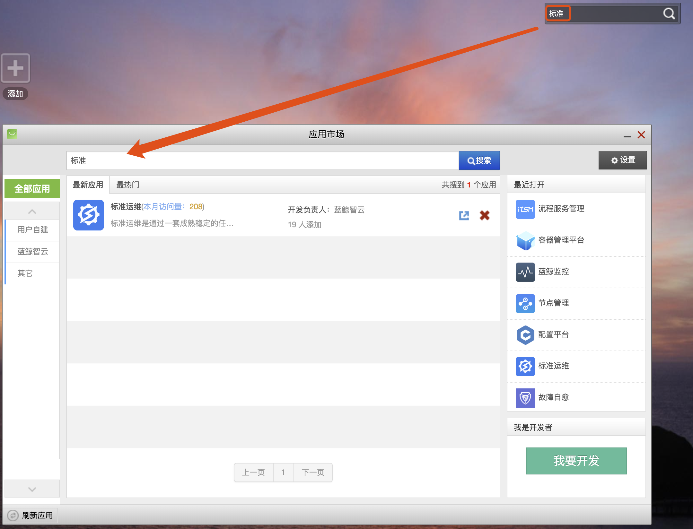

# 个人工作台

蓝鲸提供了很多开箱即用的 SaaS，会统一展示在用户的“个人工作台”，该工作台又称为“桌面”。

在登录界面，提供了“查看用户协议”、“忘记密码”、“中英文切换”等快捷入口。

## 多桌面模式

默认提供了 5 个桌面，可以根据个人情况进行存放，点击花型图标，快速进入 5 个桌面的全局视角，拖拽图标即可完成 SaaS 在不同桌面之间的调整。

除此之外，还提供了“换肤”、“快捷指引”、“问题反馈”的功能入口。

## 添加操作

点击“添加”后，会出现“添加应用”或者“新建文件夹”，“文件夹”主要用于归类桌面上的 SaaS。

“添加应用”将打开“应用市场”，选择需要的应用添加即可。

在 SaaS 的 LOGO 上单机右键，即可将该 SaaS 从桌面上“卸载”。

## 搜索操作

搜索功能主要针对“应用市场”的 SaaS 应用，帮助用户快速查找，并通过应用市场查看该 SaaS 的详细信息。

