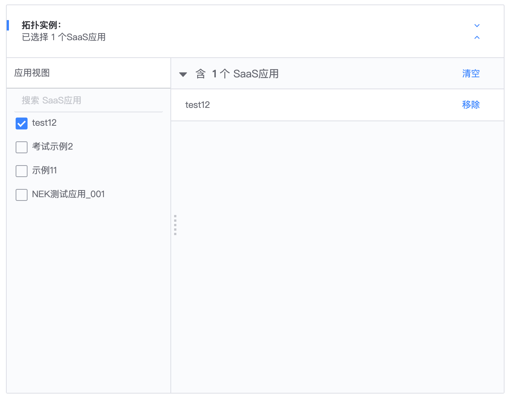

# 实例视图

> 本文重点阐述实例视图的概念, 示例, 在授权及鉴权阶段的作用, 帮助开发者更好地理解实例视图

## 1. 前置阅读

- [名词及概念](../Reference/API/02-Model/00-Concepts.md) 中的 `3. InstanceSelection: 实例视图` 和 `4. Action: 权限操作，比如增删改查`
- [实例视图 InstanceSelection API](../Reference/API/02-Model/12-InstanceSelection.md)
- [操作 Action API](../Reference/API/02-Model/13-Action.md)
- [资源拉取 API](../Reference/API/03-Callback/01-API.md)
- [说明: 资源拓扑`_bk_iam_path_`](../Explanation/04-BkIAMPath.md)

## 2. 什么是实例视图

> 实例视图, 决定了在配置权限的时候, 如何选到对应的实例

接入系统可以根据自己的业务场景，向权限中心自定义注册多种实例视图，`一种实例视图代表了一种实例的选择方式`，用户在申请权限关联资源实例时，可以切换不同的 `实例视图` 来选择实例, 配置对应的权限。

- 可以勾选到具体实例
- 如果实例视图存在多级拓扑, 可以勾选上级任意节点

## 3. 示例

### 3.1 操作不关联任何示例

即 `action` 的 `related_resource_types`为空; 此时配置权限时不需要选择实例, **不需要配置实例视图**

### 3.2 操作关联了类型实例, 实例视图是单层的

以 PaaS 的开发应用为例
- `action=develop_app`
- 关联资源类型 resource_type 为`system_id=bk_paas; id=app`
- 在配置权限的时候, 这个 app 的选择是通过实例视图 instance_selection 为 `system_id=bk_paas, id=app_view`选择出来的;
- `app_view`应用视图 只有一层 `system_id=bk_paas, id=app`, 即指向资源自己, 产品上的表现就是配置权限的时候, 是平铺的应用列表

```json
# action model
{
  "id": "develop_app",
  "name": "开发SaaS应用",
  "name_en": "develop app",
  "description": "一个用户是否能够开发SaaS",
  "description_en": "Is allowed to develop SaaS app",
  "type": "",
  "related_resource_types": [
    {
      "system_id": "bk_paas",
      "id": "app",
      "name_alias": "",
      "name_alias_en": "",
      "related_instance_selections": [
        {
          "system_id": "bk_paas",
          "id": "app_view"
        }
      ]
    }
  ],
  "version": 1
}

# instance selection model
{
  "id": "app_view",
  "name": "应用视图",
  "name_en": "app_view",
  "resource_type_chain": [
    {
      "system_id": "bk_paas",
      "id": "app"
    }
  ]
}
```



类似的示例: 操作`业务编辑`, 关联资源`业务`, 对应实例视图是`业务列表`, 拉取得到平铺的列表


### 3.3 操作关联了一种类型实例, 实例视图是多层的

标准运维的任务查看为例
- `action=task_view`
- 关联资源类型 resource_type 为`system_id=bk_sops; id=task`
- 在配置权限的时候, 这个 task 的选择是通过实例视图 instance_selection 为 `system_id=bk_sops, id=task`选择出来的;
- 任务实例视图有两层 `system_id=bk_sops, id=project` / `system_id=bk_sops, id=task`, 表示 `项目下的任务`

```json
# action model
{
  "id": "task_view",
  "name": "任务查看",
  "name_en": "Task View",
  "description": "",
  "description_en": "",
  "type": "view",
  "related_resource_types": [
    {
      "system_id": "bk_sops",
      "id": "task",
      "selection_mode": "all",
      "related_instance_selections": [
        {
          "system_id": "bk_sops",
          "id": "task"
        }
      ]
    }
  ],
  "version": 1
}
# instance selection model
{
  "id": "task",
  "name": "任务实例",
  "name_en": "Task",
  "resource_type_chain": [
    {
      "system_id": "bk_sops",
      "id": "project"
    },
    {
      "system_id": "bk_sops",
      "id": "task"
    }
  ]
}
```

此时配置权限的时候, 会先拉取第一层 `项目列表`, 选择某个项目 A 后, 可以展开`项目A下的任务列表`


## 4. 实例视图回调接口

注册操作及实例视图之后, 在权限中心页面配置权限的时候, 会回调接入系统接口, 拉去实例视图中每一层的资源;

- [资源拉取 API](../Reference/API/03-Callback/01-API.md)
- [资源拉取 API: list_instances](../Reference/API/03-Callback/12-list_instance.md)

### 4.1 只有一层的实例视图

以上面 `开发应用` 为例

```json
POST system.provider_config.host + system.provider_config.path
{
    "type": "app",
    "method": "list_instance",
    "page": {
        "offset": 0,
        "limit": 20
    }
}
```

### 4.2 存在多层的实例视图

以上面 `任务查看` 为例

第一层项目列表

```json
POST system.provider_config.host + system.provider_config.path
{
    "type": "project",
    "method": "list_instance",
    "page": {
        "offset": 0,
        "limit": 20
    }
}
```

第二层项目下的任务列表

```json
POST system.provider_config.host + system.provider_config.path
{
    "type": "task",
    "method": "list_instance",
    "filter": {
        "parent": {
            "type": "project",
            "id": "blueking"
        }
    },
    "page": {
        "offset": 0,
        "limit": 20
    }
}
```

即, 每次调用接入系统接口拉取下一层资源列表的时候, 会传递父级节点的类型和 id(`parent{type=,id=}`)

## 5. 实例视图配置的权限

### 5.1 实例视图是单层的

以上面示例中, 开发应用的实例视图为例; 示例中, 我们勾选了`test12`

```bash
app.id in ["test12"]
```

### 5.2 实例视图是多层的

以上面示例中, 任务查看的示例视图为例

如果勾选了 `项目蓝鲸下的任务test`

```bash
task.id eq test
AND
task._bk_iam_path_ starts_with /project,蓝鲸ProjectID/
```

如果勾选了 `项目蓝鲸`, 代表项目蓝鲸下的所有任务都有权限, **包括未来在项目蓝鲸下新添加的所有任务**

```bash
task._bk_iam_path_ starts_with /project,蓝鲸ProjectID/task,*/
```


### 5.3 实例是多层的, 并且 ignore_iam_path=true

以上面任务查看为例, 如果在配置操作的实例视图时, 配置了`ignore_iam_path=true`

```json
# action model
{
  "id": "task_view",
  "name": "任务查看",
  "name_en": "Task View",
  "description": "",
  "description_en": "",
  "type": "view",
  "related_resource_types": [
    {
      "system_id": "bk_sops",
      "id": "task",
      "selection_mode": "all",
      "related_instance_selections": [
        {
          "system_id": "bk_sops",
          "id": "task",
          "ignore_iam_path": true
        }
      ]
    }
  ],
  "version": 1
}
# instance selection model
{
  "id": "task",
  "name": "任务实例",
  "name_en": "Task",
  "resource_type_chain": [
    {
      "system_id": "bk_sops",
      "id": "project"
    },
    {
      "system_id": "bk_sops",
      "id": "task"
    }
  ]
}
```

如果勾选了 项目蓝鲸下的 test

```bash
task.id == test123
```

如果勾选了 `项目蓝鲸`, 代表项目蓝鲸下的所有任务都有权限

```bash
task._bk_iam_path_ starts_with /project,蓝鲸ProjectID/task,*/
```

注意, `ignore_iam_path` **只对叶子节点生效**, 对勾选中间节点的场景不起作用;

## 6. 实例视图配置的鉴权

如果实例视图是多层的, 那么对应资源在进行鉴权的时候, 资源必须带上属性`_bk_iam_path_`, 且如果操作配置了多种实例视图, 那么`_bk_iam_path_`需要带上所有实例视图下的链路信息; 否则鉴权可能会有问题;

例如, 主机查看配置了两个实例视图

- `集群 - 主机`
- `模块 - 主机`

那么用户在配置权限的时候, 可能用任意一个实例视图配置出权限, 也可能两个实例视图都使用; 即, 策略里面可能保存了两条链路下的策略;

所以, 鉴权的时候, `主机` 的`_bk_iam_path_`需要提供两个视图下的链路, 以确保鉴权正确;

```json
{
    "system": "bk_cmdb",
    "type": "host",
    "id": "192.168.1.1",
    "attribute": {
        "_bk_iam_path_": [
            "/cluster,c1/",  
            "/module, m1/"  
        ]
    }
}
```

具体见 [说明: 资源拓扑`_bk_iam_path_`](../Explanation/04-BkIAMPath.md)

## 7. 什么时候需要多层实例视图

资源本身存在业务上的`拓扑`关系, 例如, 选取某一台主机, 可以是`业务A 下的 集群B 下的 模块C 下的主机`

例如`编辑主机`操作, 关联的资源类型是`主机`, 主机对应的实例视图是`主机视图`;  对应可以配置出来的权限是

- `业务A` 下的所有主机
- `业务A / 集群B` 下的所有主机
- `业务A / 集群B / 模块C` 下的所有主机
- `业务A / 集群B / 模块C` 下的主机 A (`ignore_iam_path=false`)
- 主机 A (`ignore_iam_path=true`)
