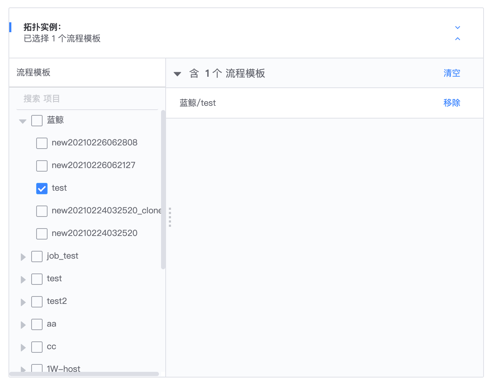
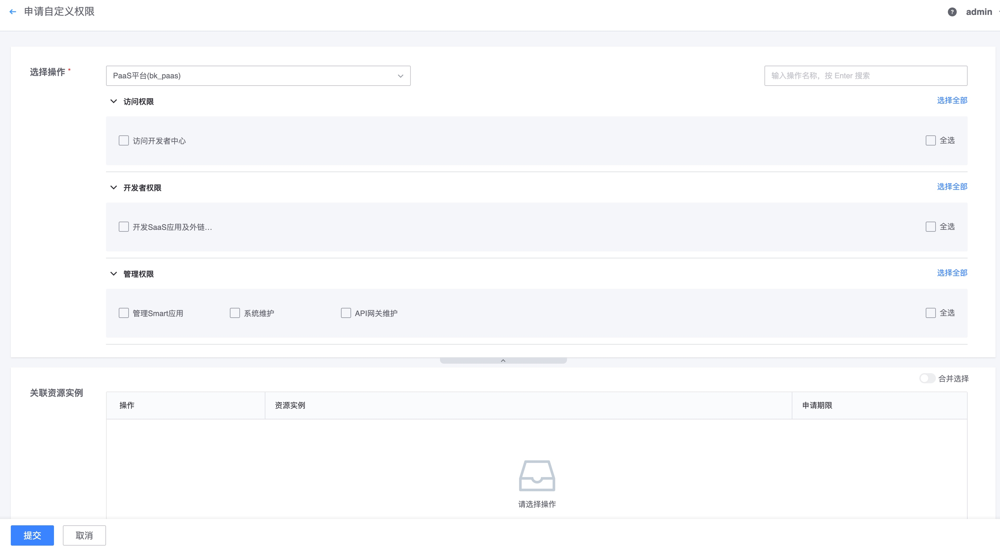
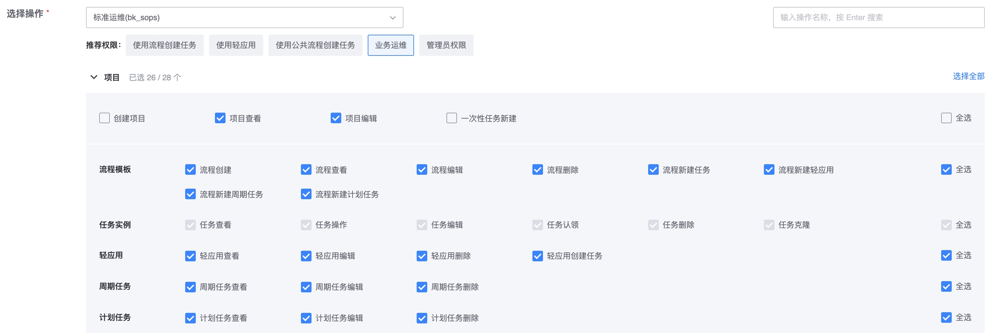

# 概念解释

## 系统(System)

> 接入权限中心的 SaaS 或平台或第三方系统

注意, 系统跟`app_code`不是一个概念, 一个系统可能有多个子模块(多个`app_code`), 但是其共用的一套权限模型及数据, 此时只需要注册一个系统, 多个`app_code`成为这个系统合法的`clients`即可.

相关链接:
- [说明: AppCode 和 SystemID](../Explanation/05-AppcodeAndSystemID.md)
- [模型注册 API: 系统](../Reference/API/02-Model/10-System.md)

## 操作(Action)

> 权限操作，比如增删改查

接入系统中需要做权限控制的某个场景功能，如作业新建、主机转移、菜单查看等，一个操作最好是最小原子功能，操作应该是可枚举相对静态的，一个系统的操作数量有可能随着系统功能模块的增加而增加，但一般不会随着时间的推移无限增长。

相关链接:
- [模型注册 API: 操作](../Reference/API/02-Model/13-Action.md)

## 资源类型(ResourceType)

> 操作对象的资源类别

指各系统需要做权限控制的操作所关联的对象，如作业新建关联的对象是作业、主机转移关联的对象是主机等，作业、主机都是一种资源类型。

相关链接:
- [模型注册 API: 资源类型](../Reference/API/02-Model/11-ResourceType.md)
- [资源反向拉取 API](../Reference/API/03-Callback/01-API.md)

## 实例视图(InstanceSelection)

> 实例视图, 决定了在配置权限的时候, 如何选到对应的实例

接入系统可以根据自己的业务场景，向权限中心自定义注册多种实例视图，一种实例视图代表了一种实例的选择方式，用户在申请权限关联资源实例时，可以切换不同的 实例视图 来选择实例权限。

相关链接:
- [模型注册 API: 实例视图](../Reference/API/02-Model/12-InstanceSelection.md)
- [说明: 实例视图](../Explanation/01-InstanceSelection.md)
- [样例 3: 使用拓扑层级管理权限](../HowTo/Examples/03-Topology.md)

## 资源实例

资源实例是某种资源类型的具体实例化对象，也是权限控制的最小粒度，如具体某个作业、某台主机等，一般来说资源实例是动态的，会随着时间推移线性增长。

相关链接:
- [样例 2: 关联简单实例权限](../HowTo/Examples/02-ActionWithResource.md)
- [大规模实例级权限限制](../Explanation/06-LargeScaleInstances.md)

## 资源属性

资源属性 是权限中心筛选资源实例的一种方式，满足那些需要动态授权的场景。

相关链接:
- [样例 4: 使用属性管理权限](../HowTo/Examples/04-Attribute.md)

## 操作组

操作组是接入系统，根据系统使用习惯，将相同场景的操作按操作组归类，方便用户/管理员在权限中心勾选操作权限。 操作组只是前端勾选操作时的体验优化，不涉及底层逻辑的依赖。

比如，作业平台有作业执行、作业删除、脚本执行、脚本查看、IP 白名单新建、全局设置管理几个操作。

加上操作组后，前端表现为：

相关链接:
- [模型注册 API: 操作组](../Reference/API/02-Model/14-ActionGroup.md)
- [样例 5: 配置操作组优化权限申请](../HowTo/Examples/05-ActionGroup.md)

## 常用操作

相关链接:
- [模型注册 API: 常用操作](../Reference/API/02-Model/17-CommonActions.md)
- [样例 6: 配置常用操作优化权限申请](../HowTo/Examples/06-CommonActions.md)

## 依赖操作

当用户申请的操作权限必须依赖其他某些前置操作权限时，比如用户申请`项目编辑`，必须依赖`项目查看`的操作权限，`项目查看`就是`项目编辑`的依赖操作，用户不需要关心依赖操作，权限中心会自动处理依赖逻辑，用户直奔目标选择需要的权限即可。

下面的图示中, 勾选`项目编辑`会自动勾选`项目查看`

相关链接:
- [样例 7: 配置依赖操作优化权限申请](../HowTo/Examples/07-RelatedActions.md)

## 用户组

用户组是权限中心推荐的权限管理方式，一个用户组可以关联多个系统的多个权限模板，从而具备对应的权限，管理员只需要往用户组添加用户/组织即可让对应的用户获得用户组的所具备的权限。

## 分级管理员

分级管理员是权限中心的二级权限管理员，成为分级管理员后可以分配相应的资源权限给其他用户。

