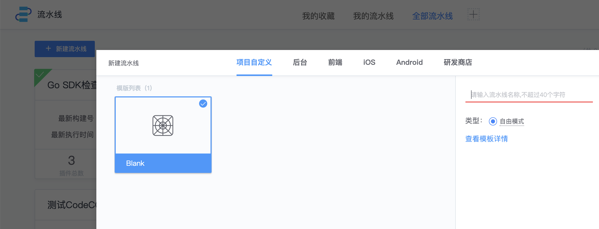
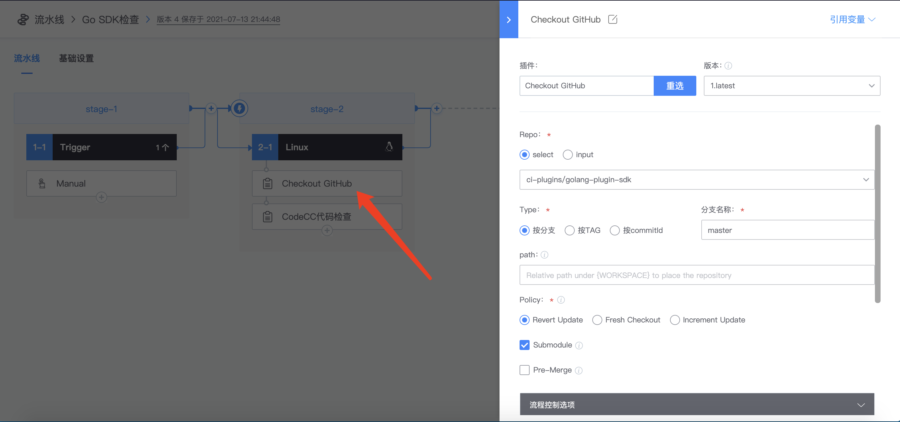
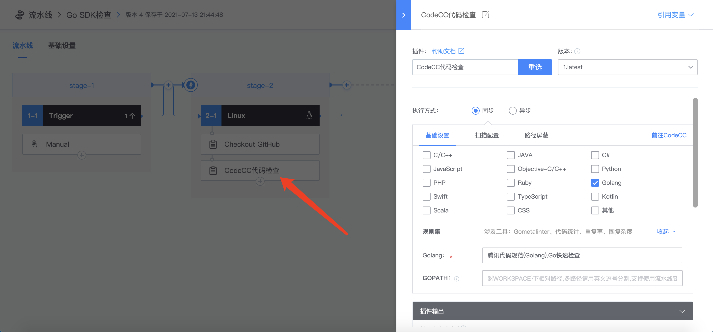
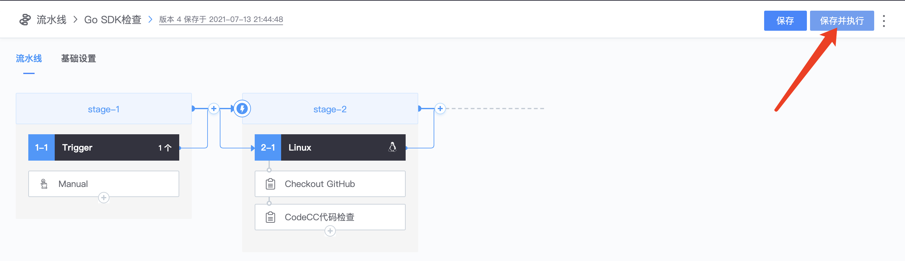
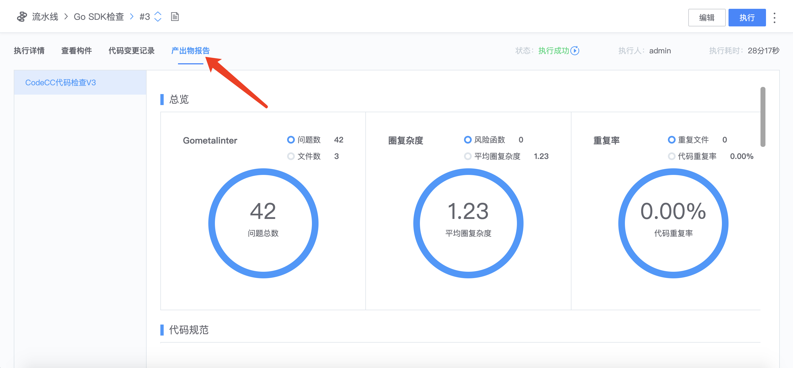

## 新建一条流水线

在流水线服务中，点击新建一条流水线。

## 添加拉取代码插件

要执行 CodeCC 代码检查，首先需要一个拉取代码插件，将代码拉取到构建环境下的工作空间。

## 添加 CodeCC 代码检查插件

添加 CodeCC 代码检查插件，选择语言、规则集等信息。
如果包含了 SpotBugs 等编译型工具，还需要填写编译脚本。

## 执行流水线，查看流水线报告

点击保存并执行按钮，执行流水线。执行结束即可查看流水线产出物报告。

