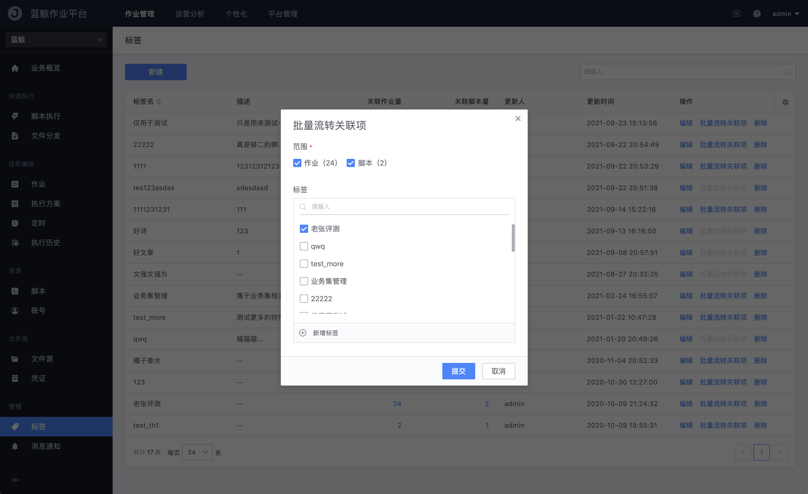

# 标签管理

提供以「标签」为主视角的业务资源（作业和脚本）管理视图，帮助业务运维团队合力的对资源进行分类管理。

### 新建标签

点击表格上方的「**新建**」按钮创建一个新的标签：

- 标签名

  为标签命名（20 个字符以内）

- 描述

  简单标注该标签的用途和使用场景的简介

### 批量流转关联项

提供以单标签为维度的批量流转功能

如下图 `老张评测` 标签下有 24 个作业、2 个脚本，如果次数勾掉原有的 `老张评测` 则意指去除这 24 个作业和 2 个脚本的该标签；如果新增勾选一个或多个标签，则表示为这 24 个作业和 2 个脚本新增对应的标签。

