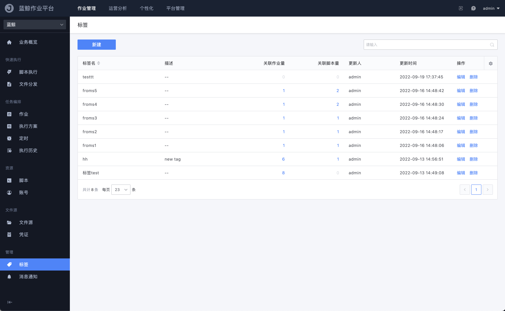
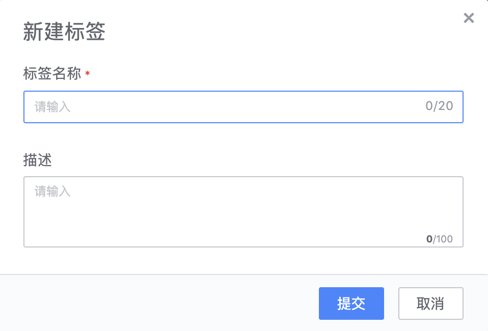

# 标签管理

提供以「标签」为主视角的业务资源（作业和脚本）管理视图，帮助业务运维团队合力的对资源进行分类管理。

- 标签名
  - 标签的名称

- 描述
  - 对于该标签使用场景的简要说明，方便日后管理维护

- 关联作业量
  - 使用了该标签的作业模板（点击该数字可以跳转查看具体关联的作业列表）

- 关联脚本量
  - 使用了该标签的脚本（点击该数字可以跳转查看具体关联的脚本列表）

- 更新人
  - 最近更新该标签信息的用户名

- 更新时间
  - 最近更新该标签信息的时间

- 操作
  - 编辑
    - 修改标签的名称和描述
  - 删除
    - 逻辑删除该标签

### 新建标签

点击表格上方的「**新建**」按钮创建一个新的标签：

- 标签名

  为标签命名（20 个字符以内）

- 描述

  简单标注该标签的用途和使用场景的简介

