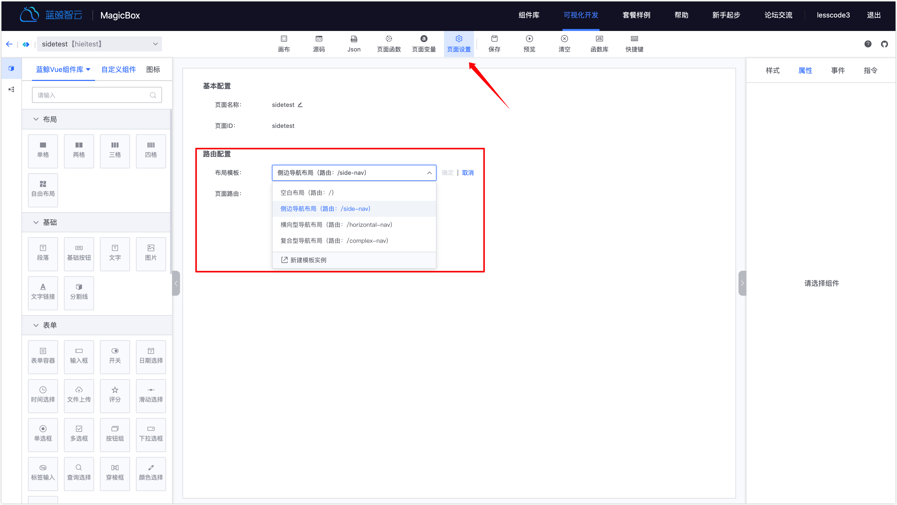
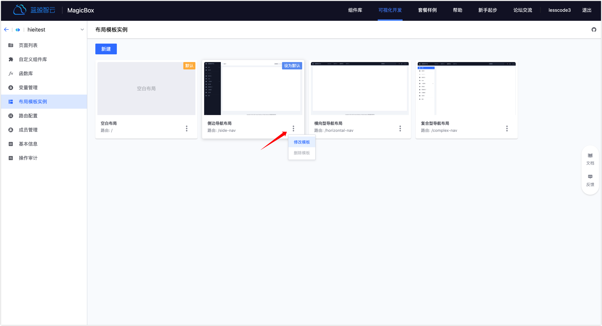

# 布局模板

## 1. 概念

布局模板是用来将具有相同布局（导航）的页面收纳在一起的方式，这样页面间就可以复用同一个布局，同时布局的路由也将成为页面的共同父路由。

## 2. 添加布局模板

系统目前共提供了 4 种布局，分别是“空白布局”、“侧边导航布局”、“横向型导航布局”、“复合型导航布局”。

### 2.1 在新建项目时添加

- 其中，“空白布局”为系统默认布局，自动勾选且不能取消。
- 如果添加时未选择其它布局模板，可创建项目后，到“布局模板实例”功能页中添加。

### 2.2 在布局模板实例中添加

**最终所属布局的页面访问路由为“布局路由/页面路由”**

新建成功后，可看到项目中所有的布局模板。

## 3. 应用布局模板

完成布局模板添加后，在添加页面时即可应用添加的布局模板到页面。多个页面使用同一个布局，则可达到复用布局的效果。布局配置在所有页面间生效，同时页面拥有共同的父路由即布局的路由。

新建页面时选择布局模板，可选择的模板为项目中所添加的所有模板。

## 4. 配置布局模板

页面应用了模板后，进入到页面编辑页，在画布中可看见模板内容，同时可以对提供的配置项进行设置。如使用的空白布局则无模板内容可见，画布中可视的即为页面内容。目前可提供的配置包括：站点名称、Logo 和导航。

下列示例图中使用的是“侧边导航布局”，正在对布局导航进入设置。其中，中间区域为页面内容编辑区。

## 5. 更多

### 5.1 修改页面布局模板

进入页面编辑页在“页面配置”中进行修改

### 5.2 修改布局模板实例名称、ID 以及模板路由

进入“布局模板实例”页找到需要修改的模板

