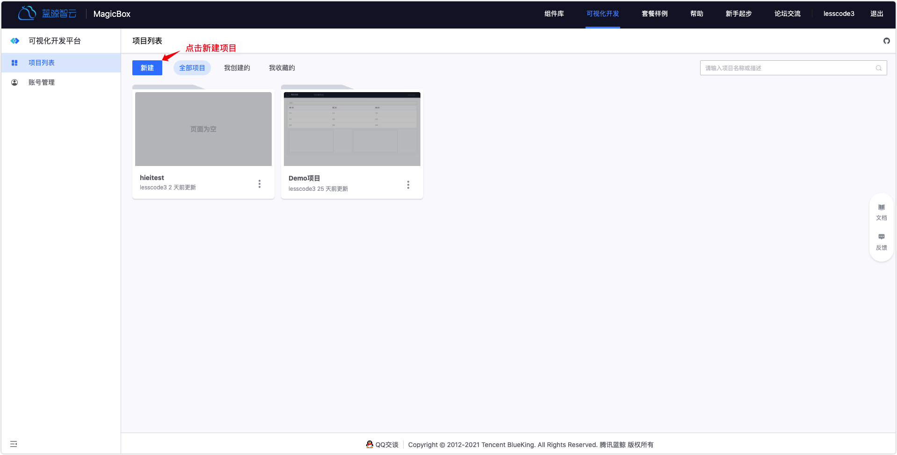
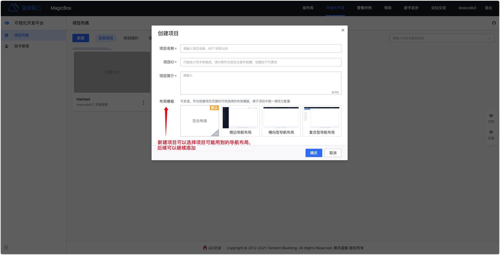
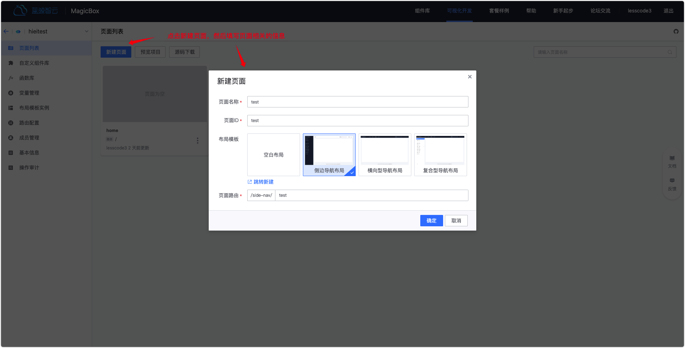
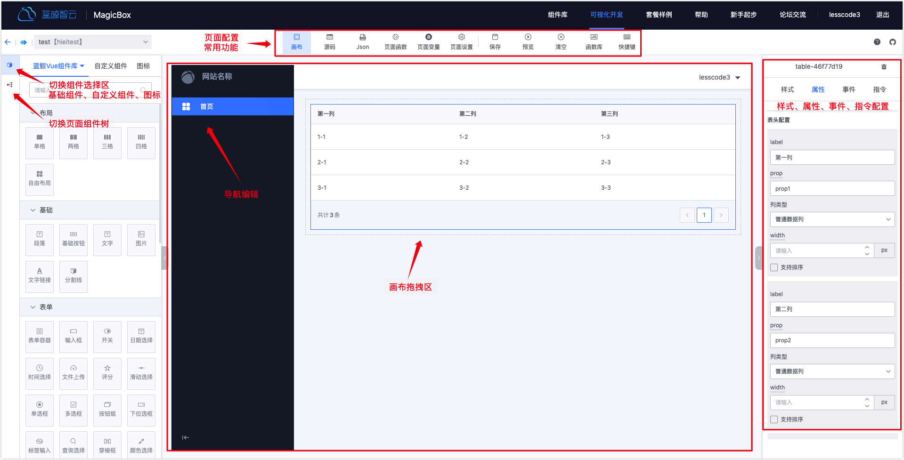
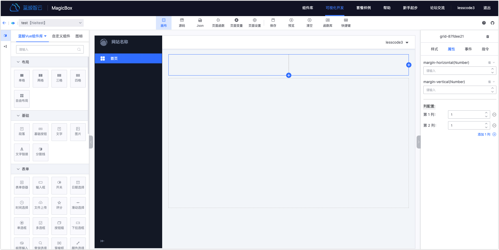
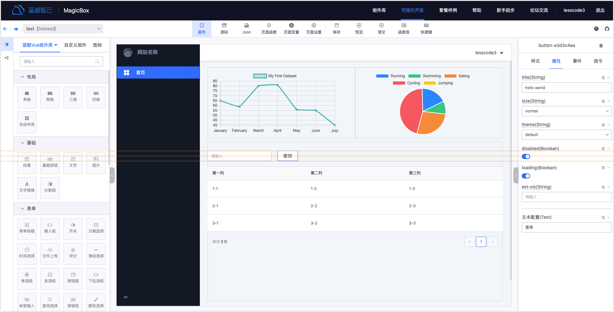
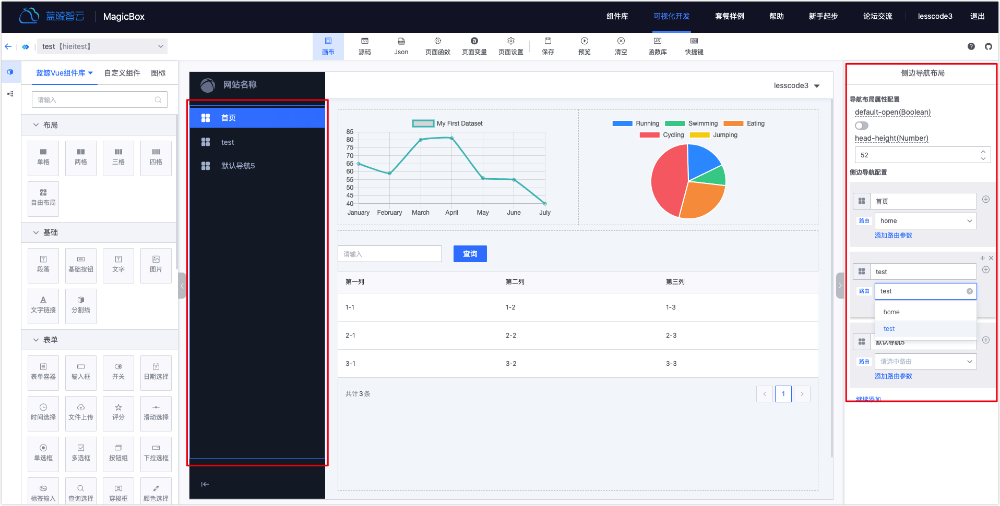
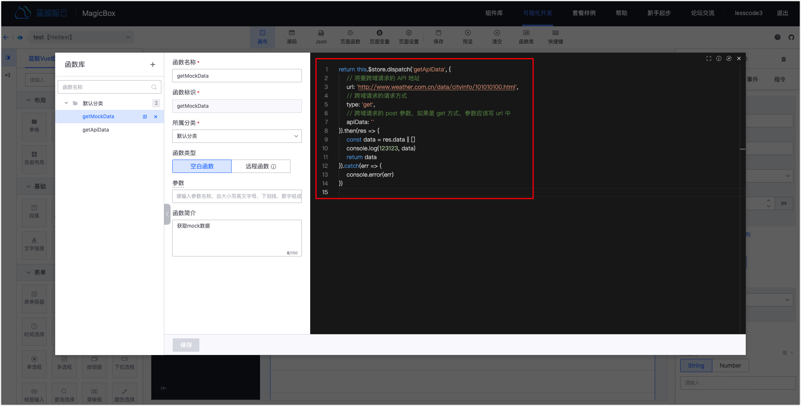
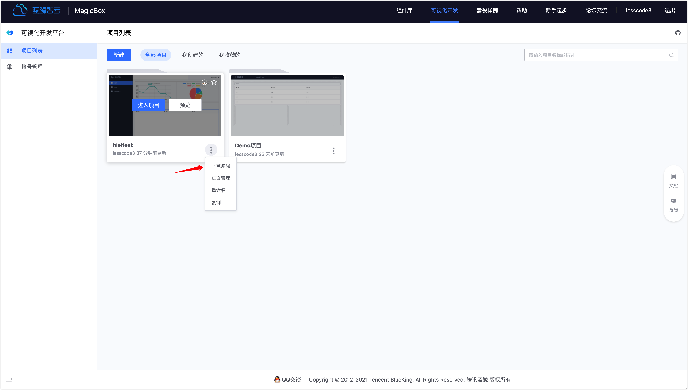
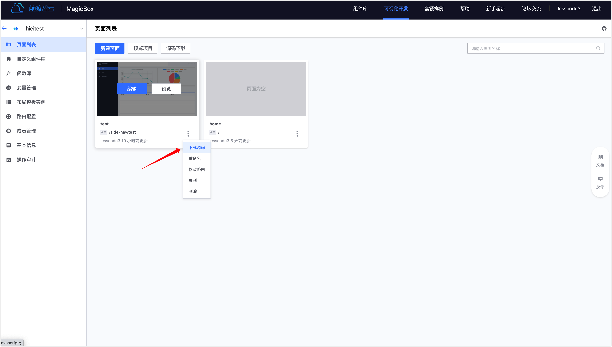

# 快速入门

## 1. 创建项目

进入蓝鲸可视化开发平台后，你可以“创建项目”开始在线一站式研发。

 

注意：

1. 项目 ID 将作为该项目自定义组件 ID 前缀，请谨慎命名
2. 创建项目时，可选择初始化布局模板实例，可基于指定布局模板实例创建项目页面

## 2. 创建、编辑页面

进入项目“页面列表”，你可以创建多个页面，并进行页面拖拽布局编辑。

- 选择页面使用的布局导航风格

    

- 拖拽组件到画布区域，进行配置

    

### 2.1 组件选择区域

- 基础组件：包含蓝鲸 Vue 组件库提供的基础通用 PC 端组件以及 ElementUI 组件库（后续将支持更多组件库）
- 自定义组件：包含当前项目内上传的自定义组件库及其它项目公开的自定义组件
- 图标：包含蓝鲸 Vue 组件库提供的图标集合，小图标、填充图标以及线性图标（后续将支持更多图标库）

### 2.2 画布区域

- 第一步：拖拽组件“栅格布局”或“自由布局”到画布中，比如“二格”和“自由布局”

    

- 第二步：再拖拽其它组件到“二格”栅栏布局和自由布局里。（在自由布局中拖拽时，会提供辅助线帮助用户对齐组件）

    

- 第三步：编辑组件样式、属性，绑定事件函数

    

- 第四步：配置页面导航

    

- 第五步：保存、预览页面

    

## 3. 函数库

你可以创建、管理项目页面所需要使用的 JS 函数。平台提供了两款示例函数供参考。
- getMockData：基于空白函数模板，调用远程 API 获取数据
- getApiData：基于远程函数模板，填写远程 API 调用信息，函数本身仅处理远程 API 返回数据即可

函数可用于组件事件绑定或组件数据源获取。

#### 注意

- 基于远程函数模板调用远程 API 的方式是由 server 发送异步请求，因此在远程 API 的服务端支持的情况下，可以实现跨域请求
- 基于空白函数模板调用远程 API 的方式默认是由浏览器发送异步请求，因此不能跨域。具体参见 getMockData 示例函数。
- 在空白函数模板中，在函数体中编写如下代码也可实现跨域请求，本质上是使用了 getApiData 的方式。
    

## 4. 自定义组件库

除了基础通用组件，还可以上传自己研发的业务场景组件。

注意：
- 自定义组件是由用户自己上传的组件，因此需要自行搭建私有 npm 仓库或者搭建[蓝鲸制品库服务](https://github.com/Tencent/bk-ci/tree/master/src/backend/storage/core)
- 组件上传包必须是使用平台提供的打包工具打包后再上传
- 须遵循平台提供的自定义组件规范进行组件开发

自定义组件开发请参见[自定义组件开发指引](../产品功能/custom-compent.md)

## 5. 二次开发

如果你对拖拽出来的页面需要进行二次开发，可参考如下方式进行：

### 方式一：下载项目全部源码

平台将把项目所有页面源码及页面路由配置集成到蓝鲸前端开发框架（[bkui-cli](https://www.npmjs.com/package/bkui-cli)）框架中，下载后的源码包可以直接在蓝鲸 PaaS 平台部署。

### 方式二：下载单页面源码

如果是已有开发中项目，只需要拖拽单独页面进行二次开发，你可以只下载单页面的源码放入你已有开发中项目工程代码中即可。

