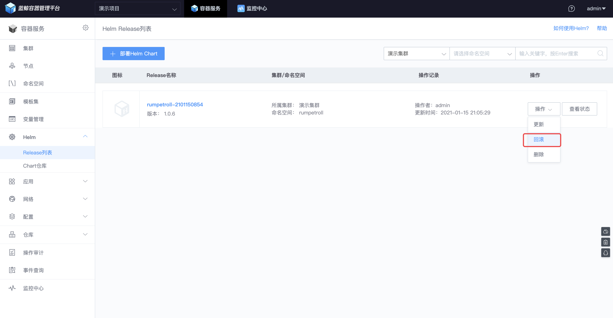

# 使用 Helm 发布应用

## 使用容器服务 Helm 部署 Chart
参考上一步推送完 Chart 之后，用户可以在【项目仓库】栏目中看到新推送的 Chart，如果没有可以点击【同步仓库】进行同步。

- 创建入口
    + 【Release 列表】菜单下，点击【部署 Helm Chart】
    +  跳转到【Chart 仓库】，选择目标 Chart 点击【部署】

图 1. Helm Release 创建入口

图 2. Helm Chart 部署按钮

- 参数填写
    + 名称：只能输入字母, 数字或者 `-`
    + Chart 版本：Chart 版本
    + 命名空间：需要实例化的目标集群+命名空间
    + 用于实例化 Helm Release 的参数，包括直接编辑 yaml 和表单两种方式：
        - yaml 文本编辑，相当于给`helm template`命令传递`-f, --values`参数
        - 表单，主要为了提升输入体验和参数校验，只有在 Chart 中定义了`questions.yaml`文件时，创建 Helm Release 页面才会生成根据`questions.yaml`内容生成表单页面。

图 3. Helm Release 创建参数页面

- Helm Release 预览
    + 在真正创建 Helm Release 之前，可以通过【预览】功能查看，将要生成的 K8S 资源配置是否符合预期。

图 4. Helm Release 创建预览入口

图 5. Helm Release 创建预览页面示例

- Helm Release 升级-对比查看功能
    + 相比于创建，针对更新的场景，蓝鲸容器服务提供了对比的功能，可以确认变更内容之后，再执行更新

图 6. Helm Release 升级-对比查看功能

- 回滚
    + 针对 Helm Release 的变更，容器服务还提供了回滚功能，在 Helm Release 列表中，选中需要回滚 Helm Release 的`回滚`操作按钮。即可以看到回滚页面，选中会要回滚的版本，确认回滚操作的变更内容即可执行回滚。

图 7. Helm Release 回滚入口

## 检查 Helm Release 状态
- 通过 Helm Release 列表页面查看
    + 选中【查看状态】即可查看资源的状态信息。

图 8. Helm Release 状态查看入口

图 9. Helm Release 状态效果图

- 使用蓝鲸容器服务 WebConsole 功能
    + 使用蓝鲸容器服务的 WebConsole 功能，用户可以不用登录主机，直接使用 kubectl 命令查看业务容器的状态。

图 10. WebConsole 使用效果图

## Helm Release 升级的版本
通过容器服务对 Helm Release 做升级时，有默认选中的版本(当前版本)。如下图所示，蓝鲸小游戏 rumpetroll 当前版本是 1.0.6，标记的是 `unchanged` , 表示当前版本自上一次被当前 Helm Release 使用之后未发生过变化。

- [开源 Helm Chart](https://github.com/helm/charts)
