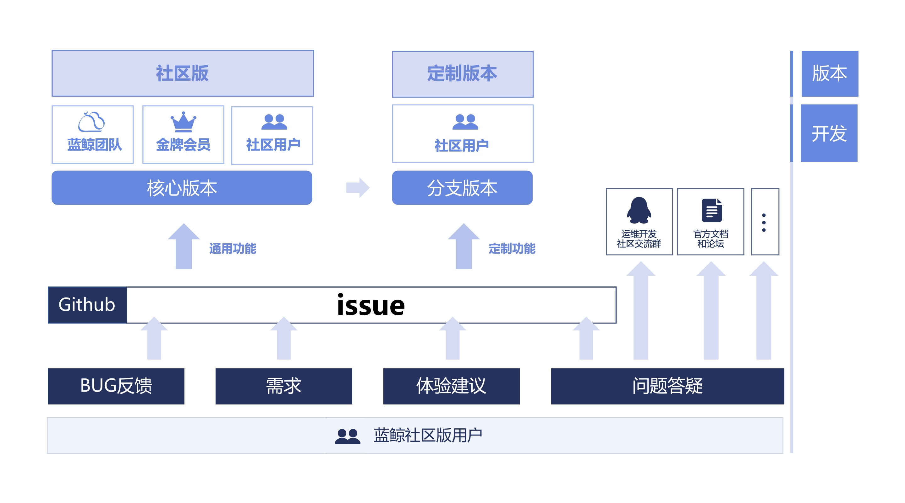

# 产品开源

BCS 团队对容器管理平台进行开源，希望将我们的技术和沉淀反馈给社区，期望能帮助更多的人解决问题；同时也邀请容器技术爱好者一起参与建设，让产品变得更加强大和易用，构建生态活跃的技术社区。

## 开源协作方式

## 开源协议
蓝鲸容器管理平台采用的是 MIT 开源协议。MIT 是和 BSD 一样宽范的许可协议，BCS 团队只想保留版权，而无任何其他的限制。 也就是说，你必须在你的发行版里包含原许可协议的声明，无论你是以二进制发布的还是以源代码发布的。

## 欢迎交流

