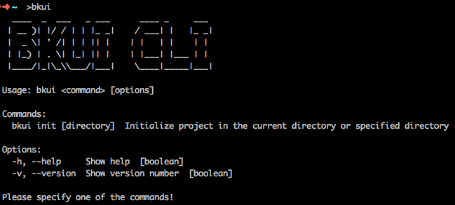

# 蓝鲸前端开发脚手架（BKUI-CLI）简介

欢迎使用蓝鲸前端开发脚手架 [BKUI-CLI](https://www.npmjs.com/package/bkui-cli)，它是基于 [Vue.js](https://vuejs.org/) 研发的一键构建蓝鲸体系前端工程的脚手架工具，包括了基础工程化能力（技术选型、结构搭建、逻辑划分、构建性能优化）、基础 mock 服务、蓝鲸前端/设计规范（代码管理、风格统一）、[bk-magic-vue 组件库](https://magicbox.bk.tencent.com/components_vue/2.0/example/index.html#/)、蓝鲸前端通用逻辑、最佳实践以及开发示例等等，可以帮助您基于前后端分离协作的模式更方便、更快速的构建蓝鲸 SaaS。

在使用蓝鲸前端开发脚手架初始化的工程中，结合了目前最新的技术，[Vue.js 2.x](https://cn.vuejs.org/)、[Vue Router 3.x](https://router.vuejs.org/zh/)、[Vuex 3.x](https://vuex.vuejs.org/zh/guide/)、[webpack 4.32.x](https://webpack.js.org/)、[@babel 7.4.x](https://babeljs.io/) 等等，同时也集成了我们日常开发过程中的最佳实践，包括基本的构建性能优化、mock 请求、常用组件、代码规范、ajax 封装等等，旨在让使用者能够专心致志的开发业务逻辑，无需为工程上其他的事情分心。

与蓝鲸 SaaS 开发框架结合使用，请参阅 [结合 BKUI 使用指南](../BKUI.md)。

## 安装与使用

### 安装

`BKUI-CLI` 已发布至 [npm](https://www.npmjs.com/package/bkui-cli)，只需要在任意目录下执行以下命令便可以安装 `BKUI-CLI`。

```bash
npm install -g bkui-cli
```

### 使用

`BKUI-CLI` 全局安装完毕后，即可输入 `bkui` 全局命令。

```bash
bkui
```

会看到如下输出：



### 帮助

在 `BKUI-CLI` 的每条命令 `<command>` 后面加上 `-h` 或者 `--help` 参数 `[options]`，会显示当前命令的帮助。

**接下来我们详细介绍 `BKUI-CLI` 的每条命令以及参数**。

## bkui -h 命令

命令行输入 `bkui -h` 或者 `bkui --help` 均会输出 `BKUI-CLI` 的帮助信息。

```bash
$ bkui -h
$ bkui --help
```


## bkui init 命令

`bkui init` 是 `BKUI-CLI` 的重要命令之一。通过前面的章节我们知道，任何命令带 `-h` 或 `--help` 参数时，都会输出当前命令的帮助信息。命令行输入 `bkui init -h`，`bkui init` 命令的帮助信息如下图：


`bkui init` 命令支持一个可选参数 `DIRECTORY_NAME`，表示要创建项目的名称。

- 如果不设置 `DIRECTORY_NAME` ，那么默认会在当前命令行执行目录下初始化项目，项目的名称就是当前目录的名称；
- 如果设置了 `DIRECTORY_NAME`，那么会在当前命令行执行目录下创建 `DIRECTORY_NAME` 并在 `DIRECTORY_NAME` 目录里生成项目模板，项目的名称就是 `DIRECTORY_NAME`。

`bkui init` 命令执行过程中，会采用交互问答的形式向使用者提出几个问题，获取答案作为初始化项目的参数，**接下来我们分别解释这几个问题的作用**。


## bkui init 命令行问题说明

> 蓝鲸前端开发脚手架是为了让开发者基于前后端分离协作的模式更方便、更快速的构建蓝鲸 SaaS。构建完整的蓝鲸 SaaS 应用，需要前后端协作。因此命令行问答交互中有几个问题例如 `AJAX_URL_PREFIX`, `LOGIN_URL`, `USER_INFO_URL` 需要和后端一起协商指定。

> 为了让前后端分离协作模式可行，这几个设置默认均为本地模拟地址（即 `http://localhost`），这么做一来可以使前端页面功能开发可以相对独立完成，二来当后端接口准备好之后，前端仅需要修改代码中对应的配置，即可进行功能联调。

### Generate project in current directory
是否在当前目录下初始化项目，**直接在当前目录下运行 `bkui init` 并且当前目录为空时会出现这个问题**。

### The current directory is not empty. Continue
是否在当前目录下初始化项目，**直接在当前目录下运行 `bkui init` 并且当前目录不为空时会出现这个问题**。

### Target directory exists. Will create a new directory and add the `.bak` suffix to the existing directory. Continue
是否在已存在的目录里初始化项目，**运行 `bkui init DIRECTORY_NAME` 并且 `DIRECTORY_NAME` 已经存在时会出现这个问题**，继续之后，会给已存在的目录添加一个时间戳后缀，同时新建 `DIRECTORY_NAME` 目录，并在 `DIRECTORY_NAME` 新目录里初始化项目。

### Is it a SaaS Application
是否是蓝鲸 SaaS 应用，默认为是。**蓝鲸前端开发脚手架除了可以构建蓝鲸 SaaS 应用，也支持构建 Web 单页应用**。

### Project name
项目名称，默认为 `bkui init` 中设置的 `DIRECTORY_NAME`，如果没有 `DIRECTORY_NAME` 参数，那么就是当前目录的名称。

### Project description
项目描述，默认为 `Project description` 字符串。

### Author
作者，默认会取你工程下的 `git config --get user.name` 以及 `git config --get user.email` 以 `name <email>` 显示。如果当前工程下没有，那么会取全局 `git` 的配置。如果全局 `git` 没有获取到，那么 `name` 会被设置为 `os.hostname()` 即操作系统的主机名，`email` 会被设置为 `''`。

### PostCSS or Scss
css 的处理引擎，目前仅支持 `postcss`。

> [postcss](https://postcss.org/) 是一个用 js 工具和插件转换 css 代码的工具，这些插件可以支持使用变量，混入(mixin)，转换未来的 css 语法，内联图片等操作。相对于 scss，我们更推荐使用 postcss，因为 postcss 是利用 js 来转换 css 代码，基于 js 写的插件理论上来说可以完成任何操作，没有限制，只要能够想到，基本上都可以利用 js 来实现，而且 postcss 不会对 css 代码做任何修改，它只是为插件提供接口，方便他们完成各自的功能。如果需要结合 webpack 使用 scss，参见 [postcss-loader](https://webpack.js.org/loaders/postcss-loader/)。

### LOCAL_DOC_URL
`bkui init` 初始化项目时，会在项目中自带一个文档示例工程，这个参数就是设置文档示例工程的本地访问 URL，默认为 `http://localhost`，如果需要自己设置，请输入绝对地址。**（文档示例工程不会对实际的工程产生任何影响，打包构建时也不会把文档示例工程的内容打入到实际工程中）**。
> 文档示例工程只是本地运行，因此不会涉及到线上部署，通常使用默认设置 `http://localhost` 即可。如果需要把文档部署到线上，可运行 `npm run build:doc` 打包构建文档示例工程，然后自行部署。

##### 如何修改本配置

- **本配置是 `${ROOT}/doc/build/config.js` 中的 `localDocUrl` 字段，可根据自己的需求修改。**

### LOCAL_DOC_PORT
文档示例工程的本地访问端口，默认为 `8081`。

##### 如何修改本配置

- **本配置是 `${ROOT}/doc/build/config.js` 中的 `localDocPort` 字段，可根据自己的需求修改。**

### LOCAL_DEV_URL
本地开发的地址，默认值为 `http://localhost`，如果需要自己设置，请输入绝对地址（本配置与线上部署无关）。
> 我们推荐将 `LOCAL_DEV_URL` 设置为与您部署的蓝鲸或非蓝鲸 SaaS 应用的线上域名一致，只是加上一个 `local-dev` 的子级前缀。

> 例如假设您部署的蓝鲸对应域名是：`http://www.bking.com`，那么 `LOCAL_DEV_URL` 就设置为 `http://local-dev.bking.com`，然后配置 host，`127.0.0.1 local-dev.bking.com`，就可用 `http://local-dev.bking.com:${LOCAL_DOC_PORT}` 来进行本地开发了。

##### 如何修改本配置

- **本配置是 `${ROOT}/build/dev.env.js` 中的 `LOCAL_DEV_URL` 字段，可根据自己的需求修改。**

### LOCAL_DEV_PORT
本地开发的端口，默认值为 `8080`。

##### 如何修改本配置

- **本配置是 `${ROOT}/build/dev.env.js` 中的 `LOCAL_DEV_PORT` 字段，可根据自己的需求修改。**

### AJAX_URL_PREFIX
ajax 请求地址前缀，我们通过这个配置来拼接出 ajax 请求的前缀，设置为 `axios` 的 `baseURL`，如果需要自己设置，请输入绝对地址。通常情况下，这个值需要与后端协商指定。

**蓝鲸 SaaS 应用和非蓝鲸 SaaS 应用 ajax 请求前缀：**

- 蓝鲸 SaaS 应用
  - 此配置默认值为 `http://localhost:8080`（`${LOCAL_DEV_URL}:${LOCAL_DEV_PORT}`）
  - ajax 完整的请求地址前缀就是 `AJAX_URL_PREFIX`
- 非蓝鲸 SaaS 应用
  - 此配置默认值为 `http://localhost:8080/api`（`${LOCAL_DEV_URL}:${LOCAL_DEV_PORT}/api`）
  - ajax 完整的请求地址前缀就是 `AJAX_URL_PREFIX`

##### 如何修改本配置

- **本地开发中，本配置是 `${ROOT}/build/dev.env.js` 中的 `AJAX_URL_PREFIX` 字段，可根据自己的需求修改。**
- **生产环境中，本配置是 `${ROOT}/build/prod.env.js` 中的 `AJAX_URL_PREFIX` 字段，可根据自己的需求修改。打包构建时，我们通常会把 `${ROOT}/build/prod.env.js` 中的 `AJAX_URL_PREFIX` 字段设置为 `''`，这么做的原因是，让 ajax 异步请求地址前缀直接和浏览器访问路径的域名信息一致。**

### AJAX_MOCK_PARAM
我们集成了简单方便的 `mock` 功能，任何请求，只要在 url 参数中带有 `AJAX_MOCK_PARAM` 的值表示的 url 参数，那么就会进入 `mock` 的逻辑。这个 url 参数的值为 `/a/b/c` 这样的路径，对应的就是 `${ROOT}/mock/ajax` 文件夹下的文件，同时还有一个 `invoke` 参数，表示这个文件里的方法名。`AJAX_MOCK_PARAM` 的默认值为 `mock-file`。

示例如下：

- 本参数设置为 `mock-file`，url 线上的请求为 `/app/project/list`
- 需要 mock 这个请求，只需要将 url 设置为 `/app/project/list?mock-file=/app/project&invoke=list`
- 同时在 `${ROOT}/mock/ajax` 下创建 app 文件夹，文件夹中创建 project 文件，文件中判断 invoke 为 list 时，返回对应的 mock 数据即可
- 本地开发过程中，`AJAX_MOCK_PARAM` 有变化时，那么修改 `${ROOT}/build/dev.env.js` 文件中 `AJAX_MOCK_PARAM` 的值，然后重启本地 devserver 即可。

##### 如何修改本配置

- **本配置是 `${ROOT}/build/dev.env.js` 中的 `AJAX_MOCK_PARAM` 字段，可根据自己的需求修改。**
- **在 `${ROOT}/build/prod.env.js` 也有一个 `AJAX_MOCK_PARAM` 字段，正常来说，生产环境中不会使用 mock 的字段，不过为了防止在打包构建后的文件中直接出现 `AJAX_MOCK_PARAM` 变量，因此在 `${ROOT}/build/prod.env.js` 文件中我们也设置了 `AJAX_MOCK_PARAM` 字段。**

### LOGIN_URL（构建非蓝鲸 SaaS 应用时才会有此配置）
登录的地址，默认值为 `${LOCAL_DEV_URL}:${LOCAL_DEV_PORT}/login`，如果需要自己设置，请输入绝对地址。在有登录逻辑的应用中，当**刷新页面**检测到未登录时，页面会自动跳转到这个值所表示的登录页面去。通常情况下，这个值需要与后端协商指定。

示例如下（**假设您本地开发的地址为 http://local-dev.bking.com**）：

| 生产环境配置 | 本地开发配置 |
|---------------|---------------|
|http://www.bking.com/login （与后端协商指定，然后在命令行问答中设置）| http://local-dev.bking.com:8080/login （由 `LOCAL_DEV_URL`, `LOCAL_DEV_PORT` 共同决定） |

- 如果初始化项目的时候还没有确定 `LOGIN_URL`，直接使用默认值即可，当确定了 `LOGIN_URL` 之后，只需要修改 `${ROOT}/build/prod.env.js` 文件中 `LOGIN_URL` 的值即可。
- 本地开发我们一般很少会涉及到登录的逻辑（检测登录逻辑主要是后端验证）。如果我们在本地开发中需要对登录逻辑做一些验证，可以通过 mock httpStatusCode 为 401 来实现。此时，可以通过修改 `${ROOT}/build/dev.env.js` 文件中 `LOGIN_URL` 的值来改变本地开发的登录地址。

##### 如何修改本配置

- **本配置是 `${ROOT}/build/dev.env.js` 中的 `LOGIN_URL` 字段，可根据自己的需求修改。**

### USER_INFO_URL
这个配置表示获取用户信息的接口，我们通过这个接口来判断当前用户是否登录，如果需要自己设置，请输入绝对地址。通常情况下，这个值需要与后端协商指定。

- 蓝鲸 SaaS 应用
  - 此配置默认值为 `account/get_user_info/`
  - 通过 index.html（线上）或 index-dev.html（本地开发） 中的 `SITE_URL` 拼出完整的获取用户信息异步接口。
  - 示例工程中，这个配置使用的是本地的 mock 接口，如需在本地开发时从后端获取异步数据，只需要把 index-dev.html 中的 `SITE_URL` 改成后端提供的地址即可。
- 非蓝鲸 SaaS 应用
  - 此配置默认值为 `user`
  - 本地开发时，通过 `AJAX_URL_PREFIX` 拼出完整的获取用户信息异步接口。
  - 示例工程中，这个配置使用的是本地的 mock 接口，如需在本地开发时从后端获取异步数据，修改 `${ROOT}/build/dev.env.js` 中的 `AJAX_URL_PREFIX` 值，然后重启本地 devserver 即可。
- 如需修改此配置的值，修改 `${ROOT}/build/dev.env.js` 和 `${ROOT}/build/prod.env.js` 中的 `USER_INFO_URL` 值，然后重启本地 devserver 即可。

##### 如何修改本配置

- **本地开发中，本配置是 `${ROOT}/build/dev.env.js` 中的 `USER_INFO_URL` 字段，可根据自己的需求修改。**
- **生产环境中，本配置是 `${ROOT}/build/prod.env.js` 中的 `USER_INFO_URL` 字段，可根据自己的需求修改。**
- **在后端接口准备后好之后，我们推荐无论是本地开发或者打包构建，即在 `${ROOT}/build/dev.env.js` 和 `${ROOT}/build/prod.env.js` 两个文件中，这个字段的配置都是一致的。**

## webpack4 类型项目目录结构

使用 `BKUI-CLI` 初始化后，项目目录结构如下：

```bash
|-- ROOT/               # 项目根目录
    |-- .babelrc        # babel 配置
    |-- .eslintignore   # eslintignore 配置
    |-- .eslintrc.js    # eslint 配置
    |-- .gitignore      # gitignore 配置
    |-- README.md       # 工程的 README
    |-- index-dev.html  # 本地开发使用的 html
    |-- index.html      # 构建部署使用的 html
    |-- package-lock.json # package-lock file
    |-- package.json    # package.json，我们在提供了基本的 doc, dev, build 等 scripts，详细内容请参见文件
    |-- postcss.config.js # postcss 配置文件，我们提供了一些常用的 postcss 插件，详细内容请参见文件
    |-- build/            # 存放打包构建脚本、webpack 插件等等的目录
    |   |-- ajax-middleware.js # ajax mock 的实现
    |   |-- build-dll.js    # webpack 打包 dll
    |   |-- build.js        # webpack build
    |   |-- check-dll.js    # 检测 dll 是否存在，如果不存在，那么会自动打包，方便在 dev 的时候不用每次都打包 dll
    |   |-- check-versions.js   # 检测 node 和 npm 的版本，版本的限制在 package.json 文件中
    |   |-- config.js       # 本地开发以及 webpack 构建时的一些配置
    |   |-- dev-client.js   # webpack-hot-middleware 注入到页面的脚本，在 dev 时，文件改动，会自动刷新浏览器
    |   |-- dev-server.js   # 本地 dev server 的实现
    |   |-- dev.env.js      # 本地开发时的环境配置
    |   |-- prod.env.js     # webpack 构建时的环境配置
    |   |-- replace-css-static-url-plugin.js # webpack 插件，用于替换 asset css 中的 BK_STATIC_URL，__webpack_public_path__ 没法解决 asset 里静态资源的 url
    |   |-- util.js         # build 里的常用方法
    |   |-- webpack.base.conf.js # webpack base 配置，用于 dev 和构建
    |   |-- webpack.dev.conf.js  # webpack dev 配置
    |   |-- webpack.prod.conf.js # webpack 构建配置
    |-- doc/            # 蓝鲸前端开发脚手架的文档工程，这里的细节与实际工程无关，就不详细介绍了，如有兴趣，可自行查看（doc 里的内容不会影响到实际的工程）
    |   ......
    |-- mock/           # mock 数据存放的目录
    |   |-- ajax/       # mock 数据存放的目录
    |       |-- index.js    # index 模块的 mock 数据文件
    |       |-- util.js     # mock 数据存放模块的常用方法
    |-- src/            # 实际项目的源码目录
    |   |-- App.vue     # App 组件
    |   |-- main.js     # 主入口
    |   |-- public-path.js  # __webpack_public_path__ 设置
    |   |-- api/        # 对 axios 封装的目录
    |   |   |-- cached-promise.js # promise 缓存
    |   |   |-- index.js          # axios 封装
    |   |   |-- request-queue.js  # 请求队列
    |   |-- common/     # 项目中常用模块的目录
    |   |   |-- auth.js     # auth
    |   |   |-- bkmagic.js  # bk-magic-vue 组件的引入
    |   |   |-- bus.js      # 全局的 event bus
    |   |   |-- demand-import.js    # 按需引入 bk-magic-vue 的组件
    |   |   |-- fully-import.js     # 全量引入 bk-magic-vue 的组件
    |   |   |-- preload.js  # 页面公共请求即每次切换 router 时都必须要发送的请求
    |   |   |-- util.js     # 项目中的常用方法
    |   |-- components/     # 项目中组件的存放目录
    |   |   |-- auth/       # auth 组件
    |   |   |   |-- index.css   # auth 组件的样式
    |   |   |   |-- index.vue   # auth 组件
    |   |   |-- exception/      # exception 组件
    |   |       |-- index.vue   # exception 组件
    |   |-- css/            # 项目中通用的 css 的存放目录。各个组件的样式通常在组件各自的目录里。
    |   |   |-- app.css     # App.vue 使用的样式
    |   |   |-- reset.css   # 全局 reset 样式
    |   |   |-- variable.css    # 存放 css 变量的样式
    |   |   |-- mixins/     # mixins 存放目录
    |   |       |-- scroll.css  # scroll mixin
    |   |-- images/         # 项目中使用的图片存放目录
    |   |   |-- 403.png     # 403 错误的图片
    |   |   |-- 404.png     # 404 错误的图片
    |   |   |-- 500.png     # 500 错误的图片
    |   |   |-- building.png # 正在建设中的图片
    |   |-- router/         # 项目 router 存放目录
    |   |   |-- index.js    # index router
    |   |-- store/          # 项目 store 存放目录
    |   |   |-- index.js    # store 主模块
    |   |   |-- modules/    # 其他 store 模块存放目录
    |   |       |-- example.js  # example store 模块
    |   |-- views/          # 项目页面组件存放目录
    |       |-- 404.vue     # 404 页面组件
    |       |-- index.vue   # 主入口页面组件，我们在这里多使用了一层 router-view 来承载，方便之后的扩展
    |       |-- example1/   # example1 页面组件存放目录
    |       |   |-- index.css   # example1 页面组件样式
    |       |   |-- index.vue   # example1 页面组件
    |       |-- example2/   # example2 页面组件
    |       |   |-- index.css   # example2 页面组件样式
    |       |   |-- index.vue   # example2 页面组件
    |       |-- example3/   # example3 页面组件
    |           |-- index.css   # example3 页面组件样式
    |           |-- index.vue   # example3 页面组件
    |-- static/             # 静态资源存放目录，通常情况下， 这个目录不会人为去改变
    |   |-- lib-manifest.json   # webpack dll 插件生成的文件，运行 npm run dll 或者 npm run build 会自动生成
    |   |-- lib.bundle.js       # webpack dll 插件生成的文件，运行 npm run dll 或者 npm run build 会自动生成
    |   |-- images/         # 图片静态资源存放目录
    |       |-- favicon.ico # 网站 favicon
```


## 配置说明

这里给大家介绍一下初始化的工程中几个需要注意的地方

### index.html 配置说明

蓝鲸前端开发脚手架是用来帮助我们构建蓝鲸 SaaS 应用的，同时它也支持我们构建一般的 web 单页应用。

在初始化的工程里，有 `index-dev.html` 和 `index.html` 两个 html 文件。这两个 html 的差异点如下：

- index.html 用于生产环境，由后端服务器渲染
- index-dev.html 用于本地开发，由本地 devserver 渲染

html 文件中有几个变量（`SITE_URL`, `BK_STATIC_URL`, `REMOTE_STATIC_URL`），配置说明如下：

#### SITE_URL

前端使用的 router mode 是 `history`，因此前端路由需要根据这个变量的值来设置**路由的根路径**以及 **ajax 异步请求地址前缀**。

- 在蓝鲸 SaaS 应用和非蓝鲸 SaaS 应用中，SITE_URL 的作用均是**设置路由的根路径**。

下面看一个简单的例子理解一下（**假设您部署的蓝鲸对应域名是：http://www.bking.com ，本地开发的地址为 http://local-dev.bking.com**）：

|             | 生产环境 SITE_URL 配置（index.html）| 生产环境访问地址 | 本地开发 SITE_URL 配置（index-dev.html）| 本地开发访问地址 |
|-------------|---------------|---------------|---------------|---------------|
| 蓝鲸 SaaS 应用 | /t/open-v214/（由后端服务注入页面）| http://www.bking.com/t/open-v214/ | /（默认值为：/）| http://local-dev.bking.com |
| 非蓝鲸 SaaS 应用 | /（蓝鲸前端开发脚手架直接生成，非蓝鲸 SaaS 应用通常不会由后端服务注入页面）| http://www.bking.com | /（默认值为：/）|  http://local-dev.bking.com |

##### 如何修改本配置
- **本地开发中，本配置是 `${ROOT}/index-dev.html` 中的 `SITE_URL` 的值，可根据自己的需求修改。**
- **生产环境中，本配置是 `${ROOT}/index.html` 中的 `SITE_URL` 的值，可根据自己的需求修改。**

**蓝鲸 SaaS 应用中，我们建议不要修改 `${ROOT}/index.html` 中 `SITE_URL` 的值，生产环境应该由后端注入到页面中。**

#### BK_STATIC_URL

前端需要根据这个值来确定静态资源的路径（包括默认写在 html 上的 lib.bundle.js 以及 webpack 动态 inject 的 js 和 css）

还是看一个简单的例子（**假设您部署的蓝鲸对应域名是：http://www.bking.com ，本地开发的地址为 http://local-dev.bking.com**）：

|             | 生产环境 BK_STATIC_URL 配置（index.html）| 生产环境加载静态资源的路径前缀 | 本地开发 BK_STATIC_URL 配置（index-dev.html）| 本地开发加载静态资源的路径前缀 |
|-------------|---------------|---------------|---------------|---------------|
| 蓝鲸 SaaS 应用 | /t/open-v214/static/dist/（由后端服务注入页面）| http://www.bking.com/t/open-v214/static/dist/ | /（默认值为：/）| http://local-dev.bking.com/ |
| 非蓝鲸 SaaS 应用 | /（蓝鲸前端开发脚手架直接生成，非蓝鲸 SaaS 应用通常不会由后端服务注入页面）| http://www.bking.com/ | / （默认值为：/）| http://local-dev.bking.com/|

##### 如何修改本配置

- **本地开发中，本配置是 `${ROOT}/index-dev.html` 中的 `BK_STATIC_URL` 的值，可根据自己的需求修改。**
- **生产环境中，本配置是 `${ROOT}/index.html` 中的 `BK_STATIC_URL` 的值，可根据自己的需求修改。**

**蓝鲸 SaaS 应用中，我们建议不要修改 `${ROOT}/index.html` 中 `BK_STATIC_URL` 的值，生产环境应该由后端注入到页面中。**

#### REMOTE_STATIC_URL

在蓝鲸 SaaS 应用以及非蓝鲸 SaaS 应用中，有时候可能需要引入其他 CDN 的静态资源文件，这个值就是用来设置其他 CDN 的静态资源路径的。生产环境由后端服务注入页面，本地开发环境默认为空。

##### 如何修改本配置

- **本地开发中，本配置是 `${ROOT}/index-dev.html` 中的 `REMOTE_STATIC_URL` 的值，可根据自己的需求修改。**
- **生产环境中，本配置是 `${ROOT}/index.html` 中的 `REMOTE_STATIC_URL` 的值，可根据自己的需求修改。**

**蓝鲸 SaaS 应用中，我们建议不要修改 `${ROOT}/index.html` 中 `REMOTE_STATIC_URL` 的值，生产环境应该由后端注入到页面中。**

### 组件库按需和全量加载的切换

蓝鲸前端开发脚手架集成了我们的 [bk-magic-vue](https://magicbox.bk.tencent.com/components_vue/2.0/example/index.html#/) 组件库。组件库支持按需加载和全量加载，两种方式的写法不同，参见 `${ROOT}/src/common/demand-import.js`（按需加载）和 `${ROOT}/src/common/fully-import.js`（全量加载）。

我们是在 `${ROOT}/src/common/bkmagic.js` 中切换的，需要全量加载，就引入 `fully-import`，需要按需加载就引入 `demand-import`。

### mock 的使用说明

蓝鲸前端开发脚手架提供简单方便的异步请求 mock 功能，通过简单的配置（仅仅只需要添加 url 的参数）来模拟后端的数据返回，有助于前后端分离协作。简单的示例如下（**假设您部署的蓝鲸对应域名是：http://www.bking.com ，线上 ajax 异步请求的根路径为: http://www.bking.com/api ，获取用户信息的请求为 http://www.bking.com/api/user**）：

- 命令行问答 `AJAX_MOCK_PARAM` 设置为默认值 `mock-file`，如果初始化工程后需要改动，修改 `${ROOT}/build/dev.env.js` 中的 `AJAX_MOCK_PARAM` 值即可
- 同时在 `${ROOT}/mock/ajax` 目录下创建 app 文件夹，文件夹中创建 index 文件，参照文件中已存在内容的写法，判断 invoke 为 getUserInfo 时，返回对应的 mock 数据即可
- mock `http://www.bking.com/api/user` 这个请求，只需在这个请求后加上这段参数即可 `?mock-file=/index&invoke=getUserInfo`；去掉这段参数，就会真正请求后端数据

::: info 如何修改本配置？
本配置是 `${ROOT}/build/dev.env.js` 中的 `AJAX_MOCK_PARAM` 字段，可根据自己的需求修改。

在 `${ROOT}/build/prod.env.js` 也有一个 `AJAX_MOCK_PARAM` 字段，正常来说，生产环境中不会使用 mock 的字段，不过为了防止在打包构建后的文件中直接出现 `AJAX_MOCK_PARAM` 变量，因此在 `${ROOT}/build/prod.env.js` 文件中我们也设置了 `AJAX_MOCK_PARAM` 字段。
:::

### 修改打包构建最终产物的生成目录
通过修改 `${ROOT}/build/config.js` 中的 `build.assetsRoot` 字段，可以更改打包构建最终产物的生成目录。

|             | 默认值 |
|-------------|---------------|
| 蓝鲸 SaaS 应用 | `path.resolve(__dirname, '../../static/dist')`（与当前工程目录同级的 static 目录下的 dist 目录，在当前工程目录外部）|
| 非蓝鲸 SaaS 应用 | `path.resolve(__dirname, '../dist')`（当前工程目录下的 dist 目录，在当前工程目录内部）|
