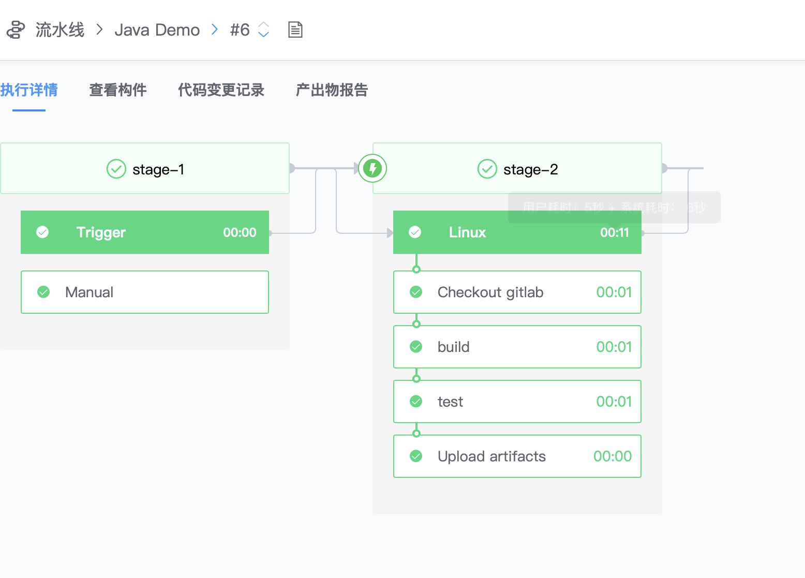

# Java Maven Demo

本篇文章将指导你如何在 bk-ci 编译**Maven**工程。

## 准备材料

- 一个 maven 工程：<https://gitlab.com/bk-ci/gs-maven.git>
- 一个包含 mvn 命令的 CI 镜像：<https://hub.docker.com/r/bkci/ci>

## 详细步骤

1. 将准备好的 gitlab 代码库关联至 bk-ci，[请参考](../Quickstarts/Link-your-first-repo.md)
2. 创建一条空白流水线
3. 将 Linux 构建环境添加到 Job2-1，镜像地址填写：bkci/ci:latest
   
4. 依次添加如下 4 个插件：
   1. Checkout Gitlab
      
   2. Shell Scripts

      ```bash
      #!/usr/bin/env bash
      cd initial
      mvn install
      ```

   3. Shell Scripts

      ```bash
      #!/usr/bin/env bash
      cd initial
      mvn test
      ```

   4. Upload artifacts
      

5. 运行流水线，观察结果

