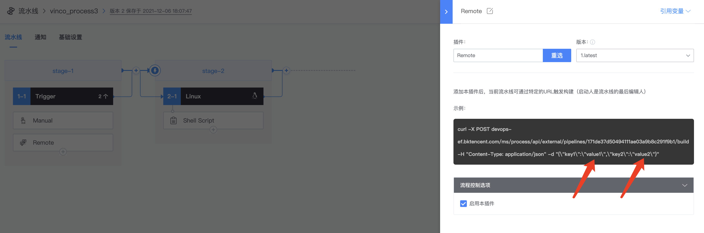

# 远程触发方式
远程触发方式可以让用户使用一条简单的 curl 命令就能启动流水线，启动人是流水线的最后编辑人

使用远程触发 remote 插件：


remote 插件提供要触发本条流水线的 curl 命令：


如果在 Trigger 定义了变量，实际调用时提供的参数将会覆盖默认参数





```bash
curl -X POST devops.bktencent.com/ms/process/api/external/pipelines/171de37d50494111ae03a9b8c291f9b1/build -H "Content-Type: application/json" -d "{\"key1\":\"value1\",\"key2\":\"value2\"}"
```
