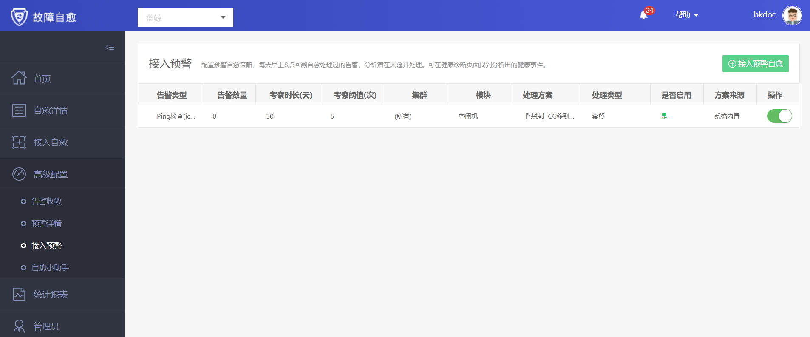
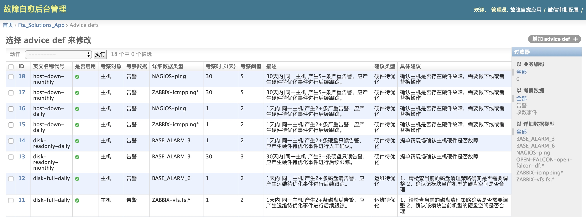

# 健康诊断

依托于腾讯故障处理的经验，集成常见故障隐患的**专家配置库**，回溯过往发生的告警单据来**提前发现问题**。

每天早上 8 点回溯自愈处理过的告警，处理分析出的潜在风险。下图为 1 天内产生 2 次磁盘容量告警，故障自愈将提示：
- 请检查当前的磁盘清理策略确实是否需要调整
- 确认该模块当前机型的硬盘空间是否合理

除了针对风险的文本建议，还可以在【接入预警】页面配置自动处理的动作。

下图的预警自愈策略为：当 1 个月内同 1 台主机产生了 5 次 Ping 告警，则故障自愈认为该主机存在异常(可能主板、内存故障)，直接将主机在 CMDB 中移到 “故障机”模块。当然，你也可以设置其他处理动作。

健康诊断，**在告警中提前发现业务隐患**。

## 附录 1 ： Django 后台调整健康诊断策略

用 PaaS 管理员访问 <PaaS_URL>/o/bk_fta_solutions/admin/，进入故障自愈的 Django 后台。

点击 `Advice_defs` 进入健康诊断策略配置页面，可以看到健康诊断建议，可以依据实际情况修改。

