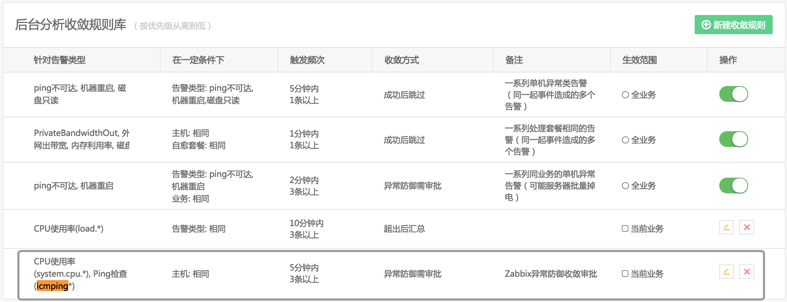

# 告警收敛

我们很有可能收到重复的告警，所以故障自愈推出告警收敛功能。

满足一定规则后，执行对应的收敛方式。

## 单业务设置

点击右上角 新建收敛规则，按下图灰色框中内容添加一条规则。

图 1. 告警收敛

下图中命中了上述最后一条规则(在同一台主机上，5 分钟内出现 3 条以上告警，由于没有进行审批动作，于是 20 分钟后超时了)。

图 2. 告警收敛结果

## 设置全局收敛规则

默认手动添加的收敛规则的生效范围是`当前业务`，如果希望在全业务下都生效，可以在 Django 后台设置。

### 任意找一个业务设置收敛规则

图 3. 添加收敛规则

图 4. 收敛规则添加成功

### 在 Django 后台修改生效范围

使用管理员角色访问以下地址：

`http://${PaaS_URL}/o/bk_fta_solutions/admin/fta_solutions_app/incidentdef/`

图 5. 在 Django 后台修改生效范围

找到刚添加的收敛规则，将其`业务编码`修改为 0 (即对所有业务生效)。

访问`告警收敛`可以发现 `规则来源` 从  `当前业务` 换成了 `系统内置`

图 6. 收敛规则来源修改成功

### 在不同业务下测试，均生效

图 7. 在 A 业务下测试收敛规则

图 8. 在 B 业务下测试收敛规则

