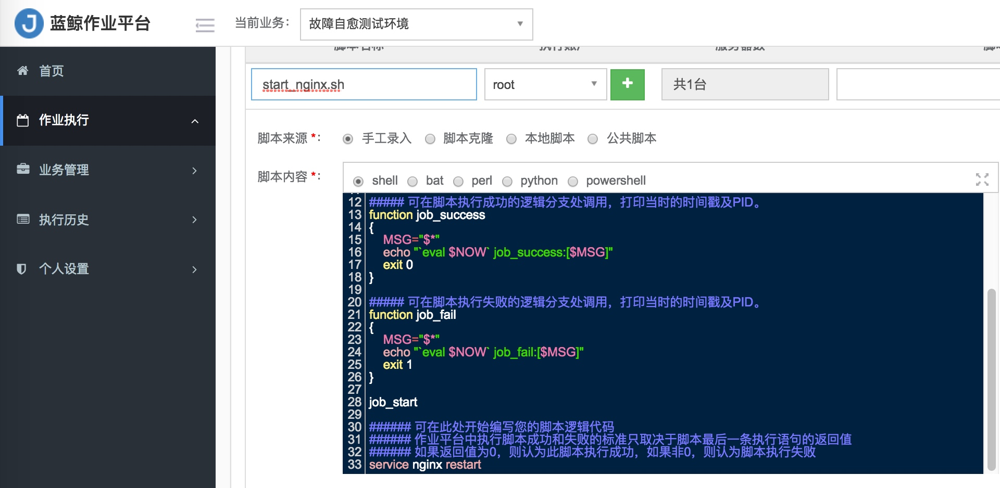

# 进程告警

故障自愈除了能处理单机性能告警外，还能处理服务类的告警，比如进程告警。

比如 Nginx 进程挂掉了，你需要拉起 Nginx 进程。

下面以 Nginx 进程告警接入自愈为例。

## 编写拉起 Nginx 进程的作业

在作业平台编写拉起 Nginx 进程的脚本。

> 脚本中除了拉起进程，你还可以考虑增加进程检测的逻辑，保证拉起进程这个过程无误。

## 创建拉起 Nginx 的自愈套餐

在【套餐管理】中新建作业平台套餐，选择刚刚在作业平台中创建的【拉起 Nginx】作业。

## 接入自愈

在【接入自愈】页面将【进程告警】关联 【拉起 Nginx】套餐，自愈范围选中【nginx】模块。

至此，进程告警的自愈处理方案配置完毕。

更多进程告警的配置细节请参考 [蓝鲸监控告警自动处理](../functions/Alarm_Automatic_Processing.md)。

