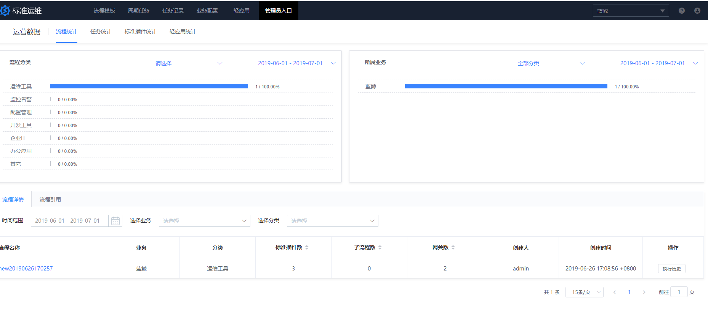

# 管理员入口
## 后台管理

包含远程插件包源管理，和远程插件同步。

后台管理可以让用户不修改标准运维源码就可以加载第三方插件，解决了标准插件开发和维护流程复杂的问题，让用户可以不需要解压官方包以及重新打包，只需要在自定义插件开发测试完成后，在标准运维配置自定义插件包源信息，然后重新部署应用，就能自动加载插件。

1.配置主包源信息。在配置页面，填入需要的信息

2.重新部署后成功加载插件效果 在 “新建流程” 中编辑默认的标准插件节点，可以看到远程插件包源中的 “自定义原子(CUS)-测试 1” ，并且选择该插件后页面渲染正常。

## 运营数据

包含流程统计、任务统计、标准插件统计、轻应用统计 4 个维度的运营数据分析。

## 公共流程

公共流程是标准运维方便用户在不同业务中共用同一套流程模板的功能。用户可以新建公共流程，达到多业务共享公共流程模板的目的。

