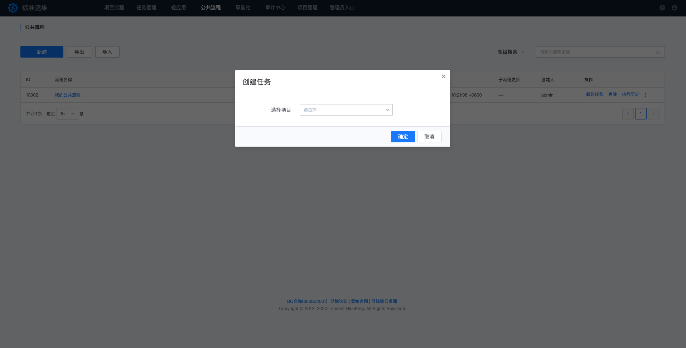

## 公共流程

公共流程通常用于管理在所有业务下都能够使用的一些流程。你可以在任意有权限的业务下使用公共流程新建任务。

在对应的流程上点击“新建任务”就能够选择特定的项目来创建和执行任务啦：

### 编辑公共流程

公共流程的编辑和项目流程相同
在对公共流程进行配置和编排的时候，我们可能会遇到一些需要选择业务的节点，如作业平台(JOB)-快速执行脚本，而公共流程大多数情况下是不需要提前配置节点所属的业务的，这个时候我们只需要将“业务”字段勾选为全局变量即可，当我们在某个业务下使用该流程新建任务的时候，标准运维会自动为你填充该字段为“新建任务”时选择的项目：

### 公共流程权限问题
要实现公共流程在项目使用，公共流程管理方需要考虑使用者是否拥有对应的权限
* 标准运维：公共流程的使用者需要拥有查看公共流程、使用公共流程新建任务两个权限
* 其他系统：公共流程的使用者还受标准插件对接的后端系统权限约束

以最常用的作业平台插件为例，公共流程管理者需考虑下面的约束：   
* 默认情况下，作业平台只允许执行方案、脚本和执行目标（IP）归属于同一个业务（集）
* 公共脚本允许所有业务使用
* 执行目标（IP）在 IP 白名单内，允许该 IP 在非本业务下分发文件、执行脚本

#### 场景 1  
使用者仅在自己业务下的主机执行，推荐使用“快速执行脚本”，并将“业务”字段勾选为全局变量。  
当我们在某个业务下使用该流程新建任务的时候，标准运维会自动为你填充该字段为“新建任务”时选择的项目。  
此时快速脚本就归属于该业务，满足脚本和执行目标（IP）归属于同一个业务（集）的约束。  

#### 场景 2  
一些特定场景下，使用者需要在管理者的主机执行操作，此时请使用“快速执行脚本”，并将“业务”字段勾选为全局变量、开启“跨业务执行”。同时将管理者的业务主机在作业平台添加到 IP 白名单，这样才能实现使用者在管理者的主机执行脚本。

