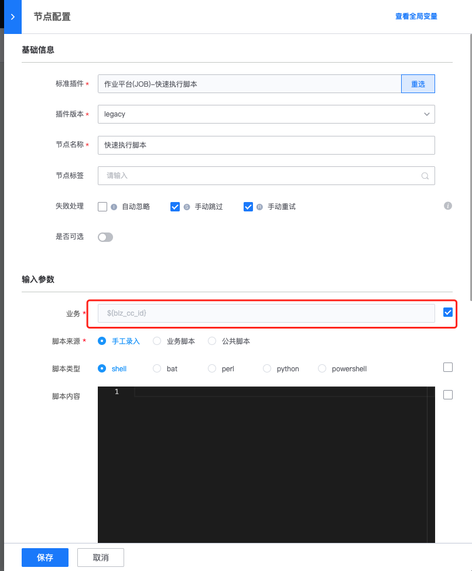

## 公共流程

公共流程通常由公共团队的成员来管理，用于管理某些希望在所有项目下都能够通用的基础流程，从而避免重复建设。只有拥有公共流程管理权限（新建/编辑/删除）才能够进入【公共流程管理】：

### 在项目下查看和引用公共流程

公共流程的管理和项目流程完全相同。公共创建编排完成后，可在项目下的【公共流程】tab查看并新建任务执行

还可将公共流程作为子流程引用，从而实现将公共团队提供的原子流程和业务的流程完成串联。

### 公共流程权限问题
要实现公共流程在项目使用，公共流程管理方需要考虑使用者是否拥有对应的权限
* 标准运维：公共流程的使用者需要拥有【公共流程查看】、【公共流程新建任务】两个权限
* 其他系统：公共流程的使用者也受标准插件对接的后端系统权限约束

以最常用的作业平台插件为例，**公共流程管理者**需考虑下面的约束：   
* 默认情况下，作业平台只允许执行方案、脚本等资源和执行目标（IP）归属于同一个业务（集）
* 非本业务IP，希望在当前业务下执行脚本/方案，传输文件等，需要添加到作业平台的IP白名单内

#### 场景1：  
使用者仅在自己业务下的主机执行，推荐使用“快速执行脚本”，并将“业务”字段勾选为全局变量。  
当我们在某个业务下使用该流程新建任务的时候，标准运维会自动为你填充该字段为“新建任务”时选择的项目。  
此时快速脚本就归属于该业务，满足脚本和执行目标（IP）属于同一个业务（集）。  

#### 场景2：  
特定场景下，使用者希望在公共流程管理者的主机，而不是业务主机执行，推荐请使用“快速执行脚本”，并将“业务”字段勾选为全局变量、同时开启“跨业务执行”。

此外还需要将该主机在作业平台添加到IP白名单，这样才能实现使用者在管理者的主机执行脚本。

