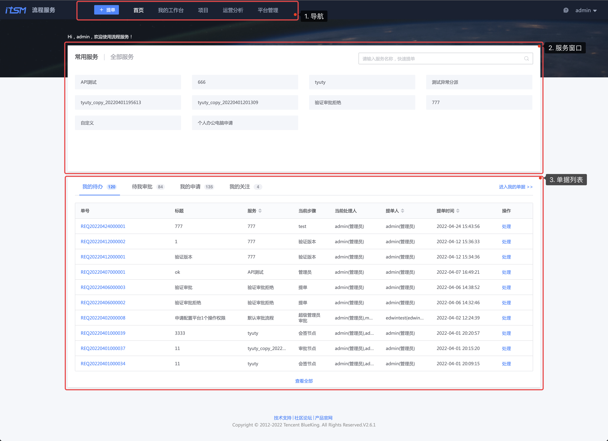

## 首页

首页是流程服务的统一服务窗口，提供相关的可用服务列表和单据状态的显示。

1. 导航

   - +提单

     快速提单的入口，可在平台所有的页面中快速通过此按钮寻找并发起一个新的服务请求

   - 首页

     即，当前页面

   - 我的工作台

     以当前登录用户为视角的个人工作台，包括个人提交的、待办的、关注的单据等等

   - 项目

     进入项目管理空间，提供服务提供方管理项目服务的信息和配置的地方

   - 运营分析

     流程服务的相关运营数据展示的页面

   - 平台管理

     提供给平台管理人员的功能页面

2. 服务窗口

   - 常用服务

     展示用户近期发起过的服务列表

   - 全部服务

     展示平台内所有对当前用户可见的服务列表

3. 单据列表

   - 我的待办

     服务流程节点当前需要我处理的单据列表

   - 待我审批

     服务流程审批节点当前需要我处理的单据列表

   - 我的申请

     我发起的服务请求列表

   - 我的关注

     我关注的服务单据列表
